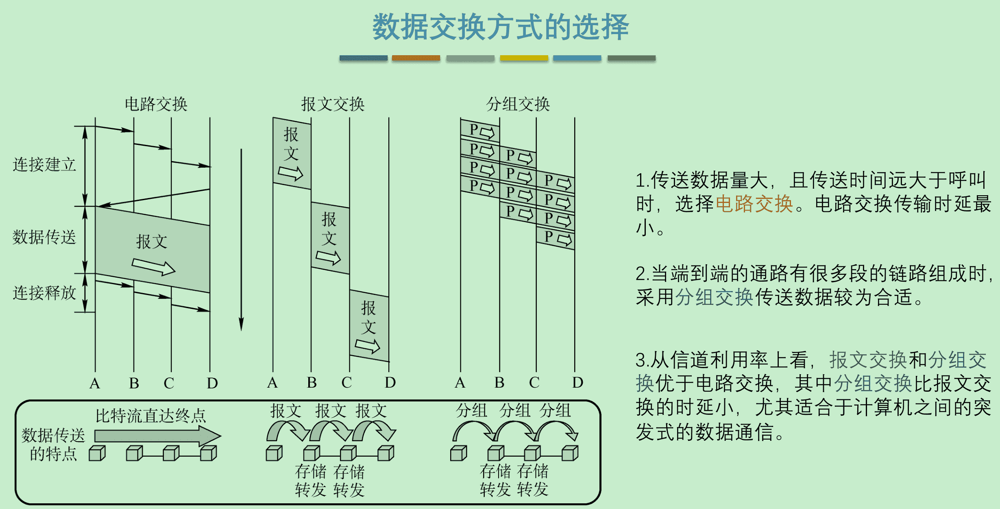

‍

‍

## 概述

‍

### 计网定义

‍

Internet：全球最大、最重要的计算机网络

* 如何称呼 Internet？
* 因特网：推荐，但却长期**未得到推广**。
* 互联网：目前流行最广，事实上的**标准译名**。

‍

‍

### 计网特点

重要基本特点

‍

* 连通性 (connectivity)
* 资源共享 (Sharing)

‍

‍

### 网络的网络

‍

- 计算机网络

  - 由若干**节点**(node)和连接这些节点的**链路**(link)组成。
  - 节点可以是计算机、集线器、交换机或路由器等。​​
- 互连网 (internetwork 或 internet)：

  - **多个网络**通过一些路由器**相互连接**起来，构成了一个覆盖范围更大的计算机网络。
  - “网络的网络”(network of networks)。​​

‍

网络与互连网

- 网络：把许多计算机连接在一起。
- 互连网：把许多网络通过一些路由器连接在一起。与网络相连的计算机常称为**主机**。
- 互连网 (internet) ≠ 互联网 (Internet)

‍

‍

## 互联网组成

从互联网的工作方式上看，可以划分为两大块

- 边缘部分： 由所有连接在互联网上的**主机**组成，由用户直接使用，用来进行通信（传送数据、音频或视频）和资源共享。
- 核心部分：由大量**网络**和连接这些网络的**路由器**组成，为边缘部分提供服务（提供连通性和交换）。

​​

从组成上来说由：端系统，通信链路和交换机组成。

* 端系统：接入因特网并通过因特网与其他设备通信的设备被称为端系统。它是一次因特网信息交换的发起者或者接收者。
* 通信链路：通信链路相当于道路，用于传输信息。在通信链路上传输的信息称为分组。
* 交换机：交换机用于辅助信息交换，选择信息交换所使用的通信链路，交换机分为二层交换机即常说的交换机和三层交换机即路由器。

‍

‍

### 边缘部分

* 处在互联网边缘部分的就是连接在互联网上的所有的主机。这些主机又称为**端系统** (end system)
* **端系统在功能上可能有很大差别**

  * 小的端系统：普通个人电脑、智能手机、网络摄像头等。
  * 大的端系统：非常昂贵的大型计算机或服务器。

​​

“计算机之间通信”实际上是指：主机 A 的某个**进程**和主机 B 上的另一个**进程**进行通信

‍

端系统之间的两种通信方式

- 客户/服务器方式
  * Client / Server 方式 简称为 C/S 方式
- 对等方式
  * Peer to Peer 方式 简称为 P2P 方式

‍

**客户-服务器方式（C/S 方式）**

- 客户/服务器方式所描述的是进程之间**服务和被服务**的关系。
- 客户是服务的**请求方**，服务器是服务的**提供方**。

‍

客户程序和服务器程序主要特点

- 客户程序
  - 被用户**调用后运行**，需**主动**向远地服务器发起通信（请求服务）。必须知道服务器程序的地址。
  - 不需要特殊的硬件和很复杂的操作系统。
- 服务器程序
  - 专门用来提供某种服务的程序，可同时处理多个客户请求。
  - 一直**不断地运行着**，**被动**地等待并接受来自各地的客户的通信请求。不需要知道客户程序的地址。
  - 一般需要强大的硬件和高级的操作系统支持。

‍

‍

**对等连接方式（P2P 方式）**

- 两台主机在通信时**不区分**服务请求方和服务提供方。
- 只要都运行了 P2P 软件，就可以进行平**等的、对等连接通信**。

> 对等连接方式从本质上看仍然是使用客户服务器方式，只是对等连接中的每一个主机**既是客户又是服务器**。

‍

​​

### 核心部分

- 是互联网中最复杂的部分。
- 向网络边缘中的主机**提供连通性**，使任何一台主机都能够向其他主机通信。
- 在网络核心部分起特殊作用的是**路由器** (router)。
- 路由器是实现分组交换 (packet switching) 的关键构件，其任务是**转发**收到的分组。

> **分组转发**是网络核心部分最重要的功能。

‍

​​

#### 交换技术

* 典型交换技术包括：

  * 电路交换
  * 分组交换
  * 报文交换 等。
* 互联网的核心部分采用**分组交换技术**

‍

比较

* 若要连续传送**大量**的数据，且其传送时间**远大于**连接建立时间，则电路交换的传输速率较快。
* 报文交换和分组交换不需要预先分配传输带宽，在传送**突发数据**时可提高整个网络的信道利用率。
* 由于一个分组的长度往往**远小于**整个报文的长度，因此分组交换比报文交换的时延小，同时也具有更好的灵活性。

‍

‍

​​

‍

‍

##### 电路交换

‍

**电路交换的主要特点**

电线对的数量与电话机数量的平方 $N^2$ 成正比。

- $5$ 部电话机两两直接相连，需 $10$ 对电线。
- $N$ 部电话机两两直接相连，需 $N(N - 1)/2$ 对电线。

​​

当电话机的数量增多时，使用**电话交换机**将这些电话连接起来。

> 每一部电话都直接连接到交换机上，而交换机使用**交换**的方法，让电话用户彼此之间可以很方便地通信。
> 这种交换方式就是**电路交换** (circuit switching)。

​​

“交换 (switching)”的含义

- 转接：把一条电话线转接到另一条电话线，使它们连通起来。
- 从通信资源的分配角度来看，就是按照某种方式**动态地**分配传输线路的资源。

‍

‍

电路交换三个阶段

- 建立连接：建立一条专用的物理通路（占用通信资源）。
- 通话：主叫和被叫双方互相通电话（一直占用通信资源）。
- 释放连接：释放刚才使用的专用的物理通路（归还通信资源）。

> 这种必须经过“建立连接（占用通信资源）、通话（一直占用通信资源）、释放连接（归还通信资源）”三个步骤的交换方式称为电路交换。

电路交换特点：通话的两个用户**始终占用**端到端的通信资源

​​

> 计算机数据具有**突发性**，这导致在传送数据时，通信线路的利用率很低，真正用来传送数据的时间往往不到 10%，甚至不到 1%，已被用户占用的通信线路资源在绝大部分时间里都是空闲的。

‍

##### **分组交换**

**分组交换的主要特点**

采用**存储转发**技术，在发送端，先把较长的报文划分成更小的等长数据段。

‍

数据段前面添加首部就构成了**分组** (packet)​​

> 分组又称为“包”，而分组的首部也可称为“包头”。

‍

分组交换以“分组”作为数据传输单元

- 互联网采用分组交换技术。**分组是在互联网中传送的数据单元**。
- 发送端**依次**把各分组发送到接收端。

​​

接收端收到分组后**剥去**首部，**还原**成原来的报文

‍

分组在互联网中的转发

- 根据**首部**中包含的目的地址、源地址等重要控制信息进行转发。
- 每一个分组在互联网中**独立选择**传输路径。
- 位于网络核心部分的**路由器负责转发分组**，即进行分组交换。
- 路由器要创建和动态维护**转发表**。

‍

路由器处理分组的过程

- 暂存收到的分组。
- 检查分组首部。
- 查找转发表。
- 按照首部中的目的地址，找到合适的接口转发出去。

‍

(a) 核心部分的路由器把网络互连起来  
​​

(b) 核心部分中的网络可用一条链路表示

‍

‍

分组交换的优点

|优点|所采用的手段|
| ----| ----------------------------------------------------------------------|
|高效|在分组传输的过程中**动态分配**传输带宽，对通信链路是**逐段**占用。|
|灵活|为每一个分组**独立**地选择最合适的转发路由。|
|迅速|以分组作为传送单位，可以**不先建立连接**就能向其他主机发送分组。|
|可靠|保证可靠性的网络协议；分布式多路由的分组交换网，使网络有很好的生存性。|

‍

分组交换带来的问题

- 排队延迟：分组在各路由器存储转发时需要排队。
- 不保证带宽：动态分配。
- 增加开销：各分组必须携带控制信息；路由器要暂存分组，维护转发表等。

‍

‍

##### **报文交换**

在 20 世纪 40 年代，电报通信就采用了基于存储转发原理的**报文交换** (message switching). 时延较长，从几分钟到几小时不等。已经很少有人使用了

‍

‍

‍

## 计网类别

‍

计算机网络有多种类别

* 按照网络的作用范围进行分类；
* 按照网络的使用者进行分类；
* 用来把用户接入到互联网的网络。

‍

‍

### **网络的作用范围分**

|类别|作用范围或距离|
| --------------------------------------| -------------------------------------------------------------------------|
|广域网 WAN (Wide Area Network)|通常为几十到几千公里。有时也称为**远程网**(long haul network)。是互联网的核心部分。|
|城域网 MAN (Metropolitan Area Network)|作用范围一般是一个城市，作用距离约为 5~50 公里。|
|局域网 LAN (Local Area Network)|局限在较小的范围（如 1 公里左右）。通常采用高速通信线路。|
|个人区域网 PAN (Personal Area Network)|范围很小，大约在 10 米左右。有时也称为**无线个人区域网** WPAN (Wireless PAN)。|

‍

‍

‍

### **网络的使用者分**

|类别|作用范围或距离|
| ------------------------| ----------------------------------------------|
|公用网 (public network)|按规定交纳费用的人都可以使用的网络。也可称为**公众网**。|
|专用网 (private network)|为特殊业务工作的需要而建造的网络。|

‍

### 拓扑结构分

‍

* 星形网络
* 总线形网络
* 环形网络
* 网状形网络

‍

‍

### **用来把用户接入到互联网的网络**接入网

AN (Access Network)

- 又称**为本地接入网**或**居民接入网**。
- **用于将用户接入互联网**。
- 实际上就是本地 ISP 所拥有的网络，它既不是互联网的核心部分，也不是互联网的边缘部分。
- 是从某个用户端系统到本地 ISP 的**第一个**路由器（也称为边缘路由器）之间的一种网络。
- 从覆盖的范围看，很多接入网还是属于局域网。

‍

‍

#### **因特网服务提供者**​**`ISP`**​​ **(**​**`I`**​​**nternet** **`S`**​​**ervice** **`P`**​​**rovider)**

‍

普通用户是如何接入到因特网的呢？

答：**通过ISP接入因特网**

ISP可以从因特网管理机构申请到成块的IP地址，同时拥有通信线路以及路由器等联网设备。任何机构和个人只需缴纳费用，就可从**ISP的得到所需要的IP地址**。

**因为因特网上的主机都必须有IP地址才能进行通信，这样就可以通过该ISP接入到因特网**

**中国的三大**​**`ISP`**​ **：中国电信，中国联通和中国移动**

‍

‍

‍

## 计网性能

---

**非性能特征**

* 费用：标准化
* 质量：可靠性
* 管理和维护：可扩展性和可升级性

> 这些非性能特征与性能指标有很大的关系。

---

- 性能指标：从不同的方面来度量计算机网络的性能。
- 重要性能指标：速率、带宽、吞吐率、时延、时延带宽积、往返时间、利用率

‍

‍

### **速率**

指的是**数据的传送速率**，也称为**数据率** (data rate) 或**比特率** (bit rate)。单位：bit/s，或 kbit/s、Mbit/s、 Gbit/s 等。

往往是指额定速率或标称速率

注意与比特的区别, 比特的KB -> B 是2^10^的关系, 10,20,30,40 为进阶序列 (到bit是 1/8), 而速率这里是单纯的数学上的k = 10^3^ 的关系, 3,6,9,12 为进阶序列

‍

‍

### **带宽**

  **(bandwidth)**

‍

* 频域

  某个信号具有的**频带宽度,**  单位是**赫**（或千赫、兆赫、吉赫等）. 某信道允许通过的信号频带范围称为该**信道的带宽**（或通频带）, 即最高频率与最低频率之差
* 带宽变大：指的是能够注入的数据变多了，不能说是比特传输的速度变快了
* 时域

  网络中某通道传送数据的能力，表示在单位时间内网络中的某信道所能通过的“**最高数据率**”。单位就是数据率的单位 bit/s。

> 两者**本质相同**。
>
> 一条通信链路的“带宽”越宽，其所能传输的“最高数据率”也越高。

‍

‍

### **吞吐量**

  **(throughput)**

单位时间内通过某个网络（或信道、接口）的**实际数据量,**  受网络的带宽或网络的额定速率的限制

有时可用**每秒传送的字节数**或**帧数**来表示。

* 受到网络的带宽或网络的额定速率的限制
* 吞吐量指的是实际的数据量（不是最大承载能力)

‍

### 丢包

(补充)

> 让a表示分组到达的平均速率，R是传输速率，即比特从队列中推出的速率，同时假设每个分组都由L比特组成，则L*a/R称为流量强度。它在估量排队时延的影响程度方面起着重要作用。如果流量强度大于1，则比特到达的平均速率超过比特从队列中传输出去的速率，在这种情况下，队列会趋向于无限大，排队时延也会趋向于无穷大。因而设计系统时必须保证流量强度不能大于1。
>
> 如果流量强度小于等于1，则：
>
> 如果分组周期性的到达，则每个分组到达时队列都是空的，因而就不会有排队时延。  
> 如果分组以突发形式到达，则有可能有很大的平均排队时延。并且随着流量强度接近于1，平均排队时延迅速增加。
>
> 在实际设备中，由于设备缓存的有限性，因而如果到达的分组无法被存储就会被丢弃，丢弃的分组会随着流量强度的增加而增加。

‍

‍

### **时延**

  **(delay 或 latency)**

指数据（一个报文或分组，甚至比特）从网络（或链路）的一端传送到另一端所需的时间。有时也称为**延迟**或**迟延**

* 一般说来，小时延的网络要**优于**大时延的网络。
* 在某些情况下，一个低速率、小时延的网络很可能要**优于**一个高速率但大时延的网络。

> 必须指出，在总时延中，究竟是哪一种时延**占主导地位**，必须具体分析。

‍

$$
总时延 = 发送时延 + 传播时延 + 处理时延 + 排队时延
$$

‍

---

‍

> 以下说法是**错误**的：“在高速链路（或高带宽链路）上，比特会传送得更快些”。

* 对于高速网络链路，我们**提高的仅仅是数据的发送速率**，而不是比特在链路上的传播速率。
* 提高数据的发送速率**只是减小了数据的发送时延**。

> 不能笼统地认为：“数据的发送速率越高，其传送的总时延就越小”。

‍

---

‍

组成

1. 发送时延 （数据长度/信道带宽）
2. 传播时延 （信道长度/电磁波的传播速率）
3. 处理时延 （校验、寻找出口的时间）
4. 排队时延 （等待输出/输入链路可用的时间）

‍

‍

#### 发送时延

‍

也称为传输时延。是主机或路由器发送数据帧所需要的时间，也就是从发送数据帧的**第一个比特**算起，到该帧的**最后一个比特**发送完毕所需的时间。

‍

$发送时延 = \frac{数据帧长度（bit）}{发送速率（bit/s）}$  

‍

* 所谓的高速链路只能改变发送时延, 该传多快还是多快(光纤等)

‍

‍

#### 传播时延

‍

**电磁波**在信道中传播一定的距离需要花费的时间

‍

$传播时延 = \frac{信道长度（米）}{信号在信道上的传播速率（米/秒）}$  

‍

‍

‍

#### 处理时延

‍

主机或路由器在收到分组时，为**处理**分组（例如分析首部、提取数据、差错检验或查找路由）所花费的时间

‍

‍

#### 排队时延

‍

分组在路由器输入输出队列中**排队等待**处理和转发所经历的时延。排队时延的长短往往取决于网络中当时的通信量。当网络的通信量很大时会发生队列溢出，使分组丢失，这相当于排队时延为无穷大。

‍

‍

‍

### **时延带宽积**

链路的**时延带宽积**又称为 以比特为单位的**链路长度** 

* 管道中的比特数表示从发送端发出**但尚未**到达接收端的比特数。
* 只有在代表链路的管道都充满比特时，链路才得到了充分利用。

> 时延带宽积 -> 链路如同一条空心管道, 传播实验就是管道长度, 带宽就是管道的截面积. V = S * L.

‍

‍

$时延带宽积 = 传播时延 \times 带宽$  

‍

‍

​​

### **往返时间**

**RTT (Round-Trip Time)**

表示从发送方**发送完数据**，到发送方**收到来自接收方的确认**总共经历的时间。

可通过ping测试

RTT 越大，在等待收到接收方的确认之前可以发送的数据越多

‍

两倍传播时延 + 对象节点的处理 + 排队 \+ 发送时延

$$
\begin{align*}
往返时间 RTT &= 结点 A 到 B 的传播时延 t_{P} \\
            &+ 结点 B 处理和排队时延 t_{PQB} \\
            &+ 结点 B 发送时延 t_{TB} \\
            &+ 结点 B 到 A 的传播时延 t_{P} \\
            &= 2 \times 传播时延 t_{P} \\
            &+ 结点 B 处理和排队时延 t_{PQB} \\
            &+ 结点 B 发送时延 t_{TB}
\end{align*}
$$

‍

​​

‍

‍

‍

### **利用率**

‍

* 信道利用率

  某信道有百分之几的时间是被利用的（即有数据通过）。完全空闲的信道的利用率是零
* 网络利用率

  全网络的信道利用率的加权平均值

‍

时延与网络利用率的关系

- 根据排队论，当某信道的利用率增大时，时延会迅速增加。$D = \frac{D_{0}}{1 - U}$
  * $D_{0}$：网络空闲时的时延。
  * D：网络在当前的时延。
  * U：网络当前的利用率，数值在 0 到 1 之间。
- 当信道的利用率增大时，该信道引起的时延迅速增加。(指数上升模型)

‍

‍

‍

‍

## 计网体系结构

‍

‍

‍

### 形成

计算机网络是一个非常复杂的系统。两台计算机要互相传送文件需解决很多问题, e.g.

> 1. 必须有一条传送数据的通路。
> 2. 发起方必须激活通路。
> 3. 要告诉网络如何识别接收方。
> 4. 发起方要清楚对方是否已开机，且与网络连接正常。
> 5. 发起方要清楚对方是否准备好接收和存储文件。
> 6. 若文件格式不兼容，要完成格式的转换。
> 7. 要处理各种差错和意外事故，保证收到正确的文件。

‍

提出了不同体系结构

‍

> OSI 试图达到一种**理想境界**：全球计算机网络都遵循这个统一标准，因而全球的计算机将能够很方便地进行互连和交换数据。但 ISO/OSI 失败了。

> * 基于 TCP/IP 的互联网已抢先在全球相当大的范围成功地运行了。
> * OSI 的专家们在完成 OSI 标准时**没有商业驱动力**；
> * OSI 的协议实现起来**过分复杂**，且运行效率很低；
> * OSI 标准的制定**周期太长**，使得按 OSI 标准生产的设备无法及时进入市场；
> * OSI 的层次**划分也不太合理**，有些功能在多个层次中重复出现。

‍

两种国际标准

- 法律上的 (de jure) 国际标准 OSI
  - 但并没有得到市场的认可。
- 事实上的 (de facto) 国际标准 TCP/IP
  - 获得了最广泛的应用。

‍

* OSI ==物联网淑慧试用==（自下向上传的七层结构的名称）

具体几个略, 自己肯定记得.

‍

### 协议与划分层次

‍

网络协议 (network protocol)，简称为协议，是**为进行网络中的数据交换而建立的规则、标准或约定**. 计算机网络的不可缺少的组成部分

‍

‍

#### 组成要素

* ==语法==：数据与控制信息的结构或格式。
* ==语义==：需要发出何种控制信息，完成何种动作以及做出何种响应。
* ==同步==：事件实现顺序的详细说明。

‍

‍

#### 两种形式

- 文字描述：便于人来阅读和理解。
- 程序代码：让计算机能够理解。

‍

​​

#### 分层的优缺点

* 各层之间是独立的。
* 灵活性好。
* 结构上可分割开。
* 易于实现和维护
* 能促进标准化工作。
* 有些功能会重复出现，因而产生了额外开销。

‍

注意：每一层的功能应非常明确。

‍

- 层数太少，就会使每一层的协议太复杂。
- 层数太多，又会在描述和综合各层功能的系统工程任务时遇到较多的困难。

‍

各层完成的主要功能

- 差错控制：使相应层次对等方的通信更加可靠。
- 流量控制：发送端的发送速率必须使接收端来得及接收，不要太快。
- 分段和重装：发送端将要发送的数据块划分为更小的单位，在接收端将其还原。
- 复用和分用：发送端几个高层会话复用一条低层的连接，在接收端再进行分用。
- 连接建立和释放：交换数据前先建立一条逻辑连接，数据传送结束后释放连接。

‍

‍

### 具有五层协议的体系结构

​​

计算机网络的体系结构

* 网络的体系结构 (Network Architecture) 是计算机网络的各层及其协议的**集合**，就是这个计算机网络及其构件所应完成的**功能的精确定义（不涉及实现）** 。
* 实现 (implementation) 是遵循这种体系结构的前提下，用何种硬件或软件完成这些功能的问题。

> 体系结构是**抽象**的，而实现则是**具体**的，是真正在运行的计算机硬件和软件。

* TCP/IP 是四层的体系结构：应用层、运输层、网际层和网络接口层。
* 但最下面的网络接口层并没有具体内容。
* 因此往往采取折中的办法，即综合 OSI 和 TCP/IP 的优点，采用一种只有五层协议的体系结构 。

---

(略)

‍

* **应用层**：所有能和用户产生网络流量的程序
* **表示层**：处理两个通信系统中交换信息的方式

  * 数据格式交换
  * 数据加密解密
  * 数据压缩和恢复
* **会话层**：有序地传输数据，建立同步

  * 使用校验点在通信失效的时候继续恢复通信，实现数据的同步传送
* **传输层**：提供可靠传输（需要确认机制）、不可靠传输（不需要确认机制）

  * 差错控制
  * 流量控制
  * 复用分用：

    * 复用：多个应用层进程可以同时使用下面传输层的服务（对于发送方）
    * 分用：传输0层把收到的信息分别交付给上面应用层中的相应进程（对于接收方）
* **网络层**：

  * 路由选择（最佳路径）
  * 流量控制
  * 差错控制
  * 拥塞控制（采取措施缓解所有节点都来不及接受）
* **数据链路层**：

  * 把网络层传下来的数据组装成帧
  * 数据链路层/链路层的传输单位是帧
* **物理层**：

  * 在物理媒体上实现的比特流的透明传输（单纯地转化成物理数据）
  * 定义接口特性、定义传输模式（单工、双工、半双工）
  * 定义传输速率
  * 比特同步、比特编码（曼切斯特编码等等）

‍

‍

#### 5 应用层(application layer)

- 任务：通过应用进程间的交互来完成特定网络应用。
- 协议：定义的是**应用进程**间通信和交互的规则。
- 把应用层交互的数据单元称为**报文**(message)。
- 例如：DNS，HTTP，SMTP

* 专门针对某些应用提供服务
* 数据单位：报文Message

‍

‍

#### 4 运输层(transport layer)

- 任务：负责向两台主机中**进程**之间的通信提供通用的数据传输服务。
- 具有复用和分用的功能。
- 主要使用**两种协议**：
  - 传输控制协议 TCP (Transmission Control Protocol)：
    - 提供**面向连接**的、**可靠**的数据传输服务。
    - 数据传输的单位是**报文段** (segment)。
  - 用户数据报协议 UDP (User Datagram Protocol)：
    - 提供无连接的**尽最大努力** (best-effort) 的数据传输服务（**不保证数据传输的可靠性**）。
    - 数据传输的单位是**用户数据报**。

‍

* 负责不同主机的进程间的传输。从源主机的进程到目的主机的进程。实现端到端通信。
* 数据单位：报文段Segment

‍

#### 3 网络层(network layer)

- 为分组交换网上的不同**主机**提供通信服务。
- 两个具体任务：
  - 路由选择：通过一定的算法，在互联网中的每一个路由器上，**生成**一个用来转发分组的**转发表**。
  - 转发：每一个路由器在接收到一个分组时，要依据转发表中指明的路径把分组**转发**到下一个路由器。
- 互联网使用的网络层协议是**无连接**的**网际协议 IP** (Internet Protocol) 和许多种路由选择协议，因此互联网的网络层也叫做网际层或 IP 层。
- IP 协议分组也叫做 **IP 数据报**，或简称为数据报。

‍

* 负责从源地址(source)到目的地地址(destination)的传输，从源主机传输数据到目标主机。实现点到点通信（point to point)
* 数据单位：数据报datagram

‍

#### 2 数据链路层(data-link layer)

- 常简称为**链路层**。
- 任务：实现两个**相邻节点**之间的**可靠通信**。
- 在两个相邻节点间的链路上传送**帧**（frame）。
- 如发现有差错，就简单地**丢弃**出错帧。
- 如果需要改正出现的差错，就要采用**可靠传输协议**来**纠正**出现的差错。这种方法会使数据链路层协议复杂。

‍

* 封装数据报。负责一条连路上，一个节点到另一个节点的传输。单跳(hop-by-hop, node-to-node)
* 数据单位：帧Frame

‍

#### 1 物理层(physical layer)

- 任务：实现**比特**（0 或 1）的传输。
- 确定连接电缆的插头应当有多少根引脚，以及各引脚应如何连接。
- 注意：传递信息所利用的一些**物理媒体**，如双绞线、同轴电缆、光缆、无线信道等，**并不在物理层协议之内**，而是在物理层协议的下面。

‍

* 通过线路传送比特(bit)流，只完成一个节点到另一个节点的传输（单跳）
* 数据单位：比特流bit

‍

‍

#### 对等层与协议数据单元

- OSI 参考模型把对等层次之间传送的数据单位称为该层的**协议数据单元 PDU** (Protocol Data Unit)。
- 任何两个同样的层次把 PDU （即数据单元加上控制信息）通过水平虚线直接传递给对方。这就是所谓的“**对等层**”之间的通信。

> 各层协议实际上就是在各个**对等层**之间传递数据时的各项规定。

‍

* 上四层端到端（客户端和客户端之间的通信），下三层点到点（某一个中介系统可能会传播到下一个节点）

‍

‍

### 实体、协议、服务和服务访问点

‍

#### 实体

* 实体第 n 层活动元素称为第 n 层实体

表示任何可发送或接收信息的硬件或软件进程

‍

‍

#### 协议 & 服务

控制**两个对等实体**进行通信的规则的集合。

在协议的控制下，两个对等实体间的通信使得本层能够**向上一层提供服务**。

要实现本层协议，还需要**使用下层所提供的服务**。

‍

- **协议**
  - 其实现保证了能够向上一层提供服务。
  - 对上面的服务用户是透明的。
  - 是“水平的”
- **服务**
  - 上层使用服务原语获得下层所提供的服务。
  - 上面的服务用户只能看见服务，无法看见下面的协议。
  - 是“垂直的”

‍

‍

#### 服务访问点 SAP

‍

在同一系统中相邻两层的实体进行交互（即交换信息） 的地方，通常称为**服务访问点 SAP** (Service Access Point)。SAP 是一个抽象的概念，它实际上就是一个**逻辑接口**。

‍

#### **服务数据单元 SDU**

‍

OSI 把层与层之间交换的数据的单位称为**服务数据单元 SDU** (Service Data Unit)。

‍

SDU 可以与 PDU 不一样。

* > 例如：可以是多个 SDU 合成为一个 PDU，也可以是一个 SDU 划分为几个 PDU。
  >

‍

‍

‍

### TCP/IP 的体系结构

(略)

路由器在转发分组时**最高**只用到**网际层**，没有使用运输层和应用层。

‍

‍

## **体系结构的各层在整个过程中起到怎样的作用**

‍

**1、发送方发送**

‍

第一步：

* **应用层**按照HTTP协议的规定构建一个**HTTP请求报文**
* 应用层将**HTTP请求报文**交付给**运输层**处理

‍

第二步：

* **运输层**给**HTTP请求报文**添加一个**TCP首部**，使之成为**TCP报文段**
* **TCP报文段的首部格式**作用是区分应用进程以及实现可靠传输
* **运输层**将T**CP报文段**交付给**网络层**处理

‍

第三步：

* **网络层**给**TCP报文段**添加一个**IP首部**，使之成为**IP数据报**
* **IP数据报的首部格式**作用是使**IP数据报**可以在互联网传输，也就是被路由器转发
* **网络层**将**IP数据报**交付给**数据链路层**处理

‍

第四步：

* **数据链路层**给**IP数据报**添加一个**首部**和一个**尾部**，使之成为**帧**
* 该**首部**的作用主要是为了让**帧**能够在一段链路上或一个网络上传输，能够被相应的目的主机接收
* 该**尾部**的作用是让目的主机检查所接收到的**帧**是否有误码
* **数据链路层**将**帧**交付给**物理层**

‍

第五步：

* **物理层**先将**帧**看做是**比特流**，这里的网络N1假设是以太网，所以**物理层**还会给该**比特流**前面添加**前导码**
* **前导码**的作用是为了让目的主机做好接收帧的准备
* **物理层**将装有**前导码**的**比特流**变换成相应的**信号**发送给传输媒体

‍

第六步：

* **信号**通过**传输媒体**到达**路由器**

‍

**2、路由器转发**

‍

在路由器中

* 提取**目的网络地址**后查找**自身路由表**。确定**转发端口**， 以便进行转发
* **网络层**将**IP数据报**交付给**数据链路层**
* **数据链路层**给**IP数据报**添加一个**首部**和一个**尾部**，使之成为**帧**
* **数据链路层**将帧交付给**物理层**
* **物理层**先将**帧**看成**比特流**，这里的网络N2假设是以太网，所以**物理层**还会给该**比特流**前面添加**前导码**
* 物理层将装有**前导码**的**比特流**变换成相应的**信号**发送给传输媒体，信号通过传输媒体到达**Web服务器**

‍

**3、接收方接收**

> 和发送方（主机）发送过程的封装正好是反着来
>
> 在Web 服务器上
>
> * **物理层**将**信号**变换为**比特流**，然后去掉**前导码**后成为**帧**，交付给**数据链路层**
> * **数据链路层**将**帧**的**首部**和**尾部**去掉后成为**IP数据报**，将其交付给**网络层**
> * **网络层**将**IP数据报**的**首部**去掉后成为**TCP报文段**，将其交付给**运输层**
> * **运输层**将**TCP报文段**的**首部**去掉后成为**HTTP请求报文**，将其交付给**应用层**
> * **应用层**对**HTTP请求报文**进行**解析**，然后给主机发回**响应报文**
>
> **发回响应报文的步骤和之前过程类似**

‍

## 数据单元长度

‍

### 链路层-Frame最大长度

以太网(Ethernet)数据帧的长度必须在46-1500字节之间，这个1500字节被称为链路层的MTU(最大传输单元)。上述数据内容长度不包括链路层的首部和尾部的18个字节。所以真正的链路层帧的长度应该是：（46＋18）－（1500＋18）

‍

### 网络层-Datagram最大长度

对于IP协议来说，数据内容的长度包含20个字节的头部信息，所以数据内容的长度为1480。

‍

### 传输层-Segment最大长度

IP协议数据内容长度1480字节存放TCP报文段或UDP报文段。最大长度理论上2^16 - IPhead - UDPhead= 65535 - 20 - 8=65507字节，但是实际上UDP数据报的数据区最大长度为1480 - 8 = 1472字节（UDP的头部信息占用八个字节）。TCP 1480-TCPHead(20) = 1460 Bytes(TCP 报文段的头部信息占用20个字节）

‍

### 协议封装过程

链路层帧只对网络层数据报进行封装不进行分割。传输层数据内容超过MTU最大传输单元时，网络层数据报对传输层报文会进行分片操作。

‍

### UDP和TCP的数据长度

我们在用Socket编程时，UDP协议要求包小于64K。TCP没有限定，TCP包头中就没有“长度”字段，而完全依靠IP层去处理分帧。这就是为什么TCP常常被称作一种“流协议”的原因，开发者在使用TCP服务的时候，不必去关心数据包的大小，只需讲SOCKET看作一条数据流的入口，往里面放数据就是了，TCP协议本身会进行拥塞/流量控制。

‍
