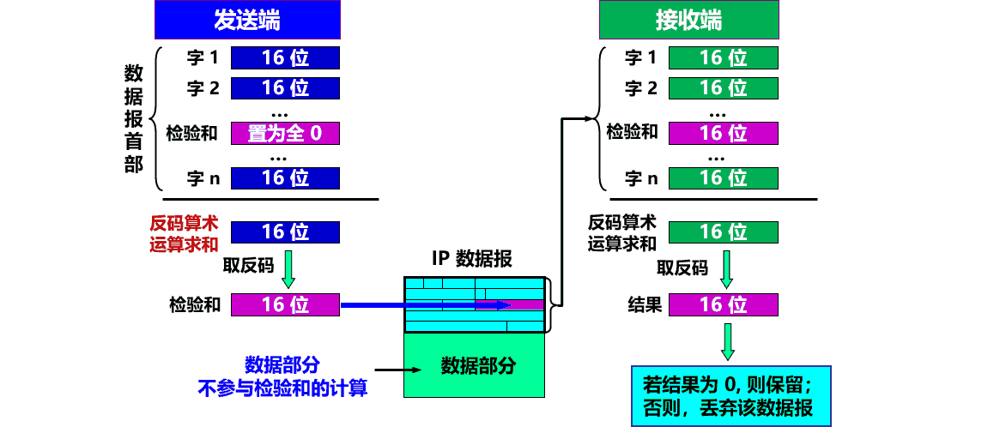
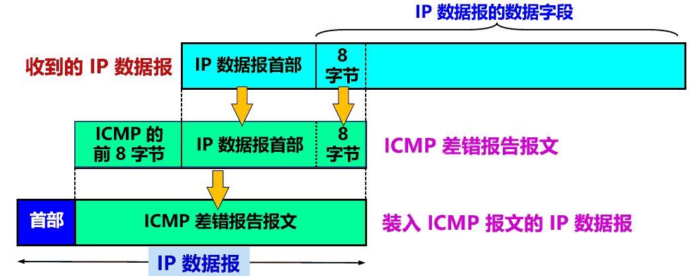
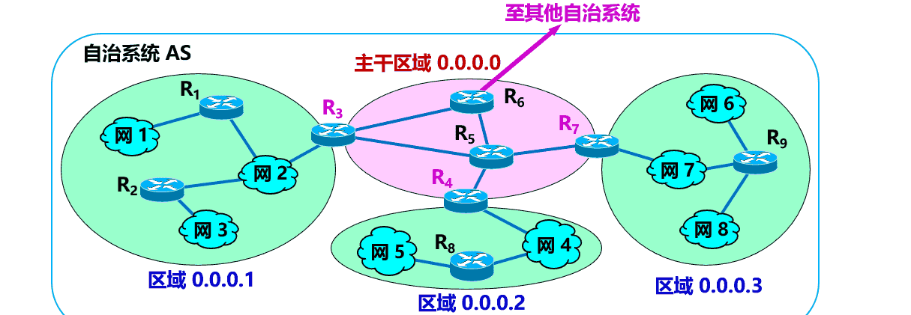
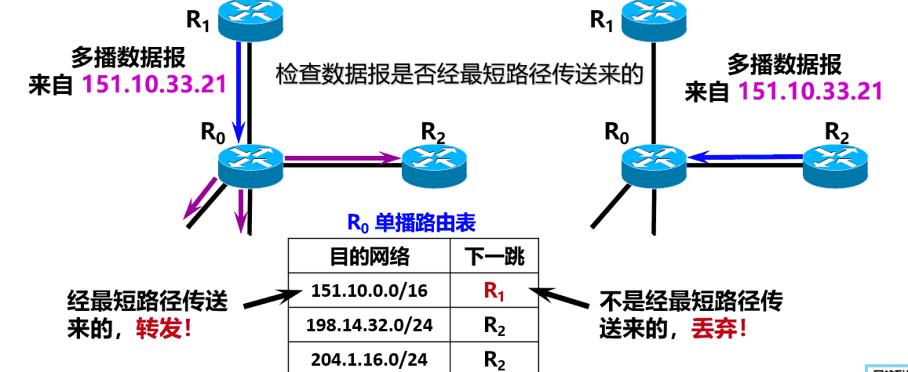
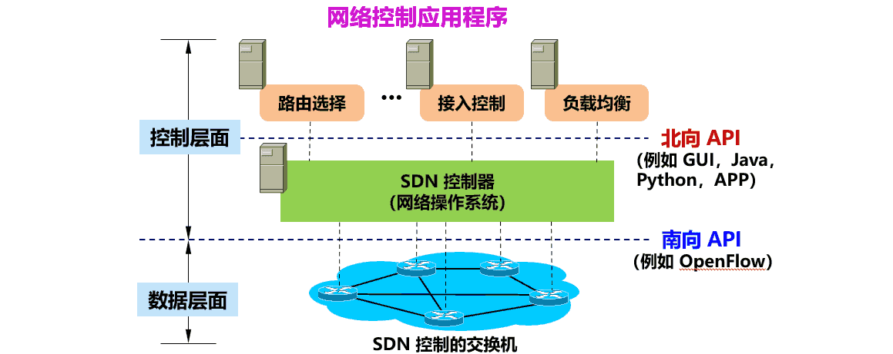

​​

网络层是整个互联网的核心，因此应当让网络层尽可能简单。网络层向上只提供简单灵活的、无连接的、尽最大努力交互的数据报服务。

使用 IP 协议，可以把异构的物理网络连接起来，使得在网络层看起来好像是一个统一的网络

‍

‍

|协议|名称|作用|
| ------| ----------------------| --------------------------------------------------------------------------------------------------------------------------------|
|IP|网际协议|IP协议不但定义了数据传输时的基本单元和格式，还定义了数据报的递交方法和路由选择|
|ICMP|Internet控制报文协议|ICMP就是一个“错误侦测与回报机制”，其目的就是让我们能够检测网路的连线状况﹐也能确保连线的准确性，是ping和traceroute的工作协议|
|RIP|路由信息协议|使用“跳数”(即metric)来衡量到达目标地址的路由距离|
|IGMP|Internet组管理协议|用于实现组播、广播等通信|

‍

## 概念

‍

### 对象

与IP协议配套使用的还有三个协议：

* 地址解析协议ARP
* 网际控制报文协议ICMP
* 网际组管理协议IGMP

‍

有以下五种不同的中间设备：

* 物理层中继系统：转发器
* 数据链路层中继系统：网桥或桥接器
* 网络层中继系统：路由器
* 网桥和路由器的混合物：桥路器
* 网络层以上的中继系统：网关

‍

使用IP协议的虚拟互联网络可以简称为IP网，互联网就是一个虚拟互联网络。

‍

### 虚电路服务与数据报服务

> 争论：
>
> * 网络层应该向运输层提供怎样的服务？**面向连接**还是**无连接**？
> * 在计算机通信中，**可靠交付**应当由谁来负责？是**网络**还是**端系统**？
>
> ‍
>
> 2 种观点：
>
> * 面向连接的可靠交付。
> * 无连接的、尽最大努力交付的数据报服务，不提供服务质量的承诺。

‍

‍

#### 可靠

‍

一种观点：让网络负责可靠交付

- 计算机网络**模仿电信网络**，使用**面向连接**的通信方式。
- 通信之前先建立**虚电路 VC** (Virtual Circuit) (即连接)，以保证双方通信所需的一切网络资源。
- 如果再使用**可靠传输**的网络协议，可使所发送的分组无差错按序到达终点，不丢失、不重复。

‍

虚电路服务：H1 发送给 H2 的所有分组都沿着同一条虚电路传送  
​​

> 虚电路只是一条**逻辑上的连接**，分组都沿着这条逻辑连接按照存储转发方式传送，并不是真正建立了一条**物理连接**。

‍

‍

#### 不可靠

另一种观点：网络提供数据报服务

‍

互联网采用的设计思路：

- **网络层**要设计得尽量**简单**，向其上层只提供简单灵活的、**无连接的**、尽最大努力交付的**数据报服务**。
  - 网络在发送分组时不需要先建立连接。
  - 每一个分组（即 IP 数据报）独立发送，与其前后的分组无关（不进行编号）。
  - 网络层不提供服务质量的承诺。即所传送的分组可能出错、丢失、重复和失序（不按序到达终点），也不保证分组传送的时限。
- 由主机中的**运输层**负责可靠的通信。

‍

‍

#### 对比

虚电路服务与数据报服务的对比

|对比的方面|虚电路服务|数据报服务|
| --------------------------| ----------------------------------------------| --------------------------------------------------|
|思路|可靠通信应当由网络来保证|可靠通信应当由用户主机来保证|
|连接的建立|必须有|不需要|
|终点地址|仅在连接建立阶段使用，每个分组使用短的虚电路号|每个分组都有终点的完整地址|
|分组的转发|属于同一条虚电路的分组均按照同一路由进行转发|每个分组独立选择路由进行转发|
|当结点出故障时|所有通过出故障的结点的虚电路均不能工作|出故障的结点可能会丢失分组，一些路由可能会发生变化|
|分组的顺序|总是按发送顺序到达终点|到达终点时不一定按发送顺序|
|端到端的差错处理和流量控制|可以由网络负责，也可以由用户主机负责|由用户主机负责|

‍

‍

### 数据层面和控制层面

‍

不同网络中的两个主机之间的通信，要经过若干个路由器转发分组来完成。

‍

在路由器之间传送的信息有以下 2 大类：

* 数据
* 路由信息（为数据传送服务）

‍

- **数据层面**
  - 路由器根据本路由器生成的**转发表**，把收到的分组从查找到的对应接口**转发**出去。
  - **独立**工作。
  - 采用**硬件**进行转发，快。
- **控制层面**
  - 根据路由选择协议所用的路由算法**计算路由**，创建出本路由器的**路由表**。
  - 许多路由器**协同**动作。
  - 采用**软件**计算，慢。

‍

‍

软件定义网络 SDN (Software Defined Network) 中的数据层面和控制层面 = 远程控制器 + 路由器 

- 远程控制器：**计算**出最佳的路由，在每一个路由器中**生成**其正确的转发表。
- 路由器：**查找**转发表，**转发**分组。

‍

‍

## IP

网际协议

‍

与网际协议 IPv4 配套的 3 个协议

- 地址解析协议 ARP (Address Resolution Protocol)
- 网际控制报文协议 ICMP (Internet Control Message Protocol)
- 网际组管理协议 IGMP (Internet Group Management Protocol)

‍

协议组成(V4)

​​

‍

‍

**地位:**

1. IP协议是TCP/IP协议的核心
2. IP以包（**数据报**）的形式传输数据，实现**不可靠**的**无连接**的数据服务

‍

**用处**:提供**不可靠,无连接**的数据报传送服务

* 不可靠(unreliable)：它不能保证IP数据报能成功地到达目的地。IP仅提供最好的传输服务。如果发生某种错误时，如某个路由器暂时用完了缓冲区， IP有一个简单的错误处理算法：丢弃该数据报，然后发送ICMP消息报给信源端。任何要求的可靠性必须由上层来提供(如TCP)。
* 无连接(connectionless)：IP并不维护任何关于后续数据报的状态信息。每个数据报的处理是相互独立的。这也说明， IP数据报可以不按发送顺序接收。如果一信源向相同的信宿发送两个连续的数据报(先是A，然后是B)，每个数据报都是独立地进行路由选择，可能选择不同的路线，因此B可能在A到达之前先到达。

‍

‍

### 虚拟互连网络

‍

实现网络互连、互通时需要解决许多问题

> * 寻址方案
> * 最大分组长度
> * 网络接入机制
> * 超时控制
> * 差错恢复方法
> * 状态报告方法
> * 路由选择技术
> * 用户接入控制
> * 服务
> * 管理与
> * 控制方式
> * ……

‍

‍

实现异构网络的互连互通方法，需要使用中间设备进行互连

‍

|层|中间设备|
| ------------| ------------------------------------|
|运输层及以上|网关(gateway)|
|网络层|路由器(router)|
|数据链路层|网桥或桥接器(bridge)，交换机(switch)|
|物理层|转发器(repeater)|

> - 使用转发器或网桥不称为网络互连
> - 转发器、网桥或交换机仅把一个网络扩大了，仍然是一个网络
> - 网络互连使用路由器

‍

‍

‍

#### 互连网络与虚拟互连网络：IP 网

​​

**IP 网的意义**

- 当互联网上的主机进行通信时，就好像在一个网络上通信一样，看不见互连的各具体的网络异构细节
- 如果在这种覆盖全球的 IP 网的上层使用 TCP 协议，那么就是现在的**互联网** (Internet)

​​

**分组传输路径**

> 源主机到目的主机的一个IP数据报需要经历路由器R1->Rn不同跳的间接交付, 最后在最后一个路由器直接交付目的主机

​​

‍

‍

### IP 地址

在 TCP/IP 体系中，IP 地址是一个最基本的概念。没有IP地址，就无法和网上的其他设备进行通信。

‍

‍

#### **IP 地址及其表示方法**

- 互联网上的每台主机（或路由器）的**每个接口**分配一个在**全世界唯一的 IP 地址**。
- 由**互联网名字和数字分配机构** ICANN (Internet Corporation for Assigned Names and Numbers) 进行分配

‍

IP 地址采用 2 级结构

‍

* 2 个字段：网络号和主机号
* $IP 地址 ::= \{ <网络号>, <主机号>\}$

> IP地址在整个互联网范围内是唯一的。
> IP 地址指明了连接到某个网络上的一个主机

‍

​​

‍

#### **分类IP地址**

‍

A, B, C, D, E

‍

​​

‍

‍

##### 各类 IP 地址的指派范围

|网络类别|最大可指派的网络数|第一个可指派的网络号|最后一个可指派的网络号|每个网络中最大主机数|
| --------| ------------------| --------------------| ----------------------| --------------------|
|A|126 $(2^{7} – 2)$|1|126|16777214 $(2^{24} - 2)$|
|B|16383 $(2^{14} – 1)$|128.1|191.255|65534 $(2^{16} - 2)$|
|C|2097151 $(2^{21} – 1)$|192.0.1|223.255.255|254 $(2^{8} - 2)$|

‍

注意：

- A 类网络地址中， 网络号 0 和 127 是保留地址，不指派。0 表示“本网络”，127 保留作为本地环回测试地址。
- B 类网络地址中，网络号 128.0 是被 IANA 保留的，不指派。采用无分类编址（CIDR）时可以指派。
- C 类网络地址中，网络号 192.0.0 是被 IANA 保留的，不指派。采用无分类编址（CIDR）时可以指派。
- 指派主机号时，要**扣除**全 0 和全 1 。全 0 和全 1 有特殊含义和用途。

‍

‍

##### 一般不使用的特殊的 IP 地址

|网络号|主机号|源地址使用|目的地址使用|代表的意思|
| ------| ----------------------| ----------| ------------| -----------------------------------------|
|0|0|可以|不可|在本网络上的本主机（见 6.6 节 DHCP 协议）|
|0|X|可以|不可|在本网络上主机号为 X 的主机|
|全 1|全 1|不可|可以|只在本网络上进行广播（各路由器均不转发）|
|Y|全 1|不可|可以|对网络号为 Y 的网络上的所有主机进行广播|
|127|非全 0 或全 1 的任何数|可以|可以|用于本地软件环回测试|

‍

​​

‍

##### 分类的 IP 地址的优点和缺点

- 管理简单；
- 使用方便；
- 转发分组迅速；
- 划分子网，灵活地使用。
- 设计上不合理：
- 大地址块，**浪费**地址资源；
- 即使采用划分子网的方法，也无法解决 IP 地址**枯竭**的问题。

‍

‍

#### **无分类编址CIDR**

CIDR (Classless Inter-Domain Routing) ：**无分类域间路由选择**。消除了传统的 A 类、B 类和 C 类地址以及划分子网的概念，可以更加有效地分配 IPv4 的地址空间，**但无法解决 IP 地址枯竭的问题**。

‍

‍

##### 网络前缀

- 2 级结构
- 2 个字段：网络前缀和主机号
- $IP 地址 ::= \{ <网络前缀>, <主机号>\}$

最大的区别：前缀的位数 n 不固定，可以在 0 ~ 32 之间选取任意值。

‍

CIDR 记法：**斜线记法**

 (slash notation)

- a.b.c.d / n：二进制 IP 地址的前 n 位是网络前缀。
- 例如：128.14.35.7/20：前 20 位是网络前缀。

‍

‍

##### 地址块

CIDR 把**网络前缀都相同的所有连续的** IP 地址组成一个 CIDR 地址块。

一个 CIDR 地址块包含的 IP 地址数目，取决于网络前缀的位数。

​​

注意：

- 128.14.35.7/20
  - 是 IP 地址，同时指明了网络前缀为 20 位。
  - 该地址是 128.14.32.0/20 地址块中的一个地址。
- 128.14.32.0/20
  - 是包含有多个 IP 地址的地址块，同时也是这个地址块中主机号为全 0 的 IP 地址。
- 128.14.35.7
  - 是 IP 地址，但未指明网络前缀长度，不知道其网络地址。

‍

‍

##### 地址掩码

 (address mask), 又称为**子网掩码** (subnet mask)

* 位数：32 位。
* 目的：让机器从 IP 地址迅速算出网络地址。
* 由一连串 1 和接着的一连串 0 组成，而 **1 的个数就是网络前缀的长度**。

> /20 地址块的地址掩码：11111111 11111111 11110000 00000000
> 点分十进制记法：255.255.240.0
> CIDR 记法：255.255.240.0/20。

‍

‍

网络地址 = (二进制的 IP 地址) AND (地址掩码)  

‍

‍

常用的 CIDR 地址块

|网络前缀长度|点分十进制|包含的地址数|相当于包含分类的网络数|
| ------------| ---------------| ------------| ------------------------|
|/13|255.248.0.0|512 K|8 个 B 类或 2048 个 C 类|
|/14|255.252.0.0|256 K|4 个 B 类或 1024 个 C 类|
|/15|255.254.0.0|128 K|2 个 B 类或 512 个 C 类|
|/16|255.255.0.0|64 K|1 个 B 类或 256 个 C 类|
|/17|255.255.128.0|32 K|128 个 C 类|
|/18|255.255.192.0|16 K|64 个 C 类|
|/19|255.255.224.0|8 K|32 个 C 类|
|/20|255.255.240.0|4 K|16 个 C 类|
|/21|255.255.248.0|2 K|8 个 C 类|
|/22|255.255.252.0|1 K|4 个 C 类|
|/23|255.255.254.0|512|2 个 C 类|
|/24|255.255.255.0|256|1 个 C 类|
|/25|255.255.255.128|128|1/2 个 C 类|
|/26|255.255.255.192|64|1/4 个 C 类|
|/27|255.255.255.224|32|1/8 个 C 类|

‍

‍

##### 构造超网

- 每一个 CIDR 地址块中的地址数**一定是 2 的整数次幂**
- 除最后几行外，CIDR 地址块都包含了多个 C 类地址（是一个 C 类地址的 2n 倍，n 是整数）
- 因此在文献中有时称 CIDR 编址为“**构造超网**”

‍

‍

##### 特殊CIDR地址块

|网络前缀长度|点分十进制|说明|
| ------------| ---------------| -----------------------------------------------------------------|
|/32|255.255.255.255|就是一个 IP 地址。这个特殊地址用于主机路由|
|/31|255.255.255.254|只有两个 IP 地址，其主机号分别为 0 和 1。 这个地址块用于点对点链路|
|/0|0.0.0.0|同时 IP 地址也是全 0，即 0.0.0.0/0。用于默认路由。|

‍

‍

##### 路由聚合

(route aggregation)

- 聚合前：16 个 C 类地址，地址掩码=255.255.255.0，路由表中需要 16 个路由项目。
  - $192.24.[0-15]$
- 聚合后：聚合为 1 个 地址，地址掩码=255.255.240.0，路由表中只需 1 个路由项目。
  - $192.24.0.0 / 20$

‍

‍

##### 地址块划分举例

|单位|地址块|二进制表示的地址块|相当于C类网络数|
| ----| ---------------| -----------------------------| ---------------|
|ISP|206.0.64.0/18|11001110.00000000.01*|64|
|大学|206.0.68.0/22|11001110.00000000.010001*|4|
|一系|206.0.68.0/23|11001110.00000000.0100010*|2|
|二系|206.0.70.0/24|11001110.00000000.01000110.*|1|
|三系|206.0.71.0/25|11001110.00000000.01000111.0*|1/2|
|四系|206.0.71.128/25|11001110.00000000.01000111.1*|1/2|

> 这个 ISP 共有 64 个 C 类网络。如果不采用 CIDR 技术，则在与该 ISP 的路由器交换路由信息的每一个路由器的转发表中，需要有 64 行。采用地址聚合后，转发表中只需要用 1 行来指出到 206.0.64.0/18 地址块的下一跳。
> 在 ISP 内的路由器的转发表中，也仅需用 206.0.68.0/22 这 1 个项目，就能把外部发送到这个大学各系的所有分组，都转发到大学的路由器。
> 可见：网络前缀越短，地址块所包含的地址数越多。

‍

‍

‍

#### **IP 地址的特点**

‍

- 每个 IP 地址都由网络前缀和主机号两部分组成。
  - IP 地址是一种**分等级**的地址结构。
    - 方便了 IP 地址的分配和管理。
    - 实现路由聚合，减小了转发表所占的存储空间，以及查找转发表的时间。
- IP 地址是标志一台主机（或路由器）和一条链路的接口。
  - 当一台**主机**同时连接到**两个网络**上时，该主机就必须同时具有**两个**相应的 IP 地址，其**网络号必须是不同的**。这种主机称为**多归属主机** (multihomed host)。
  - 一个**路由器**至少应当连接到两个网络，因此一个路由器至少应当有**两个不同**的 IP 地址。
- 转发器或交换机连接起来的若干个局域网仍为一个网络
  - 按照互联网的观点，一个网络（或子网）是指具有**相同网络前缀**的主机的集合。
  - 转发器或交换机连接起来的若干个局域网都具有同样的网络号，它们仍为一个网络。
  - 具有**不同网络号**的局域网必须使用路由器进行互连。
- 在 IP 地址中，所有分配到网络前缀的网络都是平等的。
  - 互联网**同等对待**每一个 IP 地址，不管是范围很小的局域网，还是可能覆盖很大地理范围的广域网

‍

注意

- 同一个局域网上的主机或路由器的 IP 地址中的**网络号**必须一样。
- 路由器的每一个接口都有一个**不同网络号**的 IP 地址。
- 两个路由器直接相连的接口处，可指明也可不指明 IP 地址。
  - 如指明 IP 地址，则这一段连线就构成了一种只包含一段线路的特殊“网络” 。这种网络**仅需**两个 IP 地址，可以使用  **/31** 地址块。主机号可以是 0 或 1。

‍

‍

### IP地址与MAC地址

‍

- IP 地址
  - 虚拟地址、软件地址、逻辑地址。
  - 网络层和以上各层使用。
  - 放在 IP 数据报的首部。
- MAC 地址
  - 固化在网卡上的 ROM 中。
  - 硬件地址、物理地址。
  - 数据链路层使用。
  - 放在 MAC 帧的首部。

‍

‍

#### 区别联系

> IP 地址放在 IP 数据报的首部，  
> MAC 地址则放在 MAC 帧的首部。

​​

‍

‍

#### 双地址原因

为什么要使用两种地址：IP 地址和 MAC 地址？

* 设备不同使用不同的 MAC 地址。MAC 地址之间的转换非常复杂。
* 对以太网 MAC 地址进行寻址也是极其困难的。
* IP 编址把这个复杂问题解决了。

  * 连接到互联网的主机只需各自拥有一个唯一的 IP 地址，它们之间的通信就像连接在同一个网络上那样简单方便，即使必须多次调用 ARP 来找到 MAC 地址，但这个过程都是由计算机软件自动进行的，对用户来说是看不见的。
* 因此，在虚拟的 IP 网络上用 IP 地址进行通信非常方便。

‍

‍

### IP数据报格式

​​

‍

#### **首部-固定部分**

‍

- 版本    占 4 位，指 IP 协议的版本。有 4（IPv4）和 6（IPv6）两个值；
- 首部长度    占 4 位，可表示的最大数值是 15 个单位(一个单位为 4 字节)，因此 IP 的首部长度的最大值是 60 字节
- 区分服务    占 8 位，用来获得更好的服务。只有在使用区分服务（DiffServ）时，这个字段才起作用。在一般的情况下都不使用这个字段
- 总长度    占 16 位，指首部和数据长度的和，单位为字节，因此数据报的最大长度为 65535 字节。总长度必须不超过最大传送单元 MTU
- 标识 (identification)    占 16 位，它是一个计数器，用来产生 IP 数据报的标识
- 标志(flag)    占 3 位，目前只有前两位有意义
  - 标志字段的最低位是 MF (More Fragment)。MF=1 表示后面还有分片，MF=0 表示最后一个分片。
  - 标志字段中间的一位是 DF (Don't Fragment) 。只有当 DF=0 时才允许分片。
- 片偏移    占 13 位，指出：较长的分组在分片后某片在原分组中的相对位置。片偏移以 8 个字节为偏移单位
  * IP 数据报分片概念

     ​
  * IP 数据报首部中与分片有关的字段中的数值

    |总长度|标识|MF|DF|片偏移|
    | ------------| ------| -------| ----| --------|
    |原始数据报|3820|12345|0|0|
    |数据报片1|1420|12345|1|0|
    |数据报片2|1420|12345|1|0|
    |数据报片3|1020|12345|0|0|
- 生存时间TTL    占 8 位，记为 TTL (Time To Live)，指示数据报在网络中可通过的路由器数的最大值。防止无法交付的数据报在互联网中不断兜圈子。以路由器跳数为单位，当 TTL 为 0 时就丢弃数据报
- 协议    占 8 位，指出此数据报携带的数据使用何种协议，以便目的主机的 IP 层将数据部分上交给那个处理过程
  - IP 协议支持多种协议，IP 数据报可以封装多种协议 PDU。协议字段指出应将数据部分交给哪一个进程
  - 常用的一些协议和相应的协议字段值
    |协议名|ICMP|IGMP|IP|TCP|EGP|IGP|UDP|IPv6|ESP|AH|ICMP-IPv6|OSPF|
    | ------------| ------| ------| ----| -----| -----| -----| -----| ------| -----| ----| -----------| ------|
    |协议字段值|1|2|4|6|8|9|17|41|50|51|58|89|
- 首部检验和    占 16 位，只检验数据报的首部，不检验数据部分。这里不采用 CRC 检验码而采用简单的计算方法。
  - 数据报每经过一个路由器，路由器都要重新计算一下首部检验和  
    ​​
- 源地址和目的地址都各占 32 位。

‍

#### **首部-可变部分**

- IP 首部的可变部分就是一个选项字段，用来支持排错、测量以及安全等措施，内容很丰富。
- 长度可变：从 1 个字节到 40 个字节不等，取决于所选择的项目。
- 增加了 IP 数据报的功能，但这同时也使得 IP 数据报的首部长度成为可变的，增加了每一个路由器处理数据报的开销。
- **实际上**这些选项**很少**被**使用**。

‍

‍

### IP层转发分组过程

‍

#### 基于终点的转发

- 分组在互联网中是**逐跳转发**的。
- 基于终点的转发：基于分组首部中的**目的地址**传送和转发。

‍

> 为了压缩转发表的大小，  
> 转发表中最主要的路由是（目的网络地址，下一跳地址），而不是（目的地址，下一跳地址）  
> 查找转发表的过程就是逐行寻找前缀匹配。

​​

​​

#### 最长前缀匹配

* 使用 CIDR 时，在查找转发表时可能会得到**不止一个匹配结果**。
* **最长前缀匹配** (longest-prefix matching) **原则**：选择前缀最长的一个作为匹配的前缀。
* 网络前缀越长，其地址块就越小，因而路由就越具体。
* 可以把前缀最长的排在转发表的第 1 行。

‍

> 网络前缀越长，其地址块就越小，路由就越具体(more specific)
> 可以把前缀最长的排在转发表的第 1 行，以加快查表

‍

转发表中的 2 种特殊的路由

* 主机路由 (host route)

  * 又叫做**特定主机路由**。
  * 是对特定目的主机的 IP 地址专门指明的一个路由
  * 网络前缀就是 a.b.c.d/32
  * 放在转发表的**最前面**
* 默认路由 (default route)

  * 不管分组的最终目的网络在哪里，都由指定的路由器 R 来处理
  * 用特殊前缀 0.0.0.0/0 表示
  * 举例

    * 路由器 R1 充当到达互联网的默认路由器
    * 只要目的网络不是 N1 和 N2，就**一律选择默认路由**，把 IP 数据报先间接交付默认路由器 R1，让 R1 再转发给下一个路由器。

‍

‍

#### 路由器分组转发算法

提取目的地址IP地址, 查找转发表, 找到就去转发到对应的下一跳路由器

-> 找到特定主机路由

-> 找到其最长前缀匹配

-> 找到默认路由

-- 还找不到就丢弃分组. 以上顺序找(switch不带break), 找到就转发

​​

‍

‍

#### 使用二叉线索查找转发表

‍

- **二叉线索** (binary trie)：一种特殊结构的树，可以快速在转发表中找到匹配的叶节点。
- 从二叉线索的根节点**自顶向下**的深度最多有 **32** 层，每一层对应于 IP 地址中的一位。
- 为简化二叉线索的结构，可以用**唯一前缀** (unique prefix) 来构造二叉线索。
- 为了提高二叉线索的查找速度，广泛使用了各种**压缩**技术。

‍

##### 规则

先检查 IP 地址左边的第一位，如为 0，则第一层的节点就在根节点的左下方；如为 1，则在右下方。然后再检查地址的第二位，构造出第二层的节点。依此类推，直到唯一前缀的最后一位。每个叶节点代表一个唯一前缀。  
为检查网络前缀是否匹配，必须使二叉线索中的每一个叶节点**包含**所对应的网络前缀和子网掩码。

‍

‍

用 5 个唯一前缀构成的二叉线索示例

​​

‍

在二叉线索中查找 IP 地址

​​

‍

‍

## ARP

ARP(Address Resolution Protocol) 地址解析协议, 从 IP 地址解析出 MAC 地址

逆地址解析协议RARP, 逆地址解析协议 RARP 使只知道自己硬件地址的主机能够知道其 IP 地址。这种主机往往是无盘工作站。 因此 RARP协议目前已很少使用。

‍

实现 IP 通信时使用了两个地址

1. IP 地址（网络层地址）
2. MAC 地址（数据链路层地址）

‍

‍

‍

### 高速缓存

(ARP cache)

* 存放 IP 地址到 MAC 地址的映射表。
* 映射表动态更新（新增或超时删除）。
* 映射表 $< IP 地址；MAC 地址；生存时间 (Age)；类型等 >$

‍

示例

|IP 地址|MAC 地址|生存时间 (Age)|类型|其他|
| -----------| ----------------| ----------------| ---------| ------|
|10.4.9.2|0030.7131.abfc|00:08:55|Dynamic||
|10.4.9.1|0000.0c07.ac24|00:02:55|Dynamic||
|10.4.9.99|0007.ebea.44d0|00:06:12|Dynamic||

> **超过生存时间**的项目都从高速缓存中删除，以适应网络适配器变化。

‍

#### 作用

* 存放最近获得的 IP 地址到 MAC 地址的绑定。
* 减少 ARP 广播的通信量。
* 为进一步减少 ARP 通信量，主机 A 在发送其 ARP 请求分组时，就将自己的 IP 地址到 MAC 地址的映射写入 ARP 请求分组。
* 当主机 B 收到 A 的 ARP 请求分组时，就将主机 A 的 IP 地址及其对应的 MAC 地址映射写入主机 B 自己的 ARP 高速缓存中。不必在发送 ARP 请求。

‍

‍

### 工作

‍

当主机 A 欲向**本局域网上**的某个主机 B 发送 IP 数据报时:

> 在主机A的ARP高速缓存中查找主机B的IP地址, 一般先找不到, 然后会自动运行ARP, 大呼小叫一番, 狠狠洪泛摇人, 收到回复后再找. 找出主机B的MAC地址, 更新其ARP高速缓存.
>
> 如果已经有了, 直接取出来, 然后将这个地址**写入MAC帧的目的地址**, 发送.

‍

---

(详细)

每一个主机都设有一个 **ARP 高速缓存 (ARP cache)** ，里面有所在的局域网上的各主机和路由器的 IP 地址到硬件地址的映射表。

当主机 A 欲向本局域网上的某个主机 B 发送 IP 数据报时，就先在其 **ARP 高速缓存**中查看有无主机 B 的 IP 地址

* 如有，就可查出其对应的硬件地址，再将此硬件地址写入 **MAC 帧**，然后通过局域网将该 MAC 帧发往此硬件地址
* 如没有， ARP 进程在本局域网上==广播==发送一个 **ARP 请求分组**。收到**ARP 响应分组**后，将得到的 IP 地址到硬件地址的映射写入 ARP 高速缓存。

‍

‍

#### 查找 IP 地址对应的 MAC地址

‍

* 本局域网上==广播发送== **ARP 请求**（路由器不转发 ARP 请求）
* **ARP 请求分组**：包含发送方硬件地址 / 发送方 IP 地址 / 目标方硬件地址(未知时填 0) / 目标方 IP 地址
* 单播 **ARP 响应分组**：包含发送方硬件地址 / 发送方 IP地址 / 目标方硬件地址 / 目标方 IP 地址
* ARP 分组封装在以太网帧(物理网络的帧)中传输
* 从 IP 地址到硬件地址的解析是自动进行的，主机的用户对这种地址解析过程是不知道的

‍

‍

#### 2 台主机不在同一个局域网上怎么办？

ARP 用于解决**同一个局域网上**的主机或路由器的 IP 地址和 MAC 地址的映射问题

> 通信的路径：A → 经过 R1 转发 → B。  
> 则主机 A 必须知道路由器 R1 的 IP 地址，解析出其 MAC 地址。然后把 IP 数据报传送到路由器 R1。

‍

### 广播域

(嵌入)

* 当一个网络设备想访问另外一个不知道具体位置的网络设备的时候，它就会对所有的网络设备进行广播，所有能接收到这些的广播的设备所组成的区域称为广播域
* 如果网络中发送的广播过多的话，就会产生广播风暴，会造成网络超时及流量的速度变慢，从而大大降低了网络的工作效率
* 由于网桥工作在第2层，因此它会转发广播帧，网桥的两端是一个大的广播域  

  * 隔离广播域的方法是使用第三层设备，如路由器

‍

### 使用典型情况

‍

1. 发送方是**主机**，要把 IP 数据报发送到**本网络上的另一个主机**。这时用 ARP 找到目的主机的硬件地址。
2. 发送方是**主机**，要把 IP 数据报发送到**另一个网络上的一个主机**。这时用 ARP 找到本网络上的一个路由器的硬件地址。剩下的工作由这个路由器来完成。
3. 发送方是**路由器**，要把 IP 数据报转发到**本网络上的一个主机**。这时用 ARP 找到目的主机的硬件地址。
4. 发送方是**路由器**，要把 IP 数据报转发到**另一个网络上的一个主机**。这时用 ARP 找到本网络上另一个路由器的硬件地址。剩下的工作由这个路由器来完成。

‍

‍

‍

## ICMP

网际控制报文协议

​​

* ICMP (Internet Control Message Protocol) 允许主机或路由器**报告差错**情况和**提供**有关**异常**情况的报告。
* ICMP 是互联网的**标准协议**。但不是高层协议，而是 IP 层的协议。

‍

### 报文格式

前 4 个字节是统一的格式，共有三个字段：类型、代码和检验和

接着的 4 个字节的内容与 ICMP 的类型有关

然后是数据部分

‍

​​

​​

‍

‍

‍

### 报文种类

* ==差错报告报文==
* ==询问报文==

‍

#### 差错报告报文

ICMP 差错报告报文的数据字段的内容

‍

​​

‍

‍

##### 发送场景

‍

###### 终点不可达

当路由器或主机不能交付数据报时，就向源点发送终点不可达报文。具体可再根据ICMP的代码字段细分为目的网络不可达、目的主机不可达、目的协议不可达、目的端口不可达、目的网络未知、目的主机未知等13种错误。

‍

###### 源点抑制

(Source quench)

当路由器或主机由于拥塞而丢弃数据报时，就向源点发送源点抑制报文，使源点知道应当把数据报的发送速率放慢

‍

###### 时间超过

当路由器收到一个目的IP地址不是自己的IP数据报，会将其生存时间TTL字段的值减1。

若结果不为0，则将该IP数据报转发出去;若结果为0，除丢弃该IP数据报外，还要向源点发送时间超过报文。

另外，当终点在预先规定的时间内不能收到一个数据报的全部数据报片时，就把已收到的数据报片都丢弃，也会向源点发送时间超过报文。

‍

###### 参数问题

当路由器或目的主机收到IlP数据报后，根据其首部中的检验和字段发现首部在传输过程中出现了误码，就丢弃该数据报，并向源点发送参数问题报文。

‍

###### 改变路由

（重定向）(Redirect)

路由器把改变路由报文发送给主机，让主机知道下次应将数据报发送给另外的路由器（可通过更好的路由)。

‍

##### 不应发送的情况

- 对 ICMP 差错报告报文不再发送 ICMP 差错报告报文。
- 对第一个分片的数据报片的所有后续数据报片都不发送 ICMP 差错报告报文。
- 对具有多播地址的数据报都不发送 ICMP 差错报告报文。
- 对具有特殊地址（如127.0.0.0 或 0.0.0.0）的数据报不发送 ICMP 差错报告报文。

‍

‍

#### 询问报文

‍

##### 回送请求和回答报文

* 由主机或路由器向一个特定的目的主机发出的询问。
* 收到此报文的主机必须给源主机或路由器发送 ICMP 回送回答报文。
* 这种询问报文用来测试目的站是否可达，以及了解其有关状态。

‍

‍

##### 时间戳请求和回答报文

* 请某台主机或路由器回答当前的日期和时间。
* 时间戳回答报文中有一个 32 位的字段，其中写入的整数代表从1900 年 1 月 1 日起到当前时刻一共有多少秒。
* 时间戳请求与回答可用于时钟同步和时间测量。

‍

‍

‍

### 应用举例

‍

#### PING

(Packet InterNet Groper)

* 用来测试两个主机之间的**连通性**。
* 使用了 **ICMP 回送请求与回送回答报文**。
* 是应用层直接使用网络层 ICMP 的例子，没有通过运输层的 TCP 或 UDP。
* 通过向目的主机发送 ICMP Echo 请求报文，目的主机收到之后会发送 Echo 回答报文。Ping 会根据时间和成功响应的次数估算出数据包往返时间以及丢包率。

‍

‍

#### Traceroute

- 这是UNIX操作系统中名字。在 Windows 操作系统中这个命令是 tracert。
- 用来跟踪一个分组从源点到终点的**路径**。
- 它利用 IP 数据报中的 **TTL 字段**、**ICMP 时间超过差错报告报文**和**ICMP 终点不可达差错报告报文**实现对从源点到终点的路径的跟踪。

‍

‍

## IPv6

‍

- IP 是互联网的核心协议
- IPv4 地址耗尽问题：
  - 到 2011 年 2 月，IANA IPv4 的 32 位地址已经耗尽。
  - 各地区互联网地址分配机构也相继宣布地址耗尽。
  - 我国在 2014 – 2015 年也逐步停止了向新用户和应用分配 IPv4 地址。
- 根本解决措施：采用具有更大地址空间的新版本的 IP，即 IPv6。

‍

* IPv6 仍支持**无连接的传送**。
* 将协议数据单元 PDU 称为**分组** (packet) 。
* 主要变化：

  1. 更大的地址空间。 将地址从 IPv4 的 32 位 增大到了 **128 位**。
  2. 扩展的地址层次结构。可以划分为**更多的层次**。
  3. 灵活的首部格式。定义了许多可选的**扩展首部**。
  4. 改进的选项。允许数据报包含有选项的控制信息，其选项放在**有效载荷**中。
  5. 允许协议继续扩充。更好地适应新的应用。
  6. 支持即插即用（即自动配置）。不需要使用 DHCP。
  7. 支持资源的预分配。支持实时视像等要求保证一定的带宽和时延的应用。
  8. IPv6 首部改为 8 字节对齐。首部长度必须是 8 字节的整数倍。

‍

### 数据报结构

‍

IPv6 数据报的一般形式

- 由两大部分组成：

  - 基本首部 (base header)
  - 有效载荷 (payload)。有效载荷也称为净负荷。有效载荷允许有零个或多个**扩展首部** (extension header)，再后面是数据部分。​​

‍

​​

​​

‍

‍

#### 基本首部

- 首部长度：固定的 40 字节，称为**基本首部**。
- 首部字段数：只有 8 个。

‍

**IPv6 对首部的主要更改**

‍

* 取消了首部长度字段；
* 取消了服务类型字段；
* 取消了总长度字段，改用有效载荷长度字段；
* 把 TTL 字段改称为跳数限制字段；
* 取消了协议字段，改用下一个首部字段；
* 取消了检验和字段；
* 取消了选项字段，而用扩展首部来实现选项功能。

​​

- 版本(version)—— 4 位。它指明了协议的版本，对 IPv6 该字段总是 6。
- 通信量类(traffic class)—— 8 位。这是为了区分不同的 IPv6 数据报的类别或优先级。目前正在进行不同的通信量类性能的实验。
- 流标号(flow label)—— 20 位。 “流”是互联网络上从特定源点到特定终点的一系列数据报， “流”所经过的路径上的路由器都保证指明的服务质量。所有属于同一个流的数据报都具有同样的流标号。
- 有效载荷长度(payload length)—— 16 位。它指明 IPv6 数据报除基本首部以外的字节数（所有扩展首部都算在有效载荷之内），其最大值是 64 KB。
- 下一个首部(next header)—— 8 位。相当于 IPv4 的协议字段或可选字段。
- 跳数限制(hop limit)—— 8 位。源站在数据报发出时即设定跳数限制。路由器在转发数据报时将跳数限制字段中的值减 1。当跳数限制的值为零时，就要将此数据报丢弃。
- 源地址—— 128 位。是数据报的发送站的 IP 地址。
- 目的地址—— 128 位。是数据报的接收站的 IP 地址。

‍

**六种扩展首部**

- 逐跳选项
- 路由选择
- 分片
- 鉴别
- 封装安全有效载荷
- 目的站选项

‍

### 通信

‍

三种基本类型：

* 单播 (unicast)：传统的点对点通信。
* 多播 (multicast)：一点对多点的通信。
* 任播 (anycast)：IPv6 增加的一种类型。任播的终点是一组计算机，但数据报在交付时只交付其中的一个。通常是按照路由算法得出的距离最近的一个。

‍

‍

### 地址

‍

#### 节点与接口

- IPv6 将实现 IPv6 的主机和路由器均称为**节点**。
- 一个节点可能有多个与链路相连的接口。
- IPv6 地址是分配给节点上**接口**的。
  - 一个具有多个接口的节点可以有多个单播地址。
  - 其中的任何一个地址都可以当作到达该节点的目的地址。

‍

‍

#### 冒号十六进制记法

- 每个地址占 128 位，地址空间大于 $3.4 \times 10^{38}$
- 使用**冒号十六进制记法**(colon hexadecimal notation, 简写为 colon hex)：16 位的值用十六进制值表示，各值之间用冒号分隔

‍

> 点分十进制数记法：104.230.140.100.255.255.255.255.0.0.17.128.150.10.255.255
> 冒号十六进制记法：68E6:8C64:FFFF:FFFF:0000:1180:960A:FFFF
> 冒号十六进制记法：68E6:8C64:FFFF:FFFF:0:1180:960A:FFFF

‍

两个技术：零压缩，点分十进制记法的后缀

‍

- 零压缩 (zero compression)：一串连续的零可以用**一对冒号**取代。
  - 0:0:0:0:0:0:128.10.2.1 → ::128.10.2.1
  - 1080:0:0:0:8:800:200C:417A → 1080::8:800:200C:417A
  - FF01:0:0:0:0:0:0:101（多播地址） → FF01::101
  - 0:0:0:0:0:0:0:1（环回地址） → ::1
  - 0:0:0:0:0:0:0:0（未指明地址） → ::
  - 注意：在任一地址中，只能使用一次零压缩。
- 点分十进制记法的后缀
  - 结合使用点分十进制记法的**后缀**在 IPv4 向 IPv6 的转换阶段特别有用。
  - 例如：0:0:0:0:0:0:128.10.2.1 → ::128.10.2.1
  - CIDR 的**斜线表示法**仍然可用，但**取消了子网掩码**。
  - 例如：60 位的前缀 12AB00000000CD3 可记为：
    - 12AB:0000:0000:CD30:0000:0000:0000:0000/60
    - 12AB::CD30:0:0:0:0/60 （零压缩）
    - 12AB:0:0:CD30::/60 （零压缩）

‍

> CIDR 记法地址：2001:0DB8:0:CD30:123:4567:89AB:CDEF/60，表示：
> IPv6 的地址是：2001:0DB8:0:CD30:123:4567:89AB:CDEF
> 其子网号是：2001:0DB8:0:CD30::/60

‍

‍

#### 分类

|地址类型|二进制前缀|IPv6记法|
| ----------------| ----------------------------------------------------------------| ---------|
|未指明地址|00...0（128位），仅此一个|::/128|
|环回地址|00...1（128位），仅此一个|::1/128|
|多播地址|11111111（8位），功能和 IPv4 的一样|FF00::/8|
|本地链路单播地址|1111111010（10位）, 未连接到互联网，不能和互联网上的其他主机通信|FE80::/10|
|全球单播地址|除上述四种外，所有其他的二进制前缀||

‍

‍

#### 单播地址划分方法

​​

‍

‍

### v4向v6过渡

‍

- 方法：**逐步演进，向后兼容**。
- 向后兼容：IPv6 系统必须能够接收和转发 IPv4 分组，并且能够为 IPv4 分组选择路由。
- 两种过渡策略：
  - 使用双协议栈
  - 使用隧道技术

(略)

‍

‍

‍

### ICMPv6

IPv6 也需要使用 ICMP 来反馈一些差错信息。新的版本称为 ICMPv6。

‍

​

## 静态路由配置

(略)

静态路由配置是指用户或网络管理员使用路由器的相关命令给路由器人工配置路由表

使用静态路由配置可能出现以下导致产生路由环路的错误

这种人工配置方式简单、开销小。但不能及时适应网络状态（流量、拓扑等）的变化。一般只在小规模网络中采用。

‍

### 路由环路错误

使用静态路由配置可能出现以下导致产生路由环路的错误

* 配置错误
* 聚合了不存在的网络
* 网络故障

‍

### 特殊的静态路由条目

* 默认路由    (目的网络为0.0.0.0，地址掩码为0.0.0.0)
* 特定主机路由    (目的网络为特定主机的IP地址，地址掩码为255.255.255.255)
* 黑洞路由    (下一跳为null0)

‍

‍

## 路由选择协议

属于**网络层控制层面**的内容

‍

​​

‍

RIP是一种分布式的基于距离向量的内部网关路由选择协议，通过广播UDP报文来交换路由信息。

OSPF是一个内部网关协议，要交换的信息量较大，应使报文的长度尽量短，所以不使用传输层协议，而是直接采用IP。

BGP是一个外部网关协议，在不同的自治系统之间交换路由信息，由于网络环境复杂，需要保证可靠传输，所以采用TCP。

‍

### 概念

‍

#### 路由条目的类型

* 直连网络
* 静态路由(人工配置)
* 动态路由(路由选择协议)

‍

‍

#### **理想的路由算法**

- 稳定：计算简单
- 最佳：正确完整
- 公平

‍

#### 关于“最佳路由”

- 不存在一种绝对的最佳路由算法。
- 所谓“最佳”只能是相对于某一种特定要求下得出的较为合理的选择而已。

‍

#### 路由选择非常复杂

- 需要所有节点共同协调工作的。
- 环境不断变化，而这种变化有时无法事先知道。
- 当网络发生拥塞时，很难获得所需的路由选择信息。

‍

#### 路由算法分类（自适应）

- **静态路由**选择策略
  - 非自适应路由选择；
  - 不能及时适应网络状态的变化；
  - 简单，开销较小。
- **动态路由**选择策略
  - 自适应路由选择；
  - 能较好地适应网络状态的变化；
  - 实现较为复杂，开销较大。

‍

‍

#### **层次**

‍

互联网

* 采用自适应的（即动态的）、分布式路由选择协议。
* 把整个互联网划分为许多较小的自治系统 AS，采用分层次的路由选择协议。

‍

分为 2 个层次

* 自治系统之间的路由选择 或 **域间路由选择** (interdomain routing)；
* 自治系统内部的路由选择 或 **域内路由选择** (intradomain routing)；

‍

‍

#### 自治系统

 AS (Autonomous System)

- 是在单一技术管理下的许多网络、IP地址以及路由器，而这些路由器使用一种自治系统内部的路由选择协议和共同的度量。每一个 AS 对其他 AS 表现出的是一个**单一的和一致的**路由选择策略。

‍

#### 分类

2 大类路由选择协议​​

‍

- 内部网关协议 IGP
  - Interior Gateway Protocol
  - 在一个自治系统内部使用的路由选择协议 **域内路由选择**
  - 常用：RIP，OSPF
- 外部网关协议 EGP
  - External Gateway Protocol
  - 在不同自治系统之间进行路由选择时使用的协议 **域间路由选择**
  - 使用最多：BGP-4

​​

---

* 路由选择协议

  * 域内

    * 距离向量 RIP
    * 链路状态 OSPF
  * 域间

    * 路径向量 BGP-4

‍

‍

‍

### RIP

**内部网关协议**

* 路由信息协议 RIP (Routing Information Protocol) 是一种**分布式的、基于距离向量的**路由选择协议。
* 互联网的标准协议。
* 最大优点：**简单**。
* 要求网络中的每个路由器都要**维护**从它自己到其他每一个目的网络的**距离记录**。

‍

‍

#### 特点

1. 仅和**相邻**路由器交换信息。
2. 交换的信息是当前本路由器所知道的**全部**信息，即自己的路由表。
3. 按**固定时间间隔**交换路由信息，例如，每隔 30 秒。当网络拓扑发生变化时，路由器也及时向相邻路由器通告拓扑变化后的路由信息。

‍

* 好消息传播得快，坏消息传播得慢。
* 问题：坏消息传播得慢（**慢收敛**）。

‍

##### 优缺点

* 优点：

  * 实现简单，开销较小。
* 缺点：

  * 网络规模有限。最大距离为 15（16 表示不可达）。
  * 交换的路由信息为完整路由表，开销较大。
  * 坏消息传播得慢，收敛时间过长。

‍

‍

#### **原理**

‍

##### 距离

* 路由器到**直接连接**的网络的距离 = 1。
* 路由器到**非直接连接**的网络的距离 = 所经过的路由器数 + 1。

‍

> 一句话, 距离就是两个路由器之间 A -> B 整条线段不包括起始端点的所有路由器节点数量总和

* RIP 协议中的“距离”也称为“**跳数**”(hop count)，每经过一个路由器，跳数就加 1。
* 好路由 = “距离短”的路由。**最佳路由 = “距离最短”的路由**。
* 一条路径**最多**只能包含 **15** 个路由器。
* “距离”的**最大值**为 **16** 时即相当于**不可达**。
* RIP **不能**在两个网络之间同时使用多条路由，**只选择**距离最短”的路由。

‍

​​

##### 路由表

流程

* 路由器在**刚刚开始工作**时，**路由表是空的**。
* 然后，得到**直接连接**的网络的距离（此距离定义为 1）。
* 之后，每一个路由器也只和数目非常有限的相邻路由器**交换并更新**路由信息。
* 经过若干次更新后，所有的路由器**最终**都会知道到达本自治系统中任何一个网络的**最短距离**和下一跳路由器的地址。
* RIP 协议的**收敛** (convergence) 过程较快。“收敛”就是在自治系统中所有的结点都得到正确的路由选择信息的过程。

  或者说: 若干次交换和更新后，每个路由器都知道到达本AS内各网络的最短距离和下一跳地址，称为收敛。

‍

路由表主要信息和更新规则

- 路由表主要信息：目的网络、距离（最短）、下一跳地址
- 路由表更新规则：使用距离向量算法找出到达每个目的网络的最短距离。

‍

##### **距离向量算法**

‍

对每个相邻路由器（假设其地址为 X）发送过来的 RIP 报文，路由器：

‍

1. **修改** RIP 报文中的所有项目（即路由）：把“下一跳”字段中的地址都改为 X，并把所有的“距离”字段的值加 1。
2. 对修改后的 RIP 报文中的每一个项目，**重复以下步骤**：
   - 若路由表中**没有**目的网络N，则把该项目**添加**到路由表中。否则
     - 若路由表中网络 N 的**下一跳**路由器为 X，则用收到的项目**替换**原路由表中的项目(无理由)。否则
       - 若收到项目中的距离**小于**路由表中的距离，则用收到项目**更新**原路由表中的项目。否则
         - 什么也不做。
3. 若 3 分钟还未收到相邻路由器的更新路由表，则把此相邻路由器记为**不可达**路由器，即将距离置为 16（表示不可达）。
4. 返回。

‍

​​

‍

‍

#### 报文

RIP2

> RIP2 的报文用使用 UDP 传送

‍

- 组成：**首部**和**路由** 2 个部分。
- 路由部分：由若干个路由信息组成。每个路由信息共 20 个字节。
  - **地址族标识符**（又称为地址类别）字段用来标志所使用的地址协议。
  - **路由标记**填入自治系统的号码。
  - 后面为**具体路由**，指出某个网络地址、该网络的子网掩码、下一跳路由器地址以及到此网络的距离。
- 一个 RIP 报文**最多**可包括 25 个路由，因而 RIP 报文的最大长度是 4+20 x25=504 字节。如超过，必须再用一个 RIP 报文来传送。
- RIP2 具有简单的鉴别功能。

‍

‍

### OSPF

**内部网关协议**

‍

- 开放最短路径优先 OSPF (Open Shortest Path First)是为克服 RIP 的缺点在 1989 年开发出来的。
- 原理很简单，但实现很复杂。
- 使用了 **Dijkstra** 提出的最短路径算法 SPF。
- 采用**分布式的链路状态协议** (link state protocol)。
- 现在使用 OSPFv2。

‍

‍

#### 特点

‍

三个主要特点

- 采用**洪泛法** (flooding)，向本自治系统中**所有路由器**发送信息。
- 发送的信息是与本路由器相邻的所有路由器的**链路状态**，但这只是路由器所知道的部分信息
  - 链路状态：说明本路由器都和哪些路由器**相邻**，以及该链路的**度量** (metric)
- 当链路**状态发生变化**或**每隔一段时间**（如30分钟），路由器才用洪泛法向所有路由器发送此信息

‍

‍

其他特点

* 对于不同类型的业务可计算出**不同的路由**。
* 可实现多路径间的**负载均衡**（load balancing）。
* 所有在 OSPF 路由器之间交换的分组都具有**鉴别**的功能。
* 支持**可变长度的子网划分**和**无分类编址 CIDR**。
* **32 位的序号**，序号越大状态就越新

‍

‍

#### 原理

‍

##### 链路状态数据库

 (link-state database)

‍

- 每个路由器最终都能建立。
- 全网的拓扑结构图。
- 在全网范围内是一致的（这称为链路状态数据库的同步）。
- 每个路由器使用链路状态数据库中的数据构造自己的路由表（例如，使用Dijkstra的最短路径路由算法）。

> 链路状态数据库能较快地进行更新，使各个路由器能及时更新其路由表。
> 重要优点：**OSPF 更新过程收敛速度快**。

‍

‍

##### 区域划分

OSPF 将一个自治系统划分为**两种**不同的区域 (area)

* 主干区域
* 区域

‍

**示例**

​​

- 主干区域 (backbone area) 标识符= 0.0.0.0，用来连通其他下层区域。
- 区域边界路由器 ABR (area border router)：R3、R4、R7
- 主干路由器 BR (backbone router)：R3、R4、R5、R6、R7
- 自治系统边界路由器 ASBR (AS border router)：R6

‍

---

**区域优点和缺点**

‍

- 优点：
  * 减少了整个网络上的通信量。
  * 减少了需要维护的状态数量。
  * 使每一个区域内部交换路由信息的通信量大大减小，因而使 OSPF 协议能够用于规模很大的自治系统中。
- 缺点：
  - 交换信息的种类增多了。
  - 使 OSPF 协议更加复杂了。

‍

‍

##### **分组类型**

**五种分组类型**

‍

1. 问候 (Hello) 分组。
2. 数据库描述 (Database Description) 分组。
3. 链路状态请求 (Link State Request) 分组。
4. 链路状态更新 (Link State Update) 分组。
5. 链路状态确认 (Link State Acknowledgment)分组。

‍

> OSPF 分组用 IP 数据报传送

‍

‍

#### 工作过程

‍

1. 确定邻站可达。

    * 相邻路由器每隔 10 秒钟要交换一次问候分组。
    * 若有 40 秒钟没有收到某个相邻路由器发来的问候分组，则可认为该相邻路由器是不可达的。
2. 同步链路状态数据库。

    * **同步**：指不同路由器的**链路状态数据库的内容**是一样的。
    * 两个同步的路由器叫做**完全邻接的** (fully adjacent) 路由器。

    > 不是完全邻接的路由器：它们虽然在物理上是相邻的，但其链路状态数据库并没有达到一致。
    >
3. 更新链路状态。

    * 只要链路状态发生变化，路由器就使用链路状态更新分组，采用**可靠的洪泛法**向全网更新链路状态。​​
    * 为确保链路状态数据库与全网的状态保持一致，OSPF 还规定：每隔一段时间，如 30 分钟，要刷新一次数据库中的链路状态。

    > OSPF 链路状态只涉及相邻路由器，与整个互联网的规模并无直接关系，因此当互联网规模很大时，OSPF 协议要比距离向量协议 RIP 好得多。  
    > OSPF 没有“坏消息传播得慢”的问题，收敛快。
    >

‍

‍

##### 指定的路由器 DR

‍

- 多点接入的局域网采用了**指定的路由器 DR** (designated router) 的方法，**使广播的信息量大大减少**。
- 指定的路由器**代表**该局域网上所有的链路向连接到该网络上的各路由器发送状态信息。

‍

‍

### BGP

**外部网关协议**

‍

- BGP 是**不同自治系统的路由器之间**交换路由信息的协议。
- BGP 较新版本是 2006 年 1 月发表的 BGP-4（BGP 第 4 个版本），即 RFC 4271 ~ 4278。
- 可以将 BGP-4 简写为 BGP。

‍

‍

#### **特点**

- 用于自治系统 AS 之间的路由选择。
- 只能是==力求选择==出一条能够到达目的网络且**比较好的路由**（不能兜圈子），而**并非要计算出一条最佳路由**。
  - 互联网的规模太大，使得自治系统AS之间路由选择非常困难。自治系统之间的路由选择必须考虑相关策略(政治，经济，安全等)
  - 自治系统AS之间的路由选择必须考虑有关策略。
- 采用了**路径向量** (path vector) 路由选择协议。

‍

#### 原理

‍

‍

##### BGP发言人

 (BGP speaker)

在配置BGP时，每个自治系统的管理员要选择至少一个路由器作为该自治系统的“BGP发言人"

BGP发言人交换网络可达性的信息（要到达某个网络所要经过的一系列自治系统)

当BGP发言人互相交换了网络可达性的信息后，各BGP发言人就根据所采用的策略从收到的路由信息中找出到达各自治系统的较好的路由。也就是构造出树形结构、不存在回路的自治系统连通图。

​​

‍

##### IGP、iBGP 和 eBGP 的关系

​​

- 在 AS 内部运行：
  - 内部网关协议 IGP（可以是协议 OSPF 或 RIP）
  - 协议 iBGP
- 在 AS 之间运行：
  - 协议 eBGP

‍

‍

##### eBGP 和 iBGP

‍

​​

* 在 AS 之间， BGP 发言者在半永久性 **TCP 连接**（端口号为179）上建立 BGP 会话(session)。这种连接又称为 eBGP 连接。
* 在 AS 内部，任何相互通信的两个路由器之间必须有一个逻辑连接（也使用 **TCP 连接**）。AS 内部所有的路由器之间的通信是**全连通**的。这种连接常称为 iBGP 连接。
* **eBGP** (external BGP) 连接：运行 eBGP 协议，在不同 AS 之间交换路由信息。
* **iBGP** (internal BGP) 连接：运行 iBGP 协议， 在 AS 内部的路由器之间交换 BGP 路由信息。

---

* 同一个协议 BGP（使用的报文类型、使用的属性、使用的状态机等都完全一样）。
* 但它们在通报前缀时采用的**规则不同**：

  * 在 eBGP 连接的对等端得知的前缀信息，可以通报给一个 iBGP 连接的对等端。反过来也是可以的。
  * 但从 iBGP 连接的对等端得知的前缀信息，则不能够通报给另一个 iBGP 连接的对等端。​​
* R3 从 eBGP 连接的对等端 R4 得到的前缀信息**可以**通报给 iBGP 连接的对等端 R1 或 R2。
* R3 从 iBGP 连接的对等端 R1 和 R2 得到的前缀信息**可以**通报给 eBGP 连接的对等端 R4。
* 但 R3 从 iBGP 连接的对等端 R1 得到的前缀信息**不允许**再通报给另一个 iBGP 连接的对等端 R2。

‍

‍

##### BGP 路由信息

‍

$BGP 路由 = [ 前缀, BGP属性 ] = [ 前缀, AS-PATH, NEXT-HOP ]$  

‍

* 前缀：指明到哪一个子网（用 CIDR 记法表示）。
* BGP 属性：最重要的两个属性是

  * ==自治系统路径== AS-PATH
  * ==下一跳== NEXT-HOP。

‍

‍

**示例**

​​

* $AS_{2}$ 可经 $IP_{3a}$ 到前缀 X 的路由 =     $[X, AS_{3}, IP_{3a}]$
* $AS_{1}$ 可经 $IP_{2a}$ 到前缀 X 的路由 =     $[X, AS_{2} AS_{3}, IP_{2a}]$
* $AS_{1}$ 可经 $IP_{3c}$ 到前缀 X 的路由 =     $[X, AS_{3}, IP_{3c}]$

‍

‍

##### **自治系统类型**

‍

‍

​​

‍

- 末梢 AS：不会把来自其他 AS 的分组再转发到另一个 AS。必须向所连接的 AS 付费。
- 多归属 AS (multihomed AS)：同时连接到两个或两个以上的 AS。增加连接的可靠性。
- 穿越 AS：为其他 AS 有偿转发分组。
- 对等 AS：经过事先协商的两个 AS，彼此之间的发送或接收分组都不收费。

‍

‍

##### 避免兜圈子

​​

在属性 AS-PATH 中，不允许出现相同的 AS 号。

> 例如
>
> ASX检查收到的BGP路由的AS-PATH中已经有了自己，立即删除掉这条路由，从而避免兜圈子路由的出现。

‍

‍

#### **路由选择**

AS~x~ 通过查找对应的路由表中对应的路由项目决定路径

‍

1. 本地偏好 (local preference) 值最高的路由 （默认值=100）

    > 可指定 LOCAL-PREF 参数 = [int]
    >
2. AS 跳数最小的路由​​

    > 但事实上，分组在 $AS_{x}$ 中反而可能要经过更多次数的转发。说明协议 BGP 不存在真正的最佳路由选择
    >
3. 热土豆路由选择算法

    （分组在 AS 内的转发次数最少, 迅速的转出这个自制系统AS）

    ‍

    **示例**

    ​​

    * $R_{1a}$ 选择 $R_{1c}$ 作为离开 $AS_{1}$ 的最佳选择，其 BGP 转发表中对应的项目应当是：（匹配前缀 X，下一跳路由器 $R_{1c}$）
    * $R_{1b}$ 选择 $R_{1d}$ 作为离开 $AS_{1}$ 的最佳选择，其 BGP 转发表中对应的项目应当是：（匹配前缀 X，下一跳路由器 $R_{1d}$）

    ‍
4. 路由器 BGP **ID 数值最小**的路由

    具有**多个接口的路由器**有多个 IP 地址，BGP ID 就使用该**路由器的 IP 地址中数值最大的一个**

‍

‍

#### **报文类型**

BGP-4 的四种报文

‍

- OPEN (打开)
  - 用来与相邻的另一个 BGP 发言者建立关系，使通信初始化。
- UPDATE (更新)
  - 用来通告某一路由的信息，以及列出要撤销的多条路由。
- KEEPALIVE (保活)
  - 用来周期性地证实邻站的连通性。
- NOTIFICATION (通知)
  - 用来发送检测到的差错。

BGP 报文具有通用首部  
​​

‍

### 路由器

‍

路由器工作在网络层，用于互连网络

‍

工作：**转发分组**

* 把从某个输入端口收到的分组，按照分组要去的目的地（即目的网络），把该分组从路由器的某个合适的输出端口转发给下一跳路由器。

‍

**功能划分的结构**

* 路由选择 (控制层面 - 软件)

  * 路由选择处理机
  * 路由表
  * 路由选择协议
* 分组转发 (数据层面 - 硬件)

  * 输入输出端口
  * 交换结构

‍

‍

#### 路由选择结构

* 按照路由选择算法，根据网络拓扑的变化情况，动态地改变所选择的路由，并由此构造出整个的路由表。
* 涉及到很多路由器。
* 路由表一般仅包含从目的网络到下一跳（用 IP 地址表示）的映射

‍

‍

#### 分组转发结构

* 根据转发表将用户的 IP 数据报从合适的端口转发出去。
* 仅涉及到一个路由器。
* 转发表是从路由表得出的。
* 转发表必须包含完成转发功能所必需的信息，每一行必须包含从要到达的目的网络到输出端口和某些 MAC 地址信息（如下一跳的以太网地址）的映射。

‍

‍

##### **输入端口**

**对线路上收到的分组的处理** -> 交换结构

‍

1. 线路接受分组
2. 物理层处理

    * 输入端口接收比特
3. 数据链路层处理

    * 去帧首部尾部
4. 网络层处理 - 分组排队 - 查表和转发

    * if 交换路由信息的分组 -> 送交路由选择处理机
    * if 数据分组 -> 按目的地址查找转发表, 经交换结构到达合适输出端口, 若转发表正在被占用则排队等待

​​

‍

##### **交换结构**

常用交换方法有三种：通过存储器、通过总线、通过纵横交换结构

‍

* 通过存储器

  1. 当路由器的某个输入端口收到一个分组时，就用**中断**方式通知路由选择处理机。然后分组就从输入端口**复制**到存储器中。
  2. 路由器处理机从分组首部提取目的地址，查找路由表，再将分组复制到合适的输出端口的**缓存**中。
  3. 若存储器的带宽（读或写）为每秒 M 个分组，那么路由器的交换速率（即分组从输入端口传送到输出端口的速率）**一定小于** M/2。

  ‍
* 通过总线

  1. 数据报从输入端口通过**共享的总线**直接传送到合适的输出端口，而**不需要**路由选择处理机的干预。
  2. 当分组到达输入端口时若发现**总线忙**，则被阻塞而不能通过交换结构，并在输入端口**排队**等待。
  3. 因为每一个要转发的分组都要通过这一条总线，因此路由器的转发带宽就受总线速率的限制。

  ‍
* 通过纵横交换结构 (crossbar switch fabric)

  【常被称为**互连网络** (interconnection network)。】, 是一种**无阻塞**的交换结构，分组可以转发到任何一个输出端口，只要这个输出端口没有被别的分组占用。

  1. 它有 2N 条总线，控制交叉节点可以使 N 个输入端口和 N 个输出端口相连接。
  2. 当输入端口收到一个分组时，就将它发送到**水平总线**上。
  3. 若通向输出端口的垂直总线空闲，则将**垂直总线**与水平总线接通，把该分组转发到这个输出端口。若输出端口已被占用，分组在输入端口**排队**等待。

‍

‍

##### **输出端口**

交换结构 -> **将交换结构传送来的分组发送到线路**

‍

1. 网络层处理分组排队 - 缓存管理

    * 从交换结构接受分组, 当其传送过来分组速率超过输出链路的发送速率时候, 来不及的就必须缓存在队列中. 实在堆太多队列满了(分组处理速率赶不上进入队列速率), 直接丢弃后面进入的分组
2. 数据链路层处理

    * 加上数据链路层首部尾部
3. 物理层处理

    * 发送到输出线路

‍

​​

‍

‍

## IP多播

‍

### IP数据包传输方式    

‍

单播    一对一

广播    一对多

组播(多播)    一对特定多

‍

‍

### 概念

‍

* 多播 (multicast)：以前曾译为组播。
* 目的：更好地支持一对多通信。
* 一对多通信：一个源点发送到许多个终点。

‍

* 在互联网上进行多播就叫做 **IP 多播**。
* 互联网范围的多播要靠路由器来实现。 能够运行多播协议的路由器称为**多播路由器** (multicast router), 当然其也可以转发普通的单播 IP 数据报

‍

#### **协议**

* 网际组管理协议 IGMP (Internet Group Management Protocol)

  * 使多播路由器知道多播组成员信息（**有无成员**）。
* 多播路由选择协议

  * 使多播路由器协同工作，把多播数据报用最小代价传送给多播组的所有成员。

‍

‍

#### 多播 IP 地址

- 在 IP 多播数据报的目的地址需要写入**多播组**的**标识符**。
- 多播组的标识符就是 IP 地址中的 **D 类地址**（多播地址）。
  - 地址范围：224.0.0.0 ~ 239.255.255.255
- 每一个 D 类地址标志一个多播组。

> 多播地址只能用于目的地址，不能用于源地址。

‍

‍

#### 多播数据报

- 多播数据报和一般的 IP 数据报的**区别**：
  - 目的地址：使用 D 类 IP 地址。
  - 协议字段 = 2，表明使用网际组管理协议 IGMP。
- **尽最大努力交付**，不保证一定能够交付多播组内的所有成员。
- 对多播数据报**不产生 ICMP 差错报文**。在 PING 命令后面键入多播地址，将永远不会收到响应。

‍

‍

### 特点

‍

**节约网络资源**

* 采用单播方式，向 90 台主机传送同样的视频节目需要发送 90 个单播
* 采用多播方式，只需发送一次到多播组。路由器复制分组。局域网具有硬件多播功能，不需要复制分组。

  当多播组的主机数很大时（如成千上万个），采用多播方式就可明显地减轻网络中各种资源的消耗

‍

‍

### 局域网上的硬件多播

- IANA **拥有**的以太网地址块的高 24 位为 00-00-5E。
- TCP/IP 协议使用的**以太网地址块**的范围是
  - 从 00-00-5E-00-00-00
  - 到 00-00-5E-FF-FF-FF
- IANA 只拿出 01-00-5E-00-00-00 到 01-00-5E-7F-FF-FF （$2_{23}$ 个地址）作为以太网多播地址。或者说，在 48 位的多播地址中，前 25 位都固定不变，**只有后 23 位可用作多播**。

‍

D 类 IP 地址与以太网多播地址的映射关系

​​

> 收到多播数据报的主机，还要在 IP 层对 IP 地址进行过滤，把不是本主机要接收的数据报丢弃。

‍

‍

### IGMP

**网际组管理协议**

‍

#### 任务

让连接在**本地局域网上**的**多播路由器**知道本局域网上**是否**有主机参加或退出了某个多播组。IGMP **不知道** IP 多播组包含的成员数，也**不知道**这些成员都分布在哪些网络上。

‍

‍

IGMP 使用 IP 数据报传递其报文

- 在 IGMP 报文加上 IP 首部构成 IP 数据报
- 但 IGMP 也向 IP 提供服务。
- 因此，不把 IGMP 看成是一个单独的协议，而是整个网际协议 IP 的一个组成部分。

‍

‍

#### 工作两阶段

- 第一阶段：加入多播组。
  - 当某个主机加入多播组时，该主机向多播组的多播地址发送 IGMP 报文，声明自己要成为该组的成员。
  - 本地的多播路由器收到 IGMP 报文后，将组成员关系转发给互联网上的其他多播路由器。
- 第二阶段：探询组成员变化情况。
  - 本地多播路由器**周期性**地探询本地局域网上的主机，以便知道这些主机是否还继续是组的成员。
  - 只要对某个组有一个主机响应，那么多播路由器就认为这个组是活跃的。但一个组在经过几次的探询后仍然没有一个主机响应，则不再将该组的成员关系转发给其他的多播路由器。

‍

‍

#### IGMP避免增加大量开销措施

- 所有通信**都使用 IP 多播**。只要有可能，都用**硬件多播**来传送。
- 对所有的组**只发送一个**请求信息的询问报文。默认询问速率是每 125 秒发送一次。
- 当同一个网络上连接有多个多播路由器时，能迅速和有效地选择**其中的一个**来探询主机的成员关系。
- **分散响应**。在 IGMP 的询问报文中有一个数值 N，它指明一个**最长响应时间**（默认值为 10 秒）。当收到询问时，主机在 0 到 N 之间**随机**选择发送响应所需经过的时延。若一台主机同时参加了几个多播组，则主机对每一个多播组选择不同的随机数。对应于最小时延的响应最先发送。
- **采用抑制机制**。同一个组内的每一个主机都要监听响应，只要有本组的其他主机先发送了响应，自己就不再发送响应了。

‍

‍

### **多播路由选择**

‍

> 几种多播路由选择协议
>
> * 距离向量多播路由选择协议 **DVMRP** (Distance Vector Multicast Routing Protocol)。**互联网上使用的第一个多播路由选择协议**。
> * 基于核心的转发树 **CBT** (Core Based Tree)
> * 开放最短通路优先的多播扩展 **MOSPF** (Multicast Extensions to OSPF)
> * 协议无关多播-稀疏方式 **PIM-SM** (Protocol Independent Multicast-Sparse Mode) 。**唯一成为互联网标准的一个协议**。
> * 协议无关多播-密集方式 **PIM-DM** (Protocol Independent Multicast-Dense Mode)

‍

#### 任务

‍

使多播路由器协同工作，把多播数据报用最小代价传送给多播组的所有成员。

* 多播转发必须**动态地适应多播组成员的变化**（这时网络拓扑并未发生变化），因为每一台主机可以随时加入或离开一个多播组。
* 多播路由器在**转发**多播数据报时，不能仅仅根据多播数据报中的目的地址，还要考虑这个多播数据报**从什么地方来**和**要到什么地方去**。
* 多播数据报可以由**没有加入多播组的主机**发出，也可以通过没有组成员的接入网络。

‍

- 实际上就是要找出以源主机为根节点的**多播转发树**。
- 不同的多播组对应于不同的多播转发树。
- 同一个多播组，对不同的源点也会有不同的多播转发树。

‍

> M 个源，N 个多播组，需要 MⅹN 棵以源为根的多播转发树。

‍

‍

**转发多播数据报**

转发多播数据报时使用三种方法：

1. 洪泛与剪除
2. 隧道技术 (tunneling)
3. 基于核心的发现技术

‍

##### 洪泛与剪除

- 适合于较小的多播组，所有组成员接入的局域网也是相邻接的。
- 开始时，路由器转发多播数据报使用**洪泛**的方法（这就是广播）。
- 为避免兜圈子，采用**反向路径广播 RPB** (Reverse Path Broadcasting) 的策略。

‍

###### **反向路径广播**RPB 要点

‍

* 检查，转发

    
  ​​
* 形成以源为根节点的多播转发树

    
  ​​

  * 如果存在几条同样长度的最短路径，选择 IP 地址最小的。
  * 最后就得出了以源为根节点的、用来转发多播数据报的多播转发树。
* 剪枝与嫁接

  ​​

    
  ​​

  * 剪枝：如果在多播转发树上的某个路由器发现它的下游树枝（即叶节点方向）已没有该多播组的成员，就把它和下游的树枝一起剪除。
  * 嫁接：当某个树枝有新增加的组成员时，可以再接入到多播转发树上。

‍

##### 隧道技术

 (tunneling)

‍

‍

##### 基于核心的发现技术

‍

- 对于多播组的大小在较大范围内变化时都适合。
- 对每一个多播组 G 指定一个**核心** (core) 路由器，并给出它的 **IP 单播地址**。
- 核心路由器按照前面讲过的 2 种方法创建出对应于**多播组 G 的转发树**（核心路由器为根节点）。

> - 为一个多播组构建一棵转发树，而不是为每个（源，组）组合构建一棵转发树。
> - 构建转发树开销较小，扩展性较好。

- 如果有一个路由器 R1 向核心路由器发送数据报，那么它在**途中经过**的每一个路由器都要检查其内容。
- 当数据报到达参加了多播组 G 的路由器 R2 时，R2 就处理这个数据报。
  - 如果 R1 发出的是一个**多播数据报**，其目的地址是 G 的组地址，R2 就向 G 的成员转发这个多播数据报。
  - 如果 R1 发出的数据报是一个**请求加入**多播组 G 的数据报，R2 就把这个信息加到它的路由中，并用**隧道技术**向 R1 转发每一个多播数据报的副本。

‍

‍

## VPN 虚拟专用网

‍

* 利用**公用互联网**作为本机构各**专用网之间**的**通信载体**，这样的专用网又称为**虚拟专用网 VPN** (Virtual Private Network)。
* 专用网：指这种网络是为本机构的主机用于机构内部的通信，而不是用于和网络外非本机构的主机通信。
* 虚拟：表示实际上**没有使用通信专线**，只是**在效果上**和真正的专用网一样。

‍

### 概念

‍

- 由于 **IP 地址的紧缺**，一个机构能够申请到的IP地址数往往远小于本机构所拥有的主机数。
- 考虑到**互联网并不很安全**，一个机构内也并不需要把所有的主机接入到外部的互联网。
- 如果一个机构内部的计算机通信也是采用 TCP/IP 协议，那么这些仅在**机构内部使用**的计算机就可以由本机构**自行分配**其 IP 地址。

‍

#### 本地地址与全球地址

- 本地地址：仅在机构内部使用的 IP 地址，可以由本机构自行分配，而不需要向互联网的管理机构申请。
- 全球地址：全球唯一的 IP 地址，必须向互联网的管理机构申请。
- 为区分本地地址和全球地址，RFC 1918 指明了一些**专用地址** (private address)。
  - 10.0.0.0/8 A类，从 10.0.0.0 到 10.255.255.255。1 个。
  - 172.16.0.0/12 B类，从 172.16.0.0 到 172.31.255.255。连续 16 个。
  - 192.168.0.0/16 C类，从 192.168.0.0 到 192.168.255.255。连续 256 个。

> - 专用地址只能用作本地地址，而不能用作全球地址。
> - 互联网中的所有路由器对目的地址是专用地址的数据报一律不进行转发。

‍

#### 专用网

- 采用专用 IP 地址的互连网络称为**专用互联网**或**本地互联网**，或更简单些，就叫做**专用网**。
- 专用 IP 地址也叫做**可重用地址** (reusable address)。

‍

‍

‍

### 构建

- 如果专用网不同网点之间的通信必须经过公用的互联网，但又有保密的要求，那么所有通过互联网传送的**数据都必须加密**。
- 必须为每一个场所购买**专门的**硬件和软件，并进行配置，使每一个场所的 VPN 系统**都知道**其他场所的地址。

‍

‍

#### 隧道技术

‍

网络A (本地地址10.1.0.0), R1路由器的全球地址为 125.1.2.3, 网络B (本地地址10.2.0.0), R2路由器有全球地址194.4.5.5, 在两者中间搭建隧道, 将125.1.2.3 -> 194.4.5.5.

把加密的A -> B内部数据报存放到外部数据报的数据部分, 再加上外部数据报的首部进行传输, 到位再解包

​​

### VPN 类型

- **内联网** (intranet)：**同一个机构的**内部网络所构成的 VPN。
- **外联网** (extranet)：一个机构和某些**外部机构**共同建立的 。
- **远程接入 VPN** (remote access VPN)：允许外部流动员工通过接入 VPN 建立 VPN 隧道访问公司内部网络，好像就是使用公司内部的本地网络访问一样。

‍

‍

‍

## NAT 网络地址转换

网络地址转换 NAT (Network Address Translation)

* 需要在专用网**连接**到互联网的路由器上安装 NAT 软件。
* 装有 NAT 软件的路由器叫做 NAT路由器，它**至少**有一个有效的**外部**全球 IP 地址。
* 所有使用本地地址的主机在和外界通信时，都要在 NAT 路由器上将其本地地址**转换**成全球 IP 地址，才能和互联网连接。

‍

### 概念

问题：在专用网上使用专用地址的主机如何与互联网上的主机通信（并不需要加密）

‍

解决：

* 再申请一些全球 IP 地址。但这在很多情况下是不容易做到的。
* 采用网络地址转换 NAT。这是目前使用得最多的方法。

‍

‍

‍

### 转换过程

- 在内部主机与外部主机通信时，在 NAT 路由器上发生了**两次**地址转换：
  - **离开**专用网时：替换**源地址**，将内部地址替换为全球地址。
  - **进入**专用网时：替换**目的地址**，将全球地址替换为内部地址。
- NAT 地址转换表举例
  |方向|字段|旧的 IP 地址|新的 IP 地址|
  | ----------------| ------------| ------------| ------------|
  |出（发往互联网）|源 IP 地址|192.168.0.3|172.38.1.5|
  |入（进入专用网）|目的 IP 地址|172.38.1.5|192.168.0.3|

‍

‍

### 原理

- 当 NAT 路由器具有 n 个全球 IP 地址时，专用网内**最多**可以**同时**有 n 台主机接入到互联网。
- 可以使专用网内较多数量的主机**轮流**使用 NAT 路由器有限数量的全球 IP 地址。

> 通过 NAT 路由器的通信**必须**由专用网内的**主机**发起，因此，专用网内部的主机不能充当服务器用。

‍

‍

### 网络地址与端口号转换 NAPT

‍

- NAT 并不能节省 IP 地址。
- NAPT 可以使多台拥有本地地址的主机，**共用**一个 全球 IP 地址，**同时**和互联网上的不同主机进行通信。
- 使用运输层端口号的 NAT 叫做**网络地址与端口号转换 NAPT** (Network Address and Port Translation)，而不使用端口号的 NAT 就叫做**传统的 NAT** (traditional NAT)。

‍

#### NAPT 地址转换表

|方向|字段|旧的 IP 地址和端口号|新的 IP 地址和端口号|
| ----| ---------------------------| --------------------| --------------------|
|出|源 IP 地址 : TCP 源端口|192.168.0.3 : 30000|172.38.1.5 : 40001|
|出|源 IP 地址 : TCP 源端口|192.168.0.4 : 30000|172.38.1.5 : 40002|
|入|目的 IP 地址 : TCP 目的端口|172.38.1.5 : 40001|192.168.0.3 : 30000|
|入|目的 IP 地址 : TCP 目的端口|172.38.1.5 : 40002|192.168.0.4 : 30000|

> - NAPT 把专用网内不同的源 IP 地址都转换为**相同**的全球 IP 地址，将 TCP 源端口号转换为**新的** TCP 端口号（**互不相同**）。
> - 收到从互联网发来的应答时，从 IP 数据报的数据部分找出运输层端口号，从 NAPT 转换表中找到正确的目的主机。

‍

‍

‍

## MPLS 多协议标记交换

​​

- MPLS (MultiProtocol Label Switching)：互联网建议标准。
- **多协议**：在 MPLS 的上层可以采用多种协议。
- **标签**：MPLS 利用**面向连接**技术，使每个分组携带一个叫做标签 (label) 的小整数。标签交换路由器用**标签值**检索转发表，实现分组的快速转发。

‍

MPLS 并没有取代 IP，而是作为一种 **IP 增强技术**

‍

特点

- 支持面向连接的服务质量；
- 支持流量工程，平衡网络负载；
- 有效地支持虚拟专用网 VPN。

‍

‍

### 工作原理

​​

- 当网络很大时，查找路由表要花费很多时间。
- 在出现突发通信时，缓存会溢出，引起分组丢失、传输时延增大和服务质量下降。

‍

**MPLS 基本工作过程**

‍

- 在 MPLS 域的**入口**处，给每一个 IP 数据报打上**固定长度**标签。
- 对打上标签的 IP 数据报在**第二层**（链路层）用**硬件**进行转发。
- 采用硬件技术对打上标签的 IP 数据报进行转发就称为**标签交换**。
- 可以使用**多种**数据链路层协议，如 PPP、以太网、ATM 以及帧中继等。

​​

​​

​​

‍

‍

#### MPLS 域

- **MPLS 域** (MPLS domain) ：指该域中有许多彼此相邻的路由器，并且所有的路由器都是支持 MPLS 技术的**标记交换路由器** LSR (Label Switching Router)。
- LSR 同时具有**标记交换**和**路由选择**这两种功能。标记交换功能是为了**快速转发**，路由选择功能是为了**构造转发表**。

‍

‍

#### 工作过程

‍

1. 找出标签交换路径 LSP。

   - 各 LSR 使用**标签分配协议 LDP** (Label Distribution Protocol) 交换报文，找出和标签相对应的**标签交换路径 LSP** (Label Switched Path)。整个标签交换路径就像一条虚连接一样。
2. 打标签，然后转发。

   - 入口节点 (ingress node) 给进入 MPLS 域的 IP 数据报打上标签（实际上是插入一个 MPLS 首部），并按照转发表把它转发给下一个 LSR。以后的所有 LSR 都按照标签进行转发。
   - 给 IP 数据报打标签的过程叫做**分类** (classification)。
3. 标签对换。

   - 一个标签仅在两个 LSR 之间才有意义。
   - LSR 要做**两件事**：转发，更新标记。
   - 更新标记：把转发表的入标记更换成为出标记。称之为**标签对换** (label swapping)。

   

   > 从入接口 0 收到一个入标签为 3 的 IP 数据报，转发时，应当把该 IP 数据报从出接口 1 转发出去，同时把标签对换为 1。
   >
4. 去除标签。

   - 当分组离开 MPLS 域时，MPLS 出口节点 (egress node) 把分组的标签去除。
   - 把 IP 数据报交付给非 MPLS 的主机或路由器。

   > - 这种“由入口 LSR 确定进入 MPLS 域以后的转发路径”称为**显式路由选择** (explicit routing)
   > - 与互联网中通常使用的“每一个路由器逐跳进行路由选择”有着很大的区别。
   >

‍

‍

#### **转发等价类 FEC**

转发等价类 FEC (Forwarding Equivalence Class) ：路由器按照**同样方式**对待的分组的集合。

‍

‍

给 IP 数据报打标签的过程叫做**分类** (classification)。

* 第三层（网络层）分类：只使用 IP 首部中的**源**和**目的** IP 地址等。
* 大多数运营商实现了第四层（运输层）分类：除了要检查 IP 首部外，运输层还要检查 TCP 或 UDP **端口号**。
* 有些运营商则实现了第五层（应用层）分类：进一步地检查数据报的内部并考虑其**有效载荷**。

‍

按照同样方式对待含义：从同样接口转发到同样的下一跳地址，并且具有同样服务类别和同样丢弃优先级等

例如：

* 目的 IP 地址与某一个特定 IP 地址的前缀匹配的 IP 数据报；
* 所有源地址与目的地址都相同的 IP 数据报；
* 具有某种服务质量需求的 IP 数据报。

> - 划分 FEC 的方法不受限制，由网络管理员来控制。
> - 入口节点并不是给每一个 IP 数据报指派一个不同的标签，而是将属于同样 FEC 的 IP 数据报都指派同样的标签。
> - FEC 和标签是一一对应的关系。

‍

‍

**FEC 用于负载平衡**

自定义的 FEC 可以更好地管理网络的资源。这种均衡网络负载的做法也称为**流量工程 TE** (Traffic Engineering) 或通信量工程

‍

‍

‍

### MPLS首部的位置与格式

‍

- MPLS 不要求下层的网络都使用面向连接的技术。
- MPLS 采用**封装技术**：在把 IP 数据报封装成以太网帧之前，先要插入一个 MPLS 首部。
  > 从层次的角度看，MPLS 首部处在第二层(网络层)和第三层(数据链路层)之间。
  >

‍

​​

‍

**给 IP 数据报打上标记**就是在 以太网帧首部 和 IP 数据报首部 之间插入一个 **4 字节**的 MPLS 首部

- 标签值（占 20 位），可以同时容纳高达 $2_{20}$ 个流（即 1048576 个流）。
- 试验（占 3 位）。保留用作试验。
- 栈S（占 1 位）。在有“标签栈”时使用。
- 生存时间 TTL（占 8 位），用来防止 MPLS 分组在 MPLS 域中兜圈子。

‍

### 新一代的 MPLS

‍

#### MPLS 存在的问题

- 控制协议（如 LDP）比较复杂，扩展性差，运行维护较困难。
- 协议 LDP **无法**做到基于时延或带宽等要求的流量调度。
- 为灵活地选择流量的转发路径，还需要再使用**资源预留协议** RSVP。但是：
  - RSVP 的信令非常复杂，每个节点都要维护一个庞大的链路信息数据库。
  - RSVP 只会选择一条最优路径，**不支持等价多路径路由选择** ECMP (Equal-Cost Multipath Routing) 。

‍

#### 段路由选择协议 SR

- 新一代的 MPLS：**段路由选择协议 SR** (Segment Routing)。
- **段 (segment)** ：标签，是转发指令的一种标识符。
- SR 工作原理：
- 基于标签交换，但不需要使用协议 LDP。
- 由源节点为发送的报文指定路径，并将路径转换成有序的段列表 (Segment List)，即 MPLS 标签栈，它被封装在分组首部。
- 网络中的其他节点就执行首部中的指令（即标签）进行转发。

‍

#### 控制器

即 SDN 控制器。负责：

- **收集**并掌握全网的拓扑信息和链路状态信息，**计算**出分组应传送的整个路径。
- 给分组**分配** SR 标签，指明分组从源点到终点的路径。

> SR 向 IPv6 演进，这就是 SRv6。
> SRv6 直接利用 IPv6 字段作为标签寻址 (Locator)。

‍

‍

## SDN 软件定义网络

‍

优点：

- 提高网络带宽利用率；
- 网络运行更加稳定；
- 管理更加高效简化；
- 运行费用明显降低。

‍

### 协议OpenFlow

* SDN 不是 OpenFlow。
* SDN 未规定必须使用 OpenFlow。

‍

- SDN
  - 是一个**体系结构**，是一种设计、构建和管理网络的新方法或新概念。
  - 把控制层面和数据层面**分离**，而让控制层面**利用**软件控制数据层面中的许多设备。
- OpenFlow
  - SDN 体系结构中控制层面和数据层面之间的**通信接口**。
  - 使控制层面的控制器可以对数据层面中的物理或虚拟设备进行**直接**访问和操纵。
  - 在逻辑上是**集中式**的、**基于流**的。

‍

‍

#### OpenFlow 数据层面

‍

- 匹配 + 动作

  - 数据层面的**分组交换机**或 **OpenFlow 交换机**完成“**匹配 + 动作**”。
  - 称为**广义转发**。

  > - 匹配
  >   - 对不同层次（链路层，网络层，运输层）首部中的字段进行匹配。
  > - 动作
  >   - 转发，重写，丢弃等。
  >
- 流表

  * 流表 (flow table)：规定 “匹配 + 动作”
  * 流：穿过网络的一种分组序列，而在此序列中的分组都共享分组首部某些字段的值。
  * 每个OpenFlow交换机有一个或一个以上的流表。每个流表可以包括多个流表项(flow entry)​​

‍

‍

#### 流表由远程控制器管理​​

> SDN 远程控制器通过一个**安全信道**，使用 OpenFlow 协议来管理 OpenFlow 交换机中的流表。

‍

#### 流表结构

​​

1. 首部字段值：一组字段（12 个），用来使入分组的对应首部与之相匹配。匹配不上的分组被**丢弃**，或**发送到远程控制器**做更多的处理。
2. 计数器：一组计数器，可包括已经与该表项匹配的分组数量，以及从该表项上次更新到现在经历的时间。
3. 动作：一组动作。当分组匹配某个流表项时，把分组**转发**到指明的端口，或**丢弃**该分组，或把分组进行**复制后**再从多个**端口**转发出去，或**重写**分组的首部字段（第二、三和四层的首部字段）等。

‍

> 可见：广义转发具有多样性和灵活性。其优点是显而易见的。

‍

‍

### SDN 体系结构

‍

#### 四个关键特征

- 基于流的转发。流表规定转发规则。
- 数据层面与控制层面分离。二者不在同一个设备中。
- 网络控制功能位于数据层面交换机之外，用软件实现。
- 可编程的网络。

‍

#### 与传统网络的差别

- SDN
  - 功能分散。交换机、SDN 控制器、网络控制应用程序都是可以分开的实体。
  - 可以由不同的厂商和机构来提供。
- 传统网络
  - 控制层面、数据层面、协议的实现都垂直集成在一个机器里。
  - 由单独的厂商提供。

‍

‍

### SDN 控制器

略

‍
