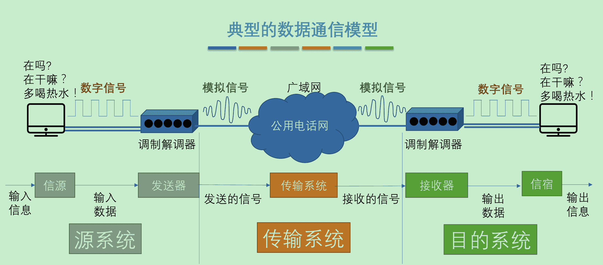

‍

​​

## 基本概念

* 物理层考虑的是怎样才能在连接各种计算机的传输媒体上**传输数据比特流**，而**不是**指具体的传输媒体。
* 作用：尽可能**屏蔽**掉不同传输媒体和通信手段的差异

‍

‍

计算速率问题

==经典问题- MB和Mbs的速率转换计算==

‍

​​

‍

​​

‍

## 数据通信基础知识

‍

### 数据通信系统的模型

‍

#### 三大部分

1. **源系统**（或发送端、发送方）
2. **传输系统**（或传输网络）
3. **目的系统**（或接收端、接收方）

‍

​​

‍

‍

#### **常用术语**

* 消息：如话音、文字、图像、视频等
* 数据：运送消息的实体。有意义的符号序列
* 信号：数据的电气的或电磁的表现

  * **模拟**信号 (analogous signal)：代表消息的参数的取值是**连续**的
  * **数字**信号 (digital signal)：代表消息的参数的取值是**离散**的
* 码元：在使用时间域（简称为**时域**）的波形表示数字信号时，代表不同离散数值的基本波形

  * 使用二进制编码时，只有两种不同的码元：0 状态，1 状态。
  * 有几种状态就是几进制码元 K进制的码元 – 码元的离散状态的个数（同样的一个波形可以对应几个比特
* 速率：码元传输速率：1s传输多少个码元

  * 信息传输速率：别名比特率、信息速率 – 1s传输多少个 比特
  * 若一个码元携带 nbit 的信息量，M baud 的码元传输速率对应的信息传输速率 = M * n bit/s
* 波特：码元传输速率的单位，每秒钟内通信线路状态改变的次数
* 带宽：表示在单位时间内从网络的某一点到另一点所能通过的最高数据率（理想中的）
* 失真: 现实中的信道干扰对信号源造成的干扰，部分干扰可恢复，部分不可恢复

  * 码间串扰：码元传输速度过快的时候让码元不清楚

‍

‍

### 信道基本概念

一般用来表示向某一个方向传送信息的媒体

‍

#### 通信类型

* 单工通信
* 半双工通信
* 全双工通信

‍

  

#### 基带信号

（即基本频带信号）

* 来自信源的信号。
* 包含有较多的低频成分，甚至有直流成分。

‍

‍

#### 调制

‍

##### 编码方式

​​

‍

- 不归零制：正电平代表 1，负电平代表 0
- 归零制：正脉冲代表 1，负脉冲(脉冲下沉)代表 0
- 曼彻斯特编码：位周期中心的向上跳变代表 0，位周期中心的向下跳变代表 1。但也可反过来定义。 **自同步**
- 差分曼彻斯特编码：在每一位的中心处始终都有跳变。位开始边界有跳变代表 0，而位开始边界没有跳变代表 1

​​

- 信号频率：
  - 曼彻斯特编码和差分曼彻斯特编码产生的信号频率比不归零制高
- 自同步能力：
  - 不归零制**不能**从信号波形本身中提取信号时钟频率（这叫做没有自同步能力）
  - 曼彻斯特编码和差分曼彻斯特编码具有**自同步能力**

‍

‍

##### 带通调制方法

基带信号往往包含有较多的低频成分，甚至有直流成分，而许多信道并不能传输这种低频分量或直流分量。必须对基带信号进行**调制** (modulation)

‍

最基本的调制方法有以下几种：

1. 调幅(AM)
2. 调频(FM)
3. 调相(PM)

‍

‍

‍

### 信道极限容量

‍

* 任何实际的信道都**不是理想**的，都**不可能**以任意高的速率进行传送。
* 码元传输的速率越高，或信号传输的距离越远，或噪声干扰越大，或传输媒体质量越差，在接收端的波形的**失真就越严重**。
* 限制码元在信道上的传输速率的两个因素

  * 信道能够通过的频率范围。
  * 信噪比。

‍

‍

#### 信道能通过频率范围

- 具体的信道所能通过的频率范围总是有限的。信号中的许多高频分量往往不能通过信道。
- **码间串扰**：接收端收到的信号波形**失去**了码元之间的清晰界限。

‍

‍

##### 奈氏准则

码元传输的最高速率 = 2W （码元/秒）

‍

‍

#### 信噪比

信噪比就是信号的平均功率和噪声的平均功率之比。常记为 S/N，并用分贝 (dB) 作为度量单位。即

$信噪比(dB) = 10 \log_{10}{(S/N)} (dB)$

‍

‍

##### 香农公式

信道的**极限**信息传输速率 C 可表达为：$C = W \log_{2} (1 + S/N ) (bit/s)$  

- W 信道的带宽 (Hz)
- S 为信道内所传信号的平均功率
- N 为信道内部的高斯噪声功率

> - 信道的带宽或信道中的信噪比越大，则信息的极限传输速率就越高。
> - 只要信息传输速率低于信道的极限信息传输速率，就一定可以找到某种办法来实现无差错的传输。

‍

提高信息的传输速率的方法：用编码的方法让每一个码元携带更多比特的信息量

若以同样的速率发送码元，则同样时间所传送的信息量就提高到了 3 倍

---

注意：奈氏准则和香农公式的意义不同

- 奈氏准则：**激励**工程人员不断探索更加先进的==编码技术==，使每一个码元携带更多比特的信息量。
- 香农公式：**告诫**工程人员，在实际有噪声的信道上，不论采用多么复杂的编码技术，都不可能突破==信息传输速率的绝对极限==。

在计算时要算两个定理之后说明一下取最小值​

‍

‍

## 物理层下面的传输媒体

‍

传输媒体是数据传输系统中在发送器和接收器之间的**物理通路**

‍

两大类

* 导引型传输媒体：电磁波被导引沿着固体媒体（铜线或光纤）传播。
* 非导引型传输媒体：指自由空间。非导引型传输媒体中电磁波的传输常称为**无线传输**。

‍

‍

### 导引型传输媒体

‍

#### **双绞线**

‍

#### **同轴电缆**

‍

#### **光纤**

- **多模光纤（近距离）**
- **单模光纤（远距离）**

‍

​​

‍

### 非导引型传输媒体

* 利用无线电波在自由空间的传播可较快地实现多种通信，因此将自由空间称为“非导引型传输媒体”

​​

#### 无线电微波通信

​​

#### 卫星通信

‍

‍

‍

## 信道复用技术

复用 (multiplexing) ：允许用户使用一个共享信道进行通信

‍

‍

### 频分复用

* 最基本。将整个带宽分为多份，用户在分配到一定的频带后，在通信过程中**自始至终**都占用这个频带
* 所有用户在同样的时间占用**不同的**带宽（即频带）资源

‍

‍

### 时分复用

- 将时间划分为一段段**等长的**时分复用帧（TDM帧）
- 每一个时分复用的用户在每一个 TDM 帧中占用固定序号的**时隙**
- 每一个用户所占用的时隙是**周期性**地出现（其周期就是TDM帧的长度）的

​​

‍

### 统计时分复用

**统计时分复用 STDM (Statistic TDM)**

STDM帧不是固定分配时隙，而是按需动态地分配时隙，因此可以提高线路的利用率

‍

‍

### 频分多址与时分多址

- 可让 N 个用户各使用一个频带，或让更多的用户轮流使用这 N 个频带。这种方式称为**频分多址接入 FDMA** (Frequency Division Multiple Access)，简称为**频分多址**。
- 可让 N 个用户各使用一个时隙，或让更多的用户轮流使用这 N 个时隙。这种方式称为**时分多址接入 TDMA** (Time Division Multiple Access)，简称为**时分多址**。

‍

‍

复用器 (multiplexer) 和分用器 (demultiplexer)成对使用

时分复用会导致信道利用率不高

‍

‍

### 波分复用

‍

波分复用 WDM (Wavelength Division Multiplexing) ：使用一根光纤来**同时传输**多个光载波信号。其中不同信号的波长, 进入调制器后变成波长不同的不同光束, 进入复用器后传递到接收端再用分用器解开, 各自通过解调器回归到原状

* 光的频分复用。由于光的频率很高，因此习惯上用波长而不是频率来表示所使用的光载波。

‍

掺铒光纤放大器: 光放大器, 高效

‍

‍

### 码分复用

* 每一个用户可以在**同样的时间**使用**同样的频带**进行通信。
* 各用户使用经过特殊挑选的不同码型，因此不会造成干扰。
* 当**码分复用 CDM** (Code Division Multiplexing) 信道为多个不同地址的用户所共享时，就称为**码分多址** CDMA (Code Division Multiple Access)。
* 常用的名词是码分多址 CDMA (Code Division Multiple Access)。
* 各用户使用经过特殊挑选的不同码型，因此彼此不会造成干扰。
* 这种系统发送的信号有很强的抗干扰能力，其频谱类似于白噪声，不易被敌人发现。

‍

‍

#### CDMA 工作原理 

- 将每一个比特时间划分为 m 个短的间隔，称为**码片** (chip)
- 为每个站指派一个**唯一的** m bit 码片序列
- 发送比特 1：发送自己的 m bit 码片序列
- 发送比特 0：发送该码片序列的二进制反码

一般来说，我们默认将 0 写成 -1，1 写成 +1 的形式

‍

---

例：S 站的 8 bit 码片序列是 00011011

- 1 → 00011011
- 0 → 11100100
- 码片序列：(–1 –1 –1 +1 +1 –1 +1 +1)

‍

> 共有四个站进行码分多址CDMA通信。四个站的码片序列为...。问哪个站发送数据了？发送数据的站发送的是0还是1？
>
> 将A、B、C、D四个码片序列分别与收到的码片序列正交
>
> |站名|码片序列|
> | ------| ------------------------------|
> |A|（－1－1－1＋1＋1－1＋1＋1）|
> |B|（－1－1＋1－1＋1＋1＋1－1）|
> |C|（－1＋1－1＋1＋1＋1－1－1）|
> |D|（－1＋1－1－1－1－1＋1－1）|
>
> |站名|计算过程(公式：S*A/m)|结果|
> | ------| --------------------------------------------| -------|
> |A|S•A／8 =（＋1－1＋3＋1－1＋3＋1＋1）／8=1|发送1|
>
> 直接用对应码片序列和这个每个位子上面的乘起来, 最后相加除以个数, 最后计算和. 1是1, -1是0, 0是沉默

‍
