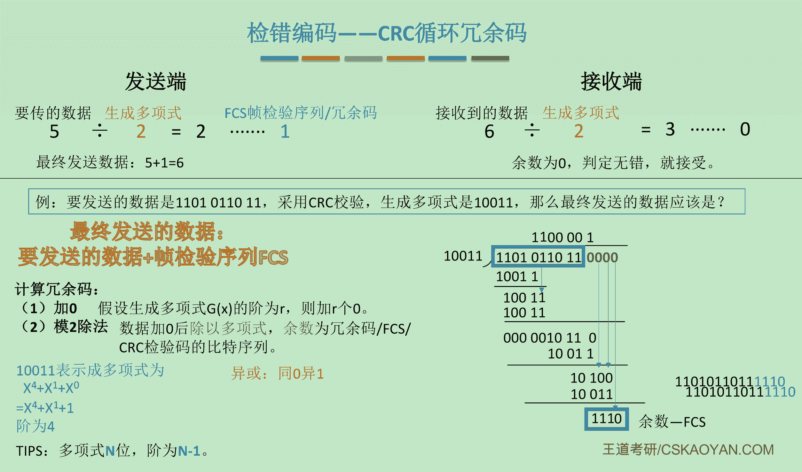
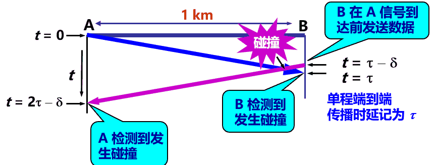

​​

‍

### Header

‍

|协议|名称|作用|
| ------| ------------------| --------------------------------------------------------------------------------------------------------------------|
|ARP|地址解析协议|根据IP地址获取物理地址|
|RARP|反向地址转换协议|根据物理地址获取IP地址|
|PPP|点对点协议|主要是用来通过拨号或专线方式建立点对点连接发送数据，使其成为各种主机、网桥和路由器之间简单连接的一种共通的解决方案|

‍

> 注意：不同的链路层可能采用不同的数据链路层协议

‍

​​

‍

数据链路层信道类型

- **点对点信道**
  * 使用一对一的**点对点**通信方式。
  * 因为不会发生碰撞，因此也比较简单，使用 PPP 协议进行控制
- **广播信道**
  * 使用一对多的**广播通信**方式。
  * 所有的节点都在同一个广播信道上发送数据，必须使用专用的**共享信道协议**来协调这些主机的数据发送。
  * 主要有两种控制方法进行协调，一个是使用信道复用技术，一是使用 CSMA/CD 协议

‍

‍

**局域网属于数据链路层**

‍

‍

‍

## 用点对点信道的数链层

‍

‍

### 数据链路

* 结点：主机和路由器
* 链路 (link) ：

  * 一条无源的点到点的物理线路段，中间**没有**任何其他的交换结点。
  * 一条链路只是一条通路的一个组成部分。
  * 或**物理链路**。
* 数据链路 (data link)：

  * 把实现控制数据传输的协议的硬件和软件加到链路上，就构成了数据链路。
  * 或**逻辑链路**。
  * 典型实现：适配器（即网卡）

‍

‍

### 帧

数据链路层协议数据单元：帧

‍

‍

### 三个基本问题

‍

#### **封装成帧**

- 封装成帧 (framing)：在一段数据的前后分别添加**首部和尾部**，构成一个帧
- 首部和尾部的一个重要作用就是进行**帧定界**（即确定帧的界限）

‍

‍

用帧首部和帧尾部封装成帧​​

**最大(数据)传送单元 MTU** (Maximum Transfer Unit) ：规定了所能传送的帧的数据部分长度上限 = 帧中的载荷大小

‍

用控制字符作为帧定界符

- 控制字符 SOH (Start Of Header) 放在一帧的最前面，表示帧的首部开始。
- 控制字符 EOT (End Of Transmission) 放在一帧的末尾，表示帧的结束。

​​

‍

#### **透明传输**

不管传送的什么样的比特组合，都应该在数据链路成上顺利传输

‍

- 问题：如果数据中的某个字节的二进制代码恰好和 SOH 或 EOT 一样，数据链路层就会**错误**地“找到帧的边界”，导致错误。
- 透明：指某一个实际存在的事物看起来却好像不存在一样。

> “在数据链路层透明传送数据”表示：无论发送什么样的比特组合的数据，这些数据都能够按照原样**没有差错**地通过这个数据链路层。

‍

用“字节填充”或“字符填充”法解决透明传输的问题

​​

几种方法

* ==字符计数法==：帧首部使用一个计数字段来表明字符数

  ​​
* ==字符填充法==：`SOH`​ 和`EOT`​填充为 Start of header 和 End of transmission

  * 传输的是二进制代码可能会出现结束字符一样的比特组合的时候，需要用字符填充法解决
  * 在控制信息的字符前添加`ESC`​**转义字符**
* ==零比特填充法==：在发送方只要连续 5 个 1，就填入 1 个 0。

  * 在接收端收到一个帧时，先找到标志字段确定边界，再扫描，5 个 1 就去掉 1 个 0。
* *违规编码法*：对于曼彻斯特编码使用“高高”、“低低”来确定帧的起始和终止

‍

‍

#### **差错控制**

 **（检测）**

‍

在传输过程中可能会产生比特差错(1位, 多位)

‍

> 在一段时间内，传输错误的比特占所传输比特总数的比率称为误码率 BER (Bit Error Rate)

‍

“无比特差错”与“无传输差错”是不同的

* **可靠传输**：数据链路层的发送端发送什么，在接收端就收到什么。
* **传输差错**可分为两大类： 位错, 帧错

  * 比特差错
  * 传输差错： 帧丢失、帧重复或帧失序等
* 在数据链路层使用 CRC 检验，能够实现无比特差错的传输，但这还不是可靠传输。
* 要做到可靠传输，还必须再加上**帧编号、确认和重传**等机制。

‍

##### 奇偶校验码

* 由 n-1 位信息元 1 位校验元构成
* 奇校验码：使得加上校验位之后，1 的个数为奇数；偶校验码：加上校验位之后1 的个数为偶数 （x………… 中，1的个数）
* 对于任何的比特数，检错率为 50%

‍

‍

##### CRC循环冗余检验

‍

​​

‍

‍

在数据后面添加上的冗余码称为**帧检验序列 FCS** (Frame Check Sequence)

‍

‍

###### **注意**

* 仅用循环冗余检验 CRC 差错检测技术只能做到**无差错接受** (accept)
* 即：“凡是接收端数据链路层接受的帧均无差错”

‍

> 补充：计算时一定要注意他给你的数据是待发送的，还是接收的！如果是接收的，就不要在后面加n-1个0了

‍

‍

‍

‍

### 流量控制与可靠传输协议

(嵌入)

‍

* 为了控制发送方的发送速度
* 和传输层的区别：数据链路层的流量控制是**点对点**的，传输层的流量控制是**端到端**的

  * 数据链路层的手段：接收方**收不下就不回复确认**
  * 传输层的流量控制手段：接收端给发送端一个**窗口公告**
* 主要方法：==停止-等待协议==、==滑动窗口协议==（GBN & SR）

  * 停等协议：发送窗口 = 1 接受窗口 = 1
  * 后退 N ：发送窗口 > 1，接收窗口 = 1
  * 选择重传：发送窗口 > 1，接收窗口 > 1
* 滑动窗口主要解决的问题：流量控制和可靠传输

‍

‍

#### 停止-等待协议

Stop-Wait Protocol

‍

* 是哪一层的问题？

  * 计算机网络发展前期质量不好，链路层要负责可靠传输，需要使用这些协议
  * 现在链路层可以暂时抛弃可靠传输，**交给传输层解决**
* 关于协议

  * 解决的问题：为了解决丢包的问题
  * 研究的前提：仅讨论单工通信
* 协议细节：​​

  * 每次发送之后都启动一个计时器，超时计时器应当比 RTT 更长一些（自动重传）
  * 发送完后必须保留副本

‍

‍

#### 回退 N 协议

Go Back N Protocol    **GBN**

‍

* 停止等待协议信道利用率过低
* 协议中的窗口：

  * 发送窗口：发送方维持一组连续的允许发送的帧序号
  * 接收窗口：接收方维持一组连续的允许接收帧的序号
* 累计确认：GBN协议采用了累计确认的方式，表明接收方已经收到了 n 号帧和它之前的全部帧
* 超时事件：出现超时的时候，发送方会重传所有已发送但没有被确认的帧
* 协议细节：

  * ​​
  * 对于发送方：确认窗口，开启计时器，超时回退重传
  * 对于接收方：若正确，发送 ACK，并将数据交付上层
  * 若错误，则直接丢弃帧，并且按照最近接收到的帧重新发送 ACK，接收方无需缓存任何失序帧，只需要维护一个 `expectedSeqnum`​
  * 规定窗口的大小不能超过$2^{(n)}-1$，其中n为有多少个比特来标志了序号

‍

‍

‍

#### 选择重传协议

Selectve Repeat Protocol    **SR**

‍

* 解决问题：对于 GBN 算法中可能会出现批量重传的问题（一次性损失太大）

  * **只重传出错的帧**，设置单个确认而不是累计确认，设置接收缓存，缓存乱序的帧
* 协议中的窗口：

  * 发送窗口 & 接收窗口均大于 0，如果下界未收到确认，将不会滑动
  * 接收窗口：只有窗口下界接收到才会滑动，后面为收到的处于等待接状态
  * ​​
* 协议细节：​​

  * 调用：检查下一个帧序号，如果位于窗口中则发送，否则缓存数据或者先返回上层
  * 发送方：收到 ACK，则帧将会标记为已接收，如果是窗口下界则前进窗口
  * 超时则重传未收到确认的帧
  * 接收方：对于窗口内的帧来者不拒（不管其顺序）
  * 失序的帧将会被缓存，并且向发送方发送确认帧。
  * 如果收到了窗口之外的帧，说明==ACK 在传输过程中丢失==，并且重新发送确认帧
* 滑动窗口的长度：

  * 发送窗口最好等于接收窗口（大了会溢出，小了没意义）
  * 规定窗口的大小不能超过$2^{(n-1)}$，其中n为有多少个比特来标志了序号。（为了避免出现二义性）

‍

‍

## 点对点协议 PPP

PPP 协议

‍

对于点对点的链路，目前使用得最广泛的数据链路层协议是**点对点协议 PPP** (Point-to-Point Protocol)。

> 用户到 ISP 的链路使用 PPP 协议 (多个用户 -> 接入网 -> ISP -> 互联网)

‍

‍

‍

### 组成部分

- 一个将 IP 数据报**封装**到串行链路的方法。
- 一个**链路控制协议 LCP** (Link Control Protocol)
- 一套**网络控制协议 NCP** (Network Control Protocol)

‍

‍

‍

### 帧格式

‍

​​

* F 字段为帧的定界符
* A 和 C 字段暂时没有意义
* FCS 字段是使用 CRC 的检验序列
* 信息部分的长度不超过 1500

‍

‍

#### **各字段的意义**

- 首部：4 个字段
  - 标志字段 F： 0x7E 。连续两帧之间只需要用一个标志字段。
  - 地址字段 A：只置为 0xFF。实际上不起作用。
  - 控制字段 C：通常置为 0x03。
  - 协议字段。
- 尾部：2 个字段。

‍

‍

#### 透明传输问题

- 当 PPP 用在异步传输时，使用**字节填充法**。
- 当 PPP 用在同步传输链路时，采用**零比特填充法**。

‍

‍

**字节填充**

填充特定字节

​​

‍

**零比特填充**

信息中出现了完全和标志字段一致的组合, 在5个连续的1中插入0再发送, 然后接收端删除这些0

‍

​​

‍

## 动态信道划分方式

(嵌入)

‍

‍

### 令牌传递协议

（轮询访问介质访问控制）

* 主要问题：令牌开销、等待延迟、单点故障
* 主要适用环境：**负载较重、通信量较大的网络**

‍

‍

### ALOHA 协议

（以下为随机访问介质访问控制）

‍

* 纯 ALOHA 协议：随机重新发送，不按时间槽发送
* 如果发生了冲突，则重新发送（接收方会检测是否发生了冲突，若发送方在一段时间内接受不到，则认定为冲突发生）
* 分槽 ALOHA 协议：分时间内槽发送，所有用户在时间片开始的时候同步接入网络信道，若发生冲突，则必须等到下一个时间片开始的时候才发送 (一个时间片为碰撞期^（大概是这么说吧, 有选择题）^)
* 相比纯 ALOHA：发生碰撞的概率更小，吞吐量和效率更高

‍

‍

### CSMA 协议

*Carrier Sense Multiple Access*

> 另见下方

* CS 载波侦听：每一个站在发送数据前先检测是否有其他计算器在发送数据
* MA 多点接入：多个计算器接入同一根总线

‍

* 坚持 CSMA / persistent CSMA：

  * 空闲则直接传输，无需等待；忙则一直监听，一空闲马上传输
* 非坚持 CSMA / non-persistent CSMA：

  * 空闲则直接传输，无需等待；忙则等待一个随机的时间之后再监听
* p-坚持 CSMA / p-persistent CSMA：

  * 空闲则以 p 概率直接传输，概率 1-p 等到下一个时间槽开始的时候传输；
  * 忙则等待一个随机的时间之后再监听
  * 既能减少冲突，又可以减少空闲等待时间

‍

‍

### CSMA/CD

*Carrier Sense Multiple Access / Collision Detection*

> 另见下方

* 传播时延对载波侦听的影响：当出现数据碰撞的时候停止发送
* 最迟检测碰撞的时间：2t，其中 t 为单程传播时延（2t = 碰撞窗口/冲突窗口/争用期）
* 确认重传时机的细节：

  * 确认退避时间（2t）> 定义参数 $k = min{重传次数, 10}$
  * 从离散的整数集合 ${0, 1, 2, …, 2^k -1}$选择一个数 r，退避时间即为 r 倍的基本退避时间
  * 当重传了 16次 仍然然不成功，说明网络太拥挤，抛弃。
* 最小帧长问题：

  * 为了能使协议检测到碰撞的时候数据还没有传输完成
  * 帧的传输时延至少要两倍于信号在总线中的传输时延

    * *最小帧长 =*   *总线传播时延* *数据传输速率* *2 =*   *2t* *数据传输速率**
    * 以太网规定的最短帧长为 64B，长度更小的会被认定为冲突帧。所以在发送前需要进行字节填充。

‍

‍

### CSMA/CA

*Carrier Sense Multiple Access / Collision Avoidance*

> 另见下方

* 主要用于无线局域网，无法做到全面检测，解决隐蔽站问题
* 让周围的所有节点都能够知道某个信道要发送数据
* 协议细节

  * 发送数据前，先检测信道是否空闲。发送`RTS`​​​​帧（Request to send），等待接收端发送`CTS`​​​​（Clear to send）
  * 发送端`CTS`​​​​后会预约信道，告诉其他信道自己要传送多少数据
  * 接收端收到数据后用 CRC 检验数据是否正确，正确则响应 ACK
  * 发送方收到 ACK之后可以进行下一个帧的发送（二进制退避算法计算推迟时间）
* 和 CSMA/CD 相比：

  * CSMA/CD 用于以太网，CSMA/CA 用于无线局域网
  * *载波检测不同*

‍

‍

‍

## 用广播信道的数链层

‍

‍

### 局域网的数链层

- 局域网最主要的特点：
  - 网络为一个单位所拥有；
  - 地理范围和站点数目均有限。
- 局域网具有如下主要优点：
  - 具有广播功能，从一个站点可很方便地访问全网。
  - 便于系统的扩展和逐渐地演变，各设备的位置可灵活调整和改变。
  - 提高了系统的可靠性、可用性和生存性。

‍

‍

#### 局域网拓扑结构

局域网是一种典型的广播信道，主要特点是网络为一个单位所拥有，且地理范围和站点数目均有限。

目前以太网占领着有线局域网市场

‍

可以按照网络拓扑结构对局域网进行分类

* 星形网
* 环形网
* 总线网
* 树形网

‍

‍

#### 局域网传输媒体

‍

共享信道带来的问题：若多个设备在共享的广播信道上**同时发送**数据，则会造成彼此干扰，导致发送失败

‍

‍

#### 媒体共享技术

- 静态划分信道
  - 频分复用
  - 时分复用
  - 波分复用
  - 码分复用
- 动态媒体接入控制（多点接入）
  - 随机接入：所有的用户可随机地发送信息。
  - 受控接入：用户必须服从一定的控制。如轮询(polling)。

‍

‍

#### **以太网的两个标准**

- DIX Ethernet V2：世界上第一个局域网产品（以太网）的规约
- IEEE 802.3：第一个 IEEE 的以太网标准

> - 这两种标准的硬件实现可以在同一个局域网上**互操作**。
> - 这两个标准标准只有很小的差别，因此很多人也常把 802.3局域网简称为“以太网”。

‍

‍

#### 两个子层 LLC | MAC

局域网的数据链路层分为 2 个子层

‍

* 逻辑链路控制 LLC (Logical Link Control)子层
* 媒体接入控制 MAC (Medium Access Control)子层

‍

‍

#### **适配器**

计算机通过适配器和局域网进行通信

网络接口板又称为通信适配器(adapter) 或 网络接口卡 NIC (Network Interface Card)，或“网卡”

‍

重要功能

- 进行串行/并行转换。
- 对数据进行缓存。
- 在计算机的操作系统安装设备驱动程序。
- 实现以太网协议。

‍

‍

‍

### CSMA/CA 协议

不怎么考

‍

CSMA/CD 与 CSMA/CA机制都从属于CSMA的思路，其核心是**先听再说**。换言之，两个在接入信道之前都须要进行监听。当发现信道空闲后，才能进行接入

* 传输介质不同：CSMA/CD 用于总线式以太网【有线】，而CSMA/CA用于无线局域网【无线】
* 载波检测方式不同：因传输介质不同，CSMA/CD与CSMA/CA的检测方式也不同。CSMA/CD通过电缆中电压的变化来检测，当数据发生碰撞时，电缆中的电压就会随着发生变化；而CSMA/CA采用能量检测（ED）、载波检测（CS）和能量载波混合检测三种检测信道空闲的方式。
* CSMA/CD检测冲突，CSMA/CA避免冲突，二者出现冲突后都会进行有上限的重传。

‍

‍

### CSMA/CD 协议

CSMA/CD 表示载波监听多点接入 / 碰撞检测。

* **多点接入** ：说明这是总线型网络，许多主机以多点的方式连接到总线上。
* **载波监听** ：每个主机都必须不停地监听信道。在发送前，如果监听到信道正在使用，就必须等待。
* **碰撞检测** ：在发送中，如果监听到信道已有其它主机正在发送数据，就表示发生了碰撞。虽然每个主机在发送数据之前都已经监听到信道为空闲，但是由于电磁波的传播时延的存在，还是有可能会发生碰撞。

‍

* 最早的以太网：将许多计算机都连接到一根**总线**上。
* 总线特点：易于实现广播通信，简单，可靠。​​
* 为了实现**一对一**通信，将接收站的硬件地址写入帧首部中的**目的地址**字段中。仅当数据帧中的目的地址与**适配器硬件地址**一致时，才能接收这个数据帧。
* 总线缺点：多个站点同时发送时，会产生发送碰撞或冲突，导致发送失败。

‍

‍

#### 以太网

以太网是一种星型拓扑结构局域网。

早期使用集线器进行连接，集线器是一种物理层设备， 作用于比特而不是帧，当一个比特到达接口时，集线器重新生成这个比特，并将其能量强度放大，从而扩大网络的传输距离，之后再将这个比特发送到其它所有接口。如果集线器同时收到两个不同接口的帧，那么就发生了碰撞。

目前以太网使用交换机替代了集线器，交换机是一种链路层设备，它不会发生碰撞，能根据 MAC 地址进行存储转发

‍

**以太网采取的2种重要措施**

‍

1. 采用较为灵活的**无连接的工作方式**。

   - 不必先建立连接就可以直接发送数据。
   - 对发送的数据帧不进行编号，也不要求对方发回确认。
   - 提供不可靠的交付服务

     - 尽最大努力的交付。
     - 对有差错帧是否需要重传则由高层来决定。
   - 同一时间只能允许一台计算机发送

     - 以太网采用最简单的随机接入。
     - 使用 CSMA/CD 协议减少冲突发生的概率。
2. 发送的数据都使用曼彻斯特 (Manchester) 编码。  

   > 曼彻斯特编码缺点：所占的频带宽度比原始的基带信号**增加了一倍**。
   >

‍

‍

#### 要点

CSMA/CD (Carrier Sense Multiple Access with Collision Detection) ：**载波监听多点接入 / 碰撞检测**。

‍

* 多点接入：说明这是总线型网络。许多计算机以多点接入的方式连接在一根总线上。
* 载波监听：即“边发送边监听”。不管在想要发送数据之前，还是在发送数据之中，每个站都必须不停地检测信道。
* 碰撞检测：适配器边发送数据，边检测信道上的信号电压的变化情况。电压摆动值超过一定的门限值时，就认为总线上至少有两个站同时在发送数据，表明产生了碰撞（或冲突）。

  检测到碰撞后

  * 适配器立即停止发送。
  * 等待一段随机时间后再次发送。

‍

三种CSMA

‍

* 1-坚持CSMA
* 非坚持CSMA
* p-坚持CSMA

‍

发送策略

||1-坚持CSMA|非坚持CSMA|p-坚持CSMA|
| ----------| ------------| ----------------| ---------------------------------|
|信道空闲|立刻发送|立刻发送|p概率发送, 不然下一个时隙再发送|
|信道忙|继续监听|等随机时刻再来|持续监听, 等空闲时候p概率发送|

‍

‍

##### 最小帧长

‍

* 以太网规定最小帧长为64字节，即512比特(512比特时间即为争用期);  

  * 如果要发送的数据非常少，那么必须加入一些填充字节，使帧长不小于64字节。
* 以太网的最小帧长确保了主机可在帧发送完成之前就检测到该帧的发送过程中是否遭遇了碰撞;  

  * 如果在争用期（共发送64字节)没有检测到碰撞，那么后续发送的数据就**一定不会发生碰撞**; 如果在争用期内检测到碰撞，就立即中止发送，这时已经发送出去的数据**一定小于64字节**, 因此凡长度小于64字节的帧都是由于碰撞而异常中止的无效帧。

‍

‍

##### 最大帧长

略

‍

##### 信道利用率

同下文信道利用率计算公式

$S_{max} = \frac{T_{0}}{T_{0} + \tau} = \frac{1}{1 + a}$

提升: 端到端距离尽可能小, 帧长尽可能长

‍

‍

#### 工作流程

记端到端的传播时延为 τ，最先发送的站点最多经过 2τ 就可以知道是否发生了碰撞，称 2τ 为 **争用期** 。只有经过争用期之后还没有检测到碰撞，才能肯定这次发送不会发生碰撞。

当发生碰撞时，站点要停止发送，等待一段时间再发送。这个时间采用 **截断二进制指数退避算法** 来确定。从离散的整数集合 {0, 1, .., (2^k^-1)} 中随机取出一个数，记作 r，然后取 r 倍的争用期作为重传等待时间

‍

​​

‍

‍

##### 载波监听CS

是指每一个站在发送数据之前先要检测一下总线上是否有其他计算机在发送数据，如果有，则暂时不要发送数据，以免发生碰撞

‍

##### 碰撞检测CD

为什么要进行碰撞检测？ 因为信号**传播时延**对载波监听产生了影响

‍

​​

> 每一个站在自己发送数据之后的一小段时间内，存在着遭遇碰撞的可能性。  
> A 需要单程传播时延的 2 倍的时间，才能检测到与 B 的发送产生了冲突。

* **碰撞检测”** 就是计算机**边发送数据边检测**信道上的信号电压大小。

  * 当几个站同时在总线上发送数据时，总线上的信号电压摆动值将会增大（互相叠加）。
  * 当一个站检测到的信号电压摆动值超过一定的门限值时，就认为总线上至少有两个站同时在发送数据，表明产生了碰撞。
* **所谓“碰撞”就是发生了冲突。因此“碰撞检测”也称为“冲突检测”。**

  * 在发生碰撞时，总线上传输的信号产生了严重的失真，无法从中恢复出有用的信息来。
  * **每一个正在发送数据的站，一旦发现总线上出现了碰撞，就要立即停止发送，免得继续浪费网络资源，然后等待一段随机时间后再次发送。**

‍

‍

‍

##### 争用期（碰撞窗口）

* 以太网的端到端往返时延 $2 \tau$ 称为**争用期**，或**碰撞窗口**。
* 经过争用期这段时间还没有检测到碰撞，才能肯定这次发送不会发生碰撞。
* 每一个主机在自己发送帧之后的一小段时间内，存在着遭遇碰撞的可能性。这一小段时间是不确定的。它取决于另个发送帧的主机到本主机的距离，但不会超过总线的端到端往返传播时延，即一个争用期时间。
* 显然，在以太网中发送帧的主机越多，端到端往返传播时延越大，发生碰撞的概率就越大。因此，共享式以太网不能连接太多的主机，使用的总线也不能太长。

> 经过争用期这段时间还没有检测到碰撞，才能肯定这次发送不会发生碰撞。

‍

‍

‍

##### 碰撞后重传的时机

采用**截断二进制指数退避** (truncated binary exponential backoff) 确定

‍

‍

‍

### 使用集线器的星形拓扑

‍

传统以太网传输媒体：粗同轴电缆 → 细同轴电缆 → 双绞线。采用双绞线的以太网采用**星形拓扑**。在星形的中心则增加了一种可靠性非常高的设备，叫做**集线器** (hub)

* 传统以太网使用同轴电缆，采用总线形拓扑结构
* 采用双绞线的以太网采用星形拓扑

‍

‍

#### 集线器

‍

特点

- 使用电子器件来模拟实际电缆线的工作，因此整个系统仍然像一个**传统的以太网**那样运行。
- 使用集线器的以太网**在逻辑上仍是一个总线网**，各工作站使用的还是 CSMA/CD 协议，并共享逻辑上的总线。
- 很像一个多接口的转发器，**工作在物理层**。
- 采用了**专门芯片**，进行自适应串音回波抵消，减少了近端串音。

‍

‍

‍

### 以太网的信道利用率

多个站在以太网上同时工作就可能会发生碰撞。

当发生碰撞时，信道资源实际上是被浪费了。因此，当扣除碰撞所造成的信道损失后，**以太网总的信道利用率并不能达到 100%** 。

‍

假设：单程端到端传播时延 = $\tau$ ，则争用期长度 = $2 \tau$ 。检测到碰撞后不发送干扰信号。

设：$帧长 = L (bit)$，$数据发送速率 = C (bit/s)$，则 $帧的发送时间 T_{0} = L/C (s)$。

‍

​​

‍

#### 以太网信道被占用的情况

一个站在发送帧时出现了碰撞。经过一个征用期2τ后，可能又出现了碰撞。这样经过若干个征用期后，一个站发送成功了。假定发送帧需要的时间是T0.

​​

> 注意：成功发送一个帧需要占用信道的时间是 $T_{0} + \tau$，比帧的发送时间要多一个单程端到端时延 $\tau$

‍

‍

#### 参数 a 与利用率

- 要提高以太网的信道利用率，就必须减小 $\tau$ 与 $T_{0}$ 之比。
- 在以太网中定义了参数 a = 以太网单程端到端时延 $\tau$ 与帧的发送时间 $T_{0}$ 之比：$a = \frac{\tau}{T_{0}}$

> a → 0，表示一发生碰撞就立即可以检测出来， 并立即停止发送，因而信道利用率很高。  
> a 越大，表明争用期所占的比例增大，每发生一次碰撞就浪费许多信道资源，使得信道利用率明显降低。

‍

‍

‍

#### 对以太网参数 a 的要求

‍

- 为提高利用率，以太网的参数 a 的值应当**尽可能小**些。
- 当数据率一定时，以太网的连线的**长度受到限制**，否则 $\tau$ 的数值会太大。
- 以太网的**帧长不能太短**，否则 T0 的值会太小，使 a 值太大。

‍

‍

#### 信道利用率的最大值

就是发送时间占总时间(发送加一个t)的比值

‍

$S_{max} = \frac{T_{0}}{T_{0} + \tau} = \frac{1}{1 + a}$  

‍

‍

‍

### 以太网MAC层

‍

#### **MAC 层的硬件地址**

**硬件地址**又称为**物理地址**，或 **MAC 地址**

‍

‍

#### 适配器的过滤功能

- 每收到一个 MAC 帧，先用硬件检查帧中的 MAC 地址。
- 如果是**发往本站**的帧则收下，然后再进行其他的处理。
- 否则就将此帧丢弃，不再进行其他的处理。

‍

“发往本站的帧”包括以下 3 种帧

- 单播 (unicast) 帧（一对一）
- 广播 (broadcast) 帧（一对全体）
- 多播 (multicast) 帧（一对多）

‍

‍

#### **MAC 帧的格式**

- 常用的以太网 MAC 帧格式有 2 种标准：
  - DIX Ethernet V2 标准
  - IEEE 的 802.3 标准
- 最常用的 MAC 帧是**以太网 V2 的格式，但大家也常常把它称为 IEEE 802.3 标准的 MAC 帧。**

‍

‍

**以太网 V2 的 MAC 帧格式**

‍

‍

​​

‍

* 类型字段用来标志**上一层**使用的是什么协议，以便把收到的 MAC 帧的数据上交给上一层的这个协议。
* 数据字段的正式名称是 **MAC 客户数据字段**。最小长度 64 字节 - 18 字节的首部和尾部 = 数据字段的最小长度（46字节）
* 当数据字段的长度小于 46 字节时，应在数据字段的后面加入整数字节的**填充字段**，以保证以太网的 MAC 帧长不小于 64 字节
* 由硬件在帧的前面插入 8 字节。第一个字段共 7 个字节，是前同步码，用来迅速实现 **MAC 帧的比特同步**。第二个字段 1 个字节是帧开始定界符，表示**后面的信息就是 MAC 帧**。

  * 为了达到比特同步，在传输媒体上实际传送的要比 MAC 帧还多 8 个字节
* 以太网还规定了帧间间隔为96比特时间，因此，**MAC帧不需要帧结束定界符**

‍

‍

**无效的 MAC 帧**

- 数据字段的长度与长度字段的值不一致
- 帧的长度不是整数个字节
- 用收到的帧检验序列 FCS 查出有差错
- 数据字段的长度不在 46 ~ 1500 字节之间
- 有效的 MAC 帧长度为 64 ~ 1518 字节之间

> - 对于检查出的无效 MAC 帧就简单地**丢弃**。
> - 以太网**不负责重传**丢弃的帧。

‍

‍

‍

## 扩展以太网

‍

### 物理层扩展

‍

#### 使用光纤扩展

主机使用光纤和一对光纤调制解调器连接到集线器

‍

#### 使用集线器扩展

用多个集线器连成更大的以太网

‍

- 优点
  - 使原来属于不同碰撞域（冲突域）的计算机能够**跨碰撞域通信**。
  - 扩大了以太网覆盖的地理范围。
- 缺点
  - 碰撞域增大了，总的吞吐量未提高。
  - 如果使用不同的以太网技术（如数据率不同），那么就不能用集线器将它们互连起来。

‍

‍

#### 碰撞域

**碰撞域**（collision domain）又称为**冲突域**，指网络中一个站点发出的帧会与其他站点发出的帧产生碰撞或冲突的那部分网络

‍

​​

‍

### 数据链路层扩展

更为常用。早期使用**网桥**，现在使用以太网**交换机**

‍

‍

**从总线以太网到星形以太网**

* 早期

  * 采用无源的总线结构。
  * 使用 CSMA/CD 协议，以半双工方式工作。
* 现在

  * 以太网交换机为中心的星形结构
  * 不使用共享总线，没有碰撞问题，不使用 CSMA/CD 协议，以全双工方式工作。但仍然采用以太网的帧结构。

---

**网桥与以太网交换机**

‍

- 网桥
  - 工作在数据链路层。
  - 根据 MAC 帧的目的地址对收到的帧进行转发和过滤。或者转发，或者丢弃。
- 交换机
  - 工作在数据链路层。
  - 多端口的网桥。
  - 可明显地提高以太网的性能。

‍

‍

#### 三层设备的区别

‍

* 路由器    可以互联两个不同网络层协议的网段
* 网桥    可以互联两个物理层和链路层不同的网段
* 集线器    不能互联两个物理层不同的网段

‍

||能否隔离冲突域 |能否隔离广播域|
| ------------------------------------| :----------------: | :--------------: |
|物理层设备【傻瓜】(中继器、集线器)|×|×|
|链路层设备【路人】(网桥、交换机）|√|×|
|网络层设备【大佬】(路由器）|√|√|

‍

‍

#### **以太网交换机(网桥)**

‍

* 实质上是一个**多接口网桥**。

  * 通常有十几个或更多的接口。
* 每个接口都直接与一个单台主机或另一个以太网交换机相连，并且一般都工作在**全双工**方式。
* 以太网交换机具有**并行性**。

  * 能同时连通多对接口，使多对主机能同时通信。
  * 相互通信的主机都独占传输媒体，无碰撞地传输数据。
  * 每一个端口和连接到端口的主机构成了一个碰撞域。

    > 以太网交换机的每个接口都是一个碰撞域: 结构
    >
    > * 以太网交换机A
    >
    >   * ->集线器1(一个碰撞域)
    >
    >     * PC1
    >     * PC2
    >     * ...
    >   * ->集线器2(另一个碰撞域)
    >
    >     * ...
    >
* 接口有**存储器**。
* **即插即用**。其内部的帧**交换表**（又称为**地址表**）是通过**自学习算法**自动地逐渐建立起来的。这种交换表就是一个内容可寻址存储器CAM (Content addressable Memory)。
* 使用**专用的交换结构芯片**，用硬件转发，其转发速率要比使用软件转发的网桥快很多。
* > 以太网交换机的性能远远超过普通的集线器，而且价格并不贵。
  >
* 每个用户独享带宽，增加了总容量

  * 集线器中N个用户只能共享平均分流其提供的带宽
  * 交换机为每个带宽都提供一定带宽, N用户每个占用B带宽, 总容量就达到B * N

---

‍

* 网桥工作在数据链路层，它根据 MAC 帧的目的地址对收到的帧进行转发。  
  网桥具有过滤帧的功能。当网桥收到一个帧时，并不是向所有的接口转发此帧，而是先检查此帧的目的 MAC 地址，然后再确定将该帧转发到哪一个接口 

  * 优点

    * 过滤通信量。
    * 扩大了物理范围。
    * 提高了可靠性。
    * 可互连不同物理层、不同 MAC 子层和不同速率（如10 Mb/s 和 100 Mb/s 以太网）的局域网。
  * 缺点

    * 存储转发增加了时延。
    * 在MAC 子层并没有流量控制功能。
    * 具有不同 MAC 子层的网段桥接在一起时时延更大。
    * 网桥只适合于用户数不太多(不超过几百个)和通信量不太大的局域网，否则有时还会因传播过多的广播信息而产生网络拥塞。这就是所谓的广播风暴。

‍

‍

##### 交换方式

- 存储转发方式
  - 把整个数据帧先缓存，再进行处理。
- 直通 (cut-through) 方式
  - 接收数据帧的同时立即按数据帧的目的 MAC 地址决定该帧的转发接口。
  - 缺点：不检查差错就直接将帧转发出去，有可能转发无效帧。

‍

‍

##### 交换机**自学习功能**

交换机具有自学习能力，学习的是交换表的内容，交换表中存储着 MAC 地址到接口的映射。  
正是由于这种自学习能力，因此交换机是一种即插即用设备，不需要网络管理员手动配置交换表内容。

‍

流程介绍

- 开始时，交换表是空的
- A 先向 B 发送一帧。该帧从接口 1 进入到交换机。
- 交换机收到帧后，先查找交换表。没有查到应从哪个接口转发这个帧给 B。
- 交换机把这个帧的源地址 A 和接口 1 写入交换表中。
- 交换机向除接口 1 以外的所有的接口广播这个帧。
- 由于与该帧的目的地址不相符，C 和 D 将丢弃该帧。
- B 向 A 发送一帧。该帧从接口 3 进入到交换机。
- 交换机收到帧后，先查找交换表。发现交换表中的 MAC 地址有 A，表明要发送给 A 的帧应从接口 1 转发出去。于是就把这个帧传送到接口 1 转发给 A。
- 交换机把这个帧的源地址 B 和接口 3 写入交换表中。

> 考虑到可能有时要在交换机的接口更换主机，或者主机要更换其网络适配器，这就需要更改交换表中的项目。为此，在交换表中每个项目都设有一定的**有效时间**。**过期的项目就自动被删除**。

> 这种**自学习**方法使得以太网交换机能够即插即用，不必人工进行配置。

‍

​​

##### 消除回路

使用生成树协议（SPT）(Spanning Tree Protocol)

‍

要点

- **不改变**网络的实际拓扑，但**在逻辑上**则切断某些链路，使得从一台主机到所有其他主机的路径是**无环路的树状结构**，从而消除了兜圈子现象。

​​

‍

‍

### 虚拟局域网

‍

#### 背景问题

以太网存在的主要问题

- 广播风暴
- 安全问题
- 管理困难

‍

‍

##### **广播风暴**​​

一个以太网是一个广播域

‍

**广播域**

（broadcast domain）指这样一部分网络，其中任何一台设备发出的广播通信都能被该部分网络中的所有其他设备所接收。

交换机之间的冗余链路形成广播风暴  
​​

‍

##### **安全问题**

- 交换机每个接口都处于一个**独立的碰撞域**（或冲突域）中，但所有计算机都处于**同一个广播域**中。
- 无法隔离不同部门的通信  
  ​​

‍

#### 定义

‍

虚拟局域网 VLAN

* 利用以太网交换机可以很方便地实现虚拟局域网 VLAN (Virtual LAN)
* IEEE 802.1Q 对虚拟局域网 VLAN 的定义：

  * **虚拟局域网 VLAN** 是由一些局域网网段构成的**与物理位置无关的逻辑组**，而这些网段具有某些共同的需求。每一个 VLAN 的帧都有一个明确的标识符，指明发送这个帧的计算机是属于哪一个 VLAN。

> 虚拟局域网其实只是局域网给用户提供的一种**服务**，并**不是**一种新型局域网。

‍

​​虚拟局域网限制了接收广播信息的工作站数，使得网络不会因传播过多的广播信息 (即“广播风暴”) 而引起性能恶化。

‍

‍

‍

‍

#### 划分方法

‍

划分虚拟局域网的方法

‍

- 基于交换机端口
  - 最简单、也是最常用的方法。
  - 属于在第 1 层划分虚拟局域网的方法。
  - 缺点：不允许用户移动。
- 基于计算机网卡的 MAC 地址
  - 根据用户计算机的 **MAC 地址**划分虚拟局域网。
  - 属于在第 2 层划分虚拟局域网的方法。
  - 允许用户移动。
  - 缺点：需要输入和管理大量的 MAC 地址。如果用户的 MAC 地址改变了，则需要管理员重新配置VLAN。
- 基于协议类型  
  - 根据以太网帧的第三个字段“**类型**”确定该类型的协议属于哪一个虚拟局域网。
  - 属于在第 2 层划分虚拟局域网的方法。
- 基于 IP 子网地址  
  - 根据以太网帧的第三个字段“类型”和 IP 分组首部中的源 IP 地址字段确定该 IP 分组属于哪一个虚拟局域网。
  - 属于在第 3 层划分虚拟局域网的方法。
- 基于高层应用或服务  
  - 根据高层应用或服务、或者它们的组合划分虚拟局域网。
  - 更加灵活，但更加复杂。

‍

‍

‍

##### 交换机

交换机的端口类型有以下三种:

* Access

  * 交换机与用户计算机之间的互连
  * 核心 同一个VLAN内部可以广播通信，不同VLAN不可以广播通信
* Trunk

  * 交换机之间或交换机与路由器之间的互连
  * "都可以"
* Hybrid

‍
