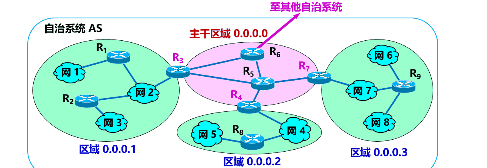

​​

网络层是整个互联网的核心，因此应当让网络层尽可能简单。网络层向上只提供简单灵活的、无连接的、尽最大努力交互的数据报服务。

使用 IP 协议，可以把异构的物理网络连接起来，使得在网络层看起来好像是一个统一的网络

‍

‍

|协议|名称|作用|
| ------| ----------------------| --------------------------------------------------------------------------------------------------------------------------------|
|IP|网际协议|IP协议不但定义了数据传输时的基本单元和格式，还定义了数据报的递交方法和路由选择|
|ICMP|Internet控制报文协议|ICMP就是一个“错误侦测与回报机制”，其目的就是让我们能够检测网路的连线状况﹐也能确保连线的准确性，是ping和traceroute的工作协议|
|RIP|路由信息协议|使用“跳数”(即metric)来衡量到达目标地址的路由距离|
|IGMP|Internet组管理协议|用于实现组播、广播等通信|

‍

‍

‍

## 概念

‍

### 对象

与IP协议配套使用的还有三个协议：

* 地址解析协议ARP
* 网际控制报文协议ICMP
* 网际组管理协议IGMP

‍

有以下五种不同的中间设备：

* 物理层中继系统：转发器
* 数据链路层中继系统：网桥或桥接器
* 网络层中继系统：路由器
* 网桥和路由器的混合物：桥路器
* 网络层以上的中继系统：网关

‍

使用IP协议的虚拟互联网络可以简称为IP网，互联网就是一个虚拟互联网络。

‍

‍

### 虚电路服务与数据报服务

> 争论：
>
> * 网络层应该向运输层提供怎样的服务？**面向连接**还是**无连接**？
> * 在计算机通信中，**可靠交付**应当由谁来负责？是**网络**还是**端系统**？
>
> ‍
>
> 2 种观点：
>
> * 面向连接的可靠交付。
> * 无连接的、尽最大努力交付的数据报服务，不提供服务质量的承诺。

‍

‍

#### 可靠

‍

一种观点：让网络负责可靠交付

- 计算机网络**模仿电信网络**，使用**面向连接**的通信方式。
- 通信之前先建立**虚电路 VC** (Virtual Circuit) (即连接)，以保证双方通信所需的一切网络资源。
- 如果再使用**可靠传输**的网络协议，可使所发送的分组无差错按序到达终点，不丢失、不重复。

‍

虚电路服务：H1 发送给 H2 的所有分组都沿着同一条虚电路传送  
​​

> 虚电路只是一条**逻辑上的连接**，分组都沿着这条逻辑连接按照存储转发方式传送，并不是真正建立了一条**物理连接**。

‍

‍

#### 不可靠

另一种观点：网络提供数据报服务

‍

互联网采用的设计思路：

- **网络层**要设计得尽量**简单**，向其上层只提供简单灵活的、**无连接的**、尽最大努力交付的**数据报服务**。
  - 网络在发送分组时不需要先建立连接。
  - 每一个分组（即 IP 数据报）独立发送，与其前后的分组无关（不进行编号）。
  - 网络层不提供服务质量的承诺。即所传送的分组可能出错、丢失、重复和失序（不按序到达终点），也不保证分组传送的时限。
- 由主机中的**运输层**负责可靠的通信。

‍

‍

#### 对比

虚电路服务与数据报服务的对比

|对比的方面|虚电路服务|数据报服务|
| --------------------------| ----------------------------------------------| --------------------------------------------------|
|思路|可靠通信应当由网络来保证|可靠通信应当由用户主机来保证|
|连接的建立|必须有|不需要|
|终点地址|仅在连接建立阶段使用，每个分组使用短的虚电路号|每个分组都有终点的完整地址|
|分组的转发|属于同一条虚电路的分组均按照同一路由进行转发|每个分组独立选择路由进行转发|
|当结点出故障时|所有通过出故障的结点的虚电路均不能工作|出故障的结点可能会丢失分组，一些路由可能会发生变化|
|分组的顺序|总是按发送顺序到达终点|到达终点时不一定按发送顺序|
|端到端的差错处理和流量控制|可以由网络负责，也可以由用户主机负责|由用户主机负责|

‍

‍

### 数据层面和控制层面

‍

不同网络中的两个主机之间的通信，要经过若干个路由器转发分组来完成。

‍

在路由器之间传送的信息有以下 2 大类：

* 数据
* 路由信息（为数据传送服务）

‍

- **数据层面**
  - 路由器根据本路由器生成的**转发表**，把收到的分组从查找到的对应接口**转发**出去。
  - **独立**工作。
  - 采用**硬件**进行转发，快。
- **控制层面**
  - 根据路由选择协议所用的路由算法**计算路由**，创建出本路由器的**路由表**。
  - 许多路由器**协同**动作。
  - 采用**软件**计算，慢。

‍

‍

## IP

网际协议

‍

与网际协议 IPv4 配套的 3 个协议

- 地址解析协议 ARP (Address Resolution Protocol)
- 网际控制报文协议 ICMP (Internet Control Message Protocol)
- 网际组管理协议 IGMP (Internet Group Management Protocol)

‍

协议组成(V4)

​​

‍

‍

**地位:**

1. IP协议是TCP/IP协议的核心
2. IP以包（**数据报**）的形式传输数据，实现**不可靠**的**无连接**的数据服务

‍

**用处**:提供**不可靠,无连接**的数据报传送服务

* 不可靠(unreliable)：它不能保证IP数据报能成功地到达目的地。IP仅提供最好的传输服务。如果发生某种错误时，如某个路由器暂时用完了缓冲区， IP有一个简单的错误处理算法：丢弃该数据报，然后发送ICMP消息报给信源端。任何要求的可靠性必须由上层来提供(如TCP)。
* 无连接(connectionless)：IP并不维护任何关于后续数据报的状态信息。每个数据报的处理是相互独立的。这也说明， IP数据报可以不按发送顺序接收。如果一信源向相同的信宿发送两个连续的数据报(先是A，然后是B)，每个数据报都是独立地进行路由选择，可能选择不同的路线，因此B可能在A到达之前先到达。

‍

‍

### 虚拟互连网络

‍

实现网络互连、互通时需要解决许多问题

实现异构网络的互连互通方法，需要使用中间设备进行互连

|层|中间设备|
| ------------| ------------------------------------|
|运输层及以上|网关(gateway)|
|网络层|路由器(router)|
|数据链路层|网桥或桥接器(bridge)，交换机(switch)|
|物理层|转发器(repeater)|

> - 使用转发器或网桥不称为网络互连
> - 转发器、网桥或交换机仅把一个网络扩大了，仍然是一个网络
> - 网络互连使用路由器

‍

‍

‍

#### 互连网络与虚拟互连网络：IP 网

​​

**IP 网的意义**

- 当互联网上的主机进行通信时，就好像在一个网络上通信一样，看不见互连的各具体的网络异构细节
- 如果在这种覆盖全球的 IP 网的上层使用 TCP 协议，那么就是现在的**互联网** (Internet)

​​

**分组传输路径**

> 源主机到目的主机的一个IP数据报需要经历路由器R1->Rn不同跳的间接交付, 最后在最后一个路由器直接交付目的主机

​​

‍

‍

### IP 地址

在 TCP/IP 体系中，IP 地址是一个最基本的概念。没有IP地址，就无法和网上的其他设备进行通信。

‍

‍

#### **IP 地址及其表示方法**

* 互联网上的每台主机（或路由器）的**每个接口**分配一个在**全世界唯一的 IP 地址**。

‍

* 2 个字段：网络号和主机号
* $IP 地址 ::= \{ <网络号>, <主机号>\}$

> IP地址在整个互联网范围内是唯一的。
> IP 地址指明了连接到某个网络上的一个主机

‍

​​

‍

#### **分类IP地址**

‍

A, B, C, D, E

‍

​​

‍

‍

##### 各类 IP 地址的指派范围

|网络类别|最大可指派的网络数|第一个可指派的网络号|最后一个可指派的网络号|每个网络中最大主机数|
| --------| ------------------| --------------------| ----------------------| --------------------|
|A|126 $(2^{7} – 2)$|1|126|16777214 $(2^{24} - 2)$|
|B|16383 $(2^{14} – 1)$|128.1|191.255|65534 $(2^{16} - 2)$|
|C|2097151 $(2^{21} – 1)$|192.0.1|223.255.255|254 $(2^{8} - 2)$|

‍

‍

注意：

- A 类网络地址中， 网络号 0 和 127 是保留地址，不指派。0 表示“本网络”，**127 保留作为本地环回测试地址**
- B 类网络地址中，网络号 128.0 是被 IANA 保留的，不指派。**采用无分类编址（CIDR）时可以指派**
- C 类网络地址中，网络号 192.0.0 是被 IANA 保留的，不指派。**采用无分类编址（CIDR）时可以指派**
- 指派主机号时，要**扣除**全 0 和全 1 。全 0 和全 1 有特殊含义和用途。

‍

‍

##### 一般不使用的特殊的 IP 地址

|网络号|主机号|源地址使用|目的地址使用|代表的意思|
| ------| ----------------------| ----------| ------------| -----------------------------------------|
|0|0|可以|不可|在本网络上的本主机（见 6.6 节 DHCP 协议）|
|0|X|可以|不可|在本网络上主机号为 X 的主机|
|全 1|全 1|不可|可以|只在本网络上进行广播（各路由器均不转发）|
|Y|全 1|不可|可以|对网络号为 Y 的网络上的所有主机进行广播|
|127|非全 0 或全 1 的任何数|可以|可以|用于本地软件环回测试|

‍

​​

‍

##### 分类的 IP 地址的优点和缺点

- 管理简单；
- 使用方便；
- 转发分组迅速；
- 划分子网，灵活地使用。
- 设计上不合理：
- 大地址块，**浪费**地址资源；
- 即使采用划分子网的方法，也无法解决 IP 地址**枯竭**的问题。

‍

‍

#### **无分类编址CIDR**

CIDR (Classless Inter-Domain Routing) ：**无分类域间路由选择**。消除了传统的 A 类、B 类和 C 类地址以及划分子网的概念，可以更加有效地分配 IPv4 的地址空间，**但无法解决 IP 地址枯竭的问题**。

‍

‍

##### 网络前缀

- 2 级结构
- 2 个字段：网络前缀和主机号
- $IP 地址 ::= \{ <网络前缀>, <主机号>\}$

最大的区别：前缀的位数 n 不固定，可以在 0 ~ 32 之间选取任意值。

‍

‍

CIDR 记法：**斜线记法**

 (slash notation)

- a.b.c.d / n：二进制 IP 地址的前 n 位是网络前缀。
- 例如：128.14.35.7/20：前 20 位是网络前缀。

‍

‍

##### 地址块

CIDR 把**网络前缀都相同的所有连续的** IP 地址组成一个 CIDR 地址块。

一个 CIDR 地址块包含的 IP 地址数目，取决于网络前缀的位数。

​​

注意：

- 128.14.35.7/20
  - 是 IP 地址，同时指明了网络前缀为 20 位。
  - 该地址是 128.14.32.0/20 地址块中的一个地址。
- 128.14.32.0/20
  - 是包含有多个 IP 地址的地址块，同时也是这个地址块中主机号为全 0 的 IP 地址。
- 128.14.35.7
  - 是 IP 地址，但未指明网络前缀长度，不知道其网络地址。

‍

‍

##### 地址掩码

 (address mask), 又称为**子网掩码** (subnet mask)

* 位数：32 位。
* 目的：让机器从 IP 地址迅速算出网络地址。
* 由一连串 1 和接着的一连串 0 组成，而 **1 的个数就是网络前缀的长度**。

> /20 地址块的地址掩码：11111111 11111111 11110000 00000000
> 点分十进制记法：255.255.240.0
> CIDR 记法：255.255.240.0/20。

‍

‍

网络地址 = (二进制的 IP 地址) AND (地址掩码)  

‍

‍

常用的 CIDR 地址块

|网络前缀长度|点分十进制|包含的地址数|相当于包含分类的网络数|
| ------------| ---------------| ------------| ------------------------|
|/13|255.248.0.0|512 K|8 个 B 类或 2048 个 C 类|
|/14|255.252.0.0|256 K|4 个 B 类或 1024 个 C 类|
|/15|255.254.0.0|128 K|2 个 B 类或 512 个 C 类|
|/16|255.255.0.0|64 K|1 个 B 类或 256 个 C 类|
|/17|255.255.128.0|32 K|128 个 C 类|
|/18|255.255.192.0|16 K|64 个 C 类|
|/19|255.255.224.0|8 K|32 个 C 类|
|/20|255.255.240.0|4 K|16 个 C 类|
|/21|255.255.248.0|2 K|8 个 C 类|
|/22|255.255.252.0|1 K|4 个 C 类|
|/23|255.255.254.0|512|2 个 C 类|
|/24|255.255.255.0|256|1 个 C 类|
|/25|255.255.255.128|128|1/2 个 C 类|
|/26|255.255.255.192|64|1/4 个 C 类|
|/27|255.255.255.224|32|1/8 个 C 类|

‍

‍

‍

##### 特殊CIDR地址块

|网络前缀长度|点分十进制|说明|
| ------------| ---------------| -----------------------------------------------------------------|
|/32|255.255.255.255|就是一个 IP 地址。这个特殊地址用于主机路由|
|/31|255.255.255.254|只有两个 IP 地址，其主机号分别为 0 和 1。 这个地址块用于点对点链路|
|/0|0.0.0.0|同时 IP 地址也是全 0，即 0.0.0.0/0。用于默认路由。|

‍

‍

##### 路由聚合

(route aggregation)

- 聚合前：16 个 C 类地址，地址掩码=255.255.255.0，路由表中需要 16 个路由项目。
  - $192.24.[0-15]$
- 聚合后：聚合为 1 个 地址，地址掩码=255.255.240.0，路由表中只需 1 个路由项目。
  - $192.24.0.0 / 20$

‍

‍

##### 地址块划分举例

|单位|地址块|二进制表示的地址块|相当于C类网络数|
| ----| ---------------| -----------------------------| ---------------|
|ISP|206.0.64.0/18|11001110.00000000.01*|64|
|大学|206.0.68.0/22|11001110.00000000.010001*|4|
|一系|206.0.68.0/23|11001110.00000000.0100010*|2|
|二系|206.0.70.0/24|11001110.00000000.01000110.*|1|
|三系|206.0.71.0/25|11001110.00000000.01000111.0*|1/2|
|四系|206.0.71.128/25|11001110.00000000.01000111.1*|1/2|

> 这个 ISP 共有 64 个 C 类网络。如果不采用 CIDR 技术，则在与该 ISP 的路由器交换路由信息的每一个路由器的转发表中，需要有 64 行。采用地址聚合后，转发表中只需要用 1 行来指出到 206.0.64.0/18 地址块的下一跳。
> 在 ISP 内的路由器的转发表中，也仅需用 206.0.68.0/22 这 1 个项目，就能把外部发送到这个大学各系的所有分组，都转发到大学的路由器。
> 可见：网络前缀越短，地址块所包含的地址数越多。

‍

‍

‍

#### **IP 地址的特点**

‍

- 每个 IP 地址都由网络前缀和主机号两部分组成。
  - IP 地址是一种**分等级**的地址结构。
    - 方便了 IP 地址的分配和管理。
    - 实现路由聚合，减小了转发表所占的存储空间，以及查找转发表的时间。
- IP 地址是标志一台主机（或路由器）和一条链路的接口。
  - 当一台**主机**同时连接到**两个网络**上时，该主机就必须同时具有**两个**相应的 IP 地址，其**网络号必须是不同的**。这种主机称为**多归属主机** (multihomed host)。
  - 一个**路由器**至少应当连接到两个网络，因此一个路由器至少应当有**两个不同**的 IP 地址。
- 转发器或交换机连接起来的若干个局域网仍为一个网络
  - 按照互联网的观点，一个网络（或子网）是指具有**相同网络前缀**的主机的集合。
  - 转发器或交换机连接起来的若干个局域网都具有同样的网络号，它们仍为一个网络。
  - 具有**不同网络号**的局域网必须使用路由器进行互连。
- 在 IP 地址中，所有分配到网络前缀的网络都是平等的。
  - 互联网**同等对待**每一个 IP 地址，不管是范围很小的局域网，还是可能覆盖很大地理范围的广域网

‍

注意

- 同一个局域网上的主机或路由器的 IP 地址中的**网络号**必须一样。
- 路由器的每一个接口都有一个**不同网络号**的 IP 地址。
- 两个路由器直接相连的接口处，可指明也可不指明 IP 地址。
  - 如指明 IP 地址，则这一段连线就构成了一种只包含一段线路的特殊“网络” 。这种网络**仅需**两个 IP 地址，可以使用  **/31** 地址块。主机号可以是 0 或 1。

‍

‍

### IP地址与MAC地址

‍

- IP 地址
  - 虚拟地址、软件地址、逻辑地址。
  - 网络层和以上各层使用。
  - 放在 IP 数据报的首部。
- MAC 地址
  - 固化在网卡上的 ROM 中。
  - 硬件地址、物理地址。
  - 数据链路层使用。
  - 放在 MAC 帧的首部。

‍

‍

#### 区别联系

> IP 地址放在 IP 数据报的首部，  
> MAC 地址则放在 MAC 帧的首部。

​​

‍

‍

‍

### IP数据报格式

​​

‍

#### **首部-固定部分**

‍

- 版本    占 4 位，指 IP 协议的版本。有 4（IPv4）和 6（IPv6）两个值；
- 首部长度    占 4 位，可表示的最大数值是 15 个单位(一个单位为 4 字节)，因此 IP 的首部长度的最大值是 60 字节
- 区分服务    占 8 位，用来获得更好的服务。只有在使用区分服务（DiffServ）时，这个字段才起作用。在一般的情况下都不使用这个字段
- 总长度    占 16 位，指首部和数据长度的和，单位为字节，因此数据报的最大长度为 65535 字节。总长度必须不超过最大传送单元 MTU
- 标识 (identification)    占 16 位，它是一个计数器，用来产生 IP 数据报的标识
- 标志(flag)    占 3 位，目前只有前两位有意义
  - 标志字段的最低位是 MF (More Fragment)。MF=1 表示后面还有分片，MF=0 表示最后一个分片。
  - 标志字段中间的一位是 DF (Don't Fragment) 。只有当 DF=0 时才允许分片。
- 片偏移    占 13 位，指出：较长的分组在分片后某片在原分组中的相对位置。片偏移以 8 个字节为偏移单位
  * IP 数据报分片概念

     ​
  * IP 数据报首部中与分片有关的字段中的数值

    |总长度|标识|MF|DF|片偏移|
    | ------------| ------| -------| ----| --------|
    |原始数据报|3820|12345|0|0|
    |数据报片1|1420|12345|1|0|
    |数据报片2|1420|12345|1|0|
    |数据报片3|1020|12345|0|0|
- 生存时间TTL    占 8 位，记为 TTL (Time To Live)，指示数据报在网络中可通过的路由器数的最大值。防止无法交付的数据报在互联网中不断兜圈子。以路由器跳数为单位，当 TTL 为 0 时就丢弃数据报
- 协议    占 8 位，指出此数据报携带的数据使用何种协议，以便目的主机的 IP 层将数据部分上交给那个处理过程
  - IP 协议支持多种协议，IP 数据报可以封装多种协议 PDU。协议字段指出应将数据部分交给哪一个进程
  - 常用的一些协议和相应的协议字段值
    |协议名|ICMP|IGMP|IP|TCP|EGP|IGP|UDP|IPv6|ESP|AH|ICMP-IPv6|OSPF|
    | ------------| ------| ------| ----| -----| -----| -----| -----| ------| -----| ----| -----------| ------|
    |协议字段值|1|2|4|6|8|9|17|41|50|51|58|89|
- 首部检验和    占 16 位，只检验数据报的首部，不检验数据部分。这里不采用 CRC 检验码而采用简单的计算方法。
  - 数据报每经过一个路由器，路由器都要重新计算一下首部检验和  
    ​​
- 源地址和目的地址都各占 32 位。

‍

‍

#### **首部-可变部分**

- IP 首部的可变部分就是一个选项字段，用来支持排错、测量以及安全等措施，内容很丰富。
- 长度可变：从 1 个字节到 40 个字节不等，取决于所选择的项目。
- 增加了 IP 数据报的功能，但这同时也使得 IP 数据报的首部长度成为可变的，增加了每一个路由器处理数据报的开销。
- **实际上**这些选项**很少**被**使用**。

‍

‍

### IP层转发分组过程

‍

#### 基于终点的转发

- 分组在互联网中是**逐跳转发**的。
- 基于终点的转发：基于分组首部中的**目的地址**传送和转发。

‍

> 为了压缩转发表的大小，  
> 转发表中最主要的路由是（目的网络地址，下一跳地址），而不是（目的地址，下一跳地址）  
> 查找转发表的过程就是逐行寻找前缀匹配。

​​

​​

#### 最长前缀匹配

* 使用 CIDR 时，在查找转发表时可能会得到**不止一个匹配结果**。
* **最长前缀匹配** (longest-prefix matching) **原则**：选择前缀最长的一个作为匹配的前缀。
* 网络前缀越长，其地址块就越小，因而路由就越具体。
* 可以把前缀最长的排在转发表的第 1 行。

‍

> 网络前缀越长，其地址块就越小，路由就越具体(more specific)
> 可以把前缀最长的排在转发表的第 1 行，以加快查表

‍

‍

转发表中的 2 种特殊的路由

* 主机路由 (host route)

  * 又叫做**特定主机路由**。
  * 是对特定目的主机的 IP 地址专门指明的一个路由
  * 网络前缀就是 a.b.c.d/32
  * 放在转发表的**最前面**
* 默认路由 (default route)

  * 不管分组的最终目的网络在哪里，都由指定的路由器 R 来处理
  * 用特殊前缀 0.0.0.0/0 表示
  * 举例

    * 路由器 R1 充当到达互联网的默认路由器
    * 只要目的网络不是 N1 和 N2，就**一律选择默认路由**，把 IP 数据报先间接交付默认路由器 R1，让 R1 再转发给下一个路由器

‍

‍

#### 路由器分组转发算法

提取目的地址IP地址, 查找转发表, 找到就去转发到对应的下一跳路由器

-> 找到特定主机路由

-> 找到其最长前缀匹配

-> 找到默认路由

-- 还找不到就丢弃分组. 以上顺序找(switch不带break), 找到就转发

​​

‍

‍

## ARP

ARP(Address Resolution Protocol) 地址解析协议, 从 IP 地址解析出 MAC 地址

逆地址解析协议RARP, 逆地址解析协议 RARP 使只知道自己硬件地址的主机能够知道其 IP 地址

‍

实现 IP 通信时使用了两个地址

1. IP 地址（网络层地址）
2. MAC 地址（数据链路层地址）

‍

‍

‍

### 高速缓存

(ARP cache)

* 存放 IP 地址到 MAC 地址的映射表。
* 映射表动态更新（新增或超时删除）。
* 映射表 $< IP 地址；MAC 地址；生存时间 (Age)；类型等 >$

‍

示例

|IP 地址|MAC 地址|生存时间 (Age)|类型|其他|
| -----------| ----------------| ----------------| ---------| ------|
|10.4.9.2|0030.7131.abfc|00:08:55|Dynamic||
|10.4.9.1|0000.0c07.ac24|00:02:55|Dynamic||
|10.4.9.99|0007.ebea.44d0|00:06:12|Dynamic||

> **超过生存时间**的项目都从高速缓存中删除，以适应网络适配器变化。

‍

‍

#### 作用

* 存放最近获得的 IP 地址到 MAC 地址的绑定。
* 减少 ARP 广播的通信量。
* 为进一步减少 ARP 通信量，主机 A 在发送其 ARP 请求分组时，就将自己的 IP 地址到 MAC 地址的映射写入 ARP 请求分组。
* 当主机 B 收到 A 的 ARP 请求分组时，就将主机 A 的 IP 地址及其对应的 MAC 地址映射写入主机 B 自己的 ARP 高速缓存中。不必在发送 ARP 请求。

‍

‍

### 工作

‍

当主机 A 欲向**本局域网上**的某个主机 B 发送 IP 数据报时:

> 在主机A的ARP高速缓存中查找主机B的IP地址, 一般先找不到, 然后会自动运行ARP, 大呼小叫一番, 狠狠洪泛摇人, 收到回复后再找. 找出主机B的MAC地址, 更新其ARP高速缓存.
>
> 如果已经有了, 直接取出来, 然后将这个地址**写入MAC帧的目的地址**, 发送.

‍

---

(详细)

每一个主机都设有一个 **ARP 高速缓存 (ARP cache)** ，里面有所在的局域网上的各主机和路由器的 IP 地址到硬件地址的映射表。

当主机 A 欲向本局域网上的某个主机 B 发送 IP 数据报时，就先在其 **ARP 高速缓存**中查看有无主机 B 的 IP 地址

* 如有，就可查出其对应的硬件地址，再将此硬件地址写入 **MAC 帧**，然后通过局域网将该 MAC 帧发往此硬件地址
* 如没有， ARP 进程在本局域网上==广播==发送一个 **ARP 请求分组**。收到**ARP 响应分组**后，将得到的 IP 地址到硬件地址的映射写入 ARP 高速缓存。

‍

‍

#### 查找 IP 地址对应的 MAC地址

‍

* 本局域网上==广播发送== **ARP 请求**（路由器不转发 ARP 请求）
* **ARP 请求分组**：包含发送方硬件地址 / 发送方 IP 地址 / 目标方硬件地址(未知时填 0) / 目标方 IP 地址
* 单播 **ARP 响应分组**：包含发送方硬件地址 / 发送方 IP地址 / 目标方硬件地址 / 目标方 IP 地址
* ARP 分组封装在以太网帧(物理网络的帧)中传输
* 从 IP 地址到硬件地址的解析是自动进行的，主机的用户对这种地址解析过程是不知道的

‍

‍

#### 2 台主机不在同一个局域网上怎么办？

ARP 用于解决**同一个局域网上**的主机或路由器的 IP 地址和 MAC 地址的映射问题

> 通信的路径：A → 经过 R1 转发 → B。  
> 则主机 A 必须知道路由器 R1 的 IP 地址，解析出其 MAC 地址。然后把 IP 数据报传送到路由器 R1。

‍

‍

### 广播域

(嵌入)

* 当一个网络设备想访问另外一个不知道具体位置的网络设备的时候，它就会对所有的网络设备进行广播，所有能接收到这些的广播的设备所组成的区域称为广播域
* 如果网络中发送的广播过多的话，就会产生广播风暴，会造成网络超时及流量的速度变慢，从而大大降低了网络的工作效率
* 由于网桥工作在第2层，因此它会转发广播帧，网桥的两端是一个大的广播域  

  * 隔离广播域的方法是使用第三层设备，如路由器

‍

‍

### 使用典型情况

‍

1. 发送方是**主机**，要把 IP 数据报发送到**本网络上的另一个主机**。这时用 ARP 找到目的主机的硬件地址。
2. 发送方是**主机**，要把 IP 数据报发送到**另一个网络上的一个主机**。这时用 ARP 找到本网络上的一个路由器的硬件地址。剩下的工作由这个路由器来完成。
3. 发送方是**路由器**，要把 IP 数据报转发到**本网络上的一个主机**。这时用 ARP 找到目的主机的硬件地址。
4. 发送方是**路由器**，要把 IP 数据报转发到**另一个网络上的一个主机**。这时用 ARP 找到本网络上另一个路由器的硬件地址。剩下的工作由这个路由器来完成。

‍

‍

‍

## ICMP

网际控制报文协议

​​ICMP (Internet Control Message Protocol) 允许主机或路由器**报告差错**情况和**提供**有关**异常**情况的报告。

‍

‍

‍

### 报文种类

* ==差错报告报文==
* ==询问报文==

‍

‍

#### 差错报告报文

ICMP 差错报告报文的数据字段的内容

‍

​​

‍

##### 发送场景

‍

###### 终点不可达

当路由器或主机不能交付数据报时，就向源点发送终点不可达报文。具体可再根据ICMP的代码字段细分为目的网络不可达、目的主机不可达、目的协议不可达、目的端口不可达、目的网络未知、目的主机未知等13种错误。

‍

###### 源点抑制

(Source quench)

当路由器或主机由于拥塞而丢弃数据报时，就向源点发送源点抑制报文，使源点知道应当把数据报的发送速率放慢

‍

###### 时间超过

当路由器收到一个目的IP地址不是自己的IP数据报，会将其生存时间TTL字段的值减1。

若结果不为0，则将该IP数据报转发出去;若结果为0，除丢弃该IP数据报外，还要向源点发送时间超过报文。

另外，当终点在预先规定的时间内不能收到一个数据报的全部数据报片时，就把已收到的数据报片都丢弃，也会向源点发送时间超过报文。

‍

###### 参数问题

当路由器或目的主机收到IlP数据报后，根据其首部中的检验和字段发现首部在传输过程中出现了误码，就丢弃该数据报，并向源点发送参数问题报文。

‍

###### 改变路由

（重定向）(Redirect)

路由器把改变路由报文发送给主机，让主机知道下次应将数据报发送给另外的路由器（可通过更好的路由)。

‍

‍

‍

#### 询问报文

‍

##### 回送请求和回答报文

* 由主机或路由器向一个特定的目的主机发出的询问。
* 收到此报文的主机必须给源主机或路由器发送 ICMP 回送回答报文。
* 这种询问报文用来测试目的站是否可达，以及了解其有关状态。

‍

‍

##### 时间戳请求和回答报文

* 请某台主机或路由器回答当前的日期和时间。
* 时间戳回答报文中有一个 32 位的字段，其中写入的整数代表从1900 年 1 月 1 日起到当前时刻一共有多少秒。
* 时间戳请求与回答可用于时钟同步和时间测量。

‍

‍

‍

‍

## IPv6

‍

‍

### 通信

‍

三种基本类型：

* 单播 (unicast)：传统的点对点通信。
* 多播 (multicast)：一点对多点的通信。
* 任播 (anycast)：IPv6 增加的一种类型。任播的终点是一组计算机，但数据报在交付时只交付其中的一个。通常是按照路由算法得出的距离最近的一个。

‍

‍

### 地址

‍

‍

#### 冒号十六进制记法

- 每个地址占 128 位，地址空间大于 $3.4 \times 10^{38}$
- 使用**冒号十六进制记法**(colon hexadecimal notation, 简写为 colon hex)：16 位的值用十六进制值表示，各值之间用冒号分隔

‍

> 点分十进制数记法：104.230.140.100.255.255.255.255.0.0.17.128.150.10.255.255
> 冒号十六进制记法：68E6:8C64:FFFF:FFFF:0000:1180:960A:FFFF
> 冒号十六进制记法：68E6:8C64:FFFF:FFFF:0:1180:960A:FFFF

‍

两个技术：零压缩，点分十进制记法的后缀

‍

- 零压缩 (zero compression)：一串连续的零可以用**一对冒号**取代。
  - 0:0:0:0:0:0:128.10.2.1 → ::128.10.2.1
  - 1080:0:0:0:8:800:200C:417A → 1080::8:800:200C:417A
  - FF01:0:0:0:0:0:0:101（多播地址） → FF01::101
  - 0:0:0:0:0:0:0:1（环回地址） → ::1
  - 0:0:0:0:0:0:0:0（未指明地址） → ::
  - 注意：在任一地址中，只能使用一次零压缩。
- 点分十进制记法的后缀
  - 结合使用点分十进制记法的**后缀**在 IPv4 向 IPv6 的转换阶段特别有用。
  - 例如：0:0:0:0:0:0:128.10.2.1 → ::128.10.2.1
  - CIDR 的**斜线表示法**仍然可用，但**取消了子网掩码**。
  - 例如：60 位的前缀 12AB00000000CD3 可记为：
    - 12AB:0000:0000:CD30:0000:0000:0000:0000/60
    - 12AB::CD30:0:0:0:0/60 （零压缩）
    - 12AB:0:0:CD30::/60 （零压缩）

‍

> CIDR 记法地址：2001:0DB8:0:CD30:123:4567:89AB:CDEF/60，表示：
> IPv6 的地址是：2001:0DB8:0:CD30:123:4567:89AB:CDEF
> 其子网号是：2001:0DB8:0:CD30::/60

‍

‍

‍

### v4向v6过渡

‍

- 方法：**逐步演进，向后兼容**。
- 向后兼容：IPv6 系统必须能够接收和转发 IPv4 分组，并且能够为 IPv4 分组选择路由。
- 两种过渡策略：
  - 使用双协议栈
  - 使用隧道技术

‍

‍

‍

‍

## 路由选择协议

属于**网络层控制层面**的内容

‍

​​

‍

RIP是一种分布式的基于距离向量的内部网关路由选择协议，通过广播UDP报文来交换路由信息。

OSPF是一个内部网关协议，要交换的信息量较大，应使报文的长度尽量短，所以不使用传输层协议，而是直接采用IP。

BGP是一个外部网关协议，在不同的自治系统之间交换路由信息，由于网络环境复杂，需要保证可靠传输，所以采用TCP。

‍

‍

### 概念

‍

#### 路由条目的类型

* 直连网络
* 静态路由(人工配置)
* 动态路由(路由选择协议)

‍

‍

#### **理想的路由算法**

- 稳定：计算简单
- 最佳：正确完整
- 公平

‍

#### 关于“最佳路由”

- 不存在一种绝对的最佳路由算法。
- 所谓“最佳”只能是相对于某一种特定要求下得出的较为合理的选择而已。

‍

#### 路由选择非常复杂

- 需要所有节点共同协调工作的。
- 环境不断变化，而这种变化有时无法事先知道。
- 当网络发生拥塞时，很难获得所需的路由选择信息。

‍

#### 路由算法分类（自适应）

- **静态路由**选择策略
  - 非自适应路由选择；
  - 不能及时适应网络状态的变化；
  - 简单，开销较小。
- **动态路由**选择策略
  - 自适应路由选择；
  - 能较好地适应网络状态的变化；
  - 实现较为复杂，开销较大。

‍

‍

#### **层次**

‍

互联网

* 采用自适应的（即动态的）、分布式路由选择协议。
* 把整个互联网划分为许多较小的自治系统 AS，采用分层次的路由选择协议。

‍

分为 2 个层次

* 自治系统之间的路由选择 或 **域间路由选择** (interdomain routing)；
* 自治系统内部的路由选择 或 **域内路由选择** (intradomain routing)；

‍

‍

#### 自治系统

 AS (Autonomous System)

- 是在单一技术管理下的许多网络、IP地址以及路由器，而这些路由器使用一种自治系统内部的路由选择协议和共同的度量。每一个 AS 对其他 AS 表现出的是一个**单一的和一致的**路由选择策略。

‍

#### 分类

2 大类路由选择协议​​

‍

- 内部网关协议 IGP
  - Interior Gateway Protocol
  - 在一个自治系统内部使用的路由选择协议 **域内路由选择**
  - 常用：RIP，OSPF
- 外部网关协议 EGP
  - External Gateway Protocol
  - 在不同自治系统之间进行路由选择时使用的协议 **域间路由选择**
  - 使用最多：BGP-4

​​

---

* 路由选择协议

  * 域内

    * 距离向量 RIP
    * 链路状态 OSPF
  * 域间

    * 路径向量 BGP-4

‍

‍

‍

### RIP

**内部网关协议**

* 路由信息协议 RIP (Routing Information Protocol) 是一种**分布式的、基于距离向量的**路由选择协议。
* 互联网的标准协议。
* 最大优点：**简单**。
* 要求网络中的每个路由器都要**维护**从它自己到其他每一个目的网络的**距离记录**。

‍

‍

#### 特点

1. 仅和**相邻**路由器交换信息。
2. 交换的信息是当前本路由器所知道的**全部**信息，即自己的路由表。
3. 按**固定时间间隔**交换路由信息，例如，每隔 30 秒。当网络拓扑发生变化时，路由器也及时向相邻路由器通告拓扑变化后的路由信息。

‍

* 好消息传播得快，坏消息传播得慢。
* 问题：坏消息传播得慢（**慢收敛**）。

‍

##### 优缺点

* 优点：

  * 实现简单，开销较小。
* 缺点：

  * 网络规模有限。最大距离为 15（16 表示不可达）。
  * 交换的路由信息为完整路由表，开销较大。
  * 坏消息传播得慢，收敛时间过长。

‍

‍

#### **原理**

‍

##### 距离

* 路由器到**直接连接**的网络的距离 = 1。
* 路由器到**非直接连接**的网络的距离 = 所经过的路由器数 + 1。

‍

> 一句话, 距离就是两个路由器之间 A -> B 整条线段不包括起始端点的所有路由器节点数量总和

* RIP 协议中的“距离”也称为“**跳数**”(hop count)，每经过一个路由器，跳数就加 1。
* 好路由 = “距离短”的路由。**最佳路由 = “距离最短”的路由**。
* 一条路径**最多**只能包含 **15** 个路由器。
* “距离”的**最大值**为 **16** 时即相当于**不可达**。
* RIP **不能**在两个网络之间同时使用多条路由，**只选择**距离最短”的路由。

‍

​​

##### 路由表

流程

* 路由器在**刚刚开始工作**时，**路由表是空的**。
* 然后，得到**直接连接**的网络的距离（此距离定义为 1）。
* 之后，每一个路由器也只和数目非常有限的相邻路由器**交换并更新**路由信息。
* 经过若干次更新后，所有的路由器**最终**都会知道到达本自治系统中任何一个网络的**最短距离**和下一跳路由器的地址。
* RIP 协议的**收敛** (convergence) 过程较快。“收敛”就是在自治系统中所有的结点都得到正确的路由选择信息的过程。

  或者说: 若干次交换和更新后，每个路由器都知道到达本AS内各网络的最短距离和下一跳地址，称为收敛。

‍

路由表主要信息和更新规则

- 路由表主要信息：目的网络、距离（最短）、下一跳地址
- 路由表更新规则：使用距离向量算法找出到达每个目的网络的最短距离。

‍

##### **距离向量算法**

‍

对每个相邻路由器（假设其地址为 X）发送过来的 RIP 报文，路由器：

‍

1. **修改** RIP 报文中的所有项目（即路由）：把“下一跳”字段中的地址都改为 X，并把所有的“距离”字段的值加 1。
2. 对修改后的 RIP 报文中的每一个项目，**重复以下步骤**：
   - 若路由表中**没有**目的网络N，则把该项目**添加**到路由表中。否则
     - 若路由表中网络 N 的**下一跳**路由器为 X，则用收到的项目**替换**原路由表中的项目(无理由)。否则
       - 若收到项目中的距离**小于**路由表中的距离，则用收到项目**更新**原路由表中的项目。否则
         - 什么也不做。
3. 若 3 分钟还未收到相邻路由器的更新路由表，则把此相邻路由器记为**不可达**路由器，即将距离置为 16（表示不可达）。
4. 返回。

‍

​​

‍

‍

#### 报文

RIP2

> RIP2 的报文用使用 UDP 传送

‍

- 组成：**首部**和**路由** 2 个部分。
- 路由部分：由若干个路由信息组成。每个路由信息共 20 个字节。
  - **地址族标识符**（又称为地址类别）字段用来标志所使用的地址协议。
  - **路由标记**填入自治系统的号码。
  - 后面为**具体路由**，指出某个网络地址、该网络的子网掩码、下一跳路由器地址以及到此网络的距离。
- 一个 RIP 报文**最多**可包括 25 个路由，因而 RIP 报文的最大长度是 4+20 x25=504 字节。如超过，必须再用一个 RIP 报文来传送。
- RIP2 具有简单的鉴别功能。

‍

‍

### OSPF

**内部网关协议**

‍

- 开放最短路径优先 OSPF (Open Shortest Path First)是为克服 RIP 的缺点在 1989 年开发出来的。
- 原理很简单，但实现很复杂。
- 使用了 **Dijkstra** 提出的最短路径算法 SPF。
- 采用**分布式的链路状态协议** (link state protocol)。
- 现在使用 OSPFv2。

‍

‍

#### 特点

‍

三个主要特点

- 采用**洪泛法** (flooding)，向本自治系统中**所有路由器**发送信息。
- 发送的信息是与本路由器相邻的所有路由器的**链路状态**，但这只是路由器所知道的部分信息
  - 链路状态：说明本路由器都和哪些路由器**相邻**，以及该链路的**度量** (metric)
- 当链路**状态发生变化**或**每隔一段时间**（如30分钟），路由器才用洪泛法向所有路由器发送此信息

‍

‍

其他特点

* 对于不同类型的业务可计算出**不同的路由**。
* 可实现多路径间的**负载均衡**（load balancing）。
* 所有在 OSPF 路由器之间交换的分组都具有**鉴别**的功能。
* 支持**可变长度的子网划分**和**无分类编址 CIDR**。
* **32 位的序号**，序号越大状态就越新

‍

‍

#### 原理

‍

##### 链路状态数据库

 (link-state database)

‍

- 每个路由器最终都能建立。
- 全网的拓扑结构图。
- 在全网范围内是一致的（这称为链路状态数据库的同步）。
- 每个路由器使用链路状态数据库中的数据构造自己的路由表（例如，使用Dijkstra的最短路径路由算法）。

> 链路状态数据库能较快地进行更新，使各个路由器能及时更新其路由表。
> 重要优点：**OSPF 更新过程收敛速度快**。

‍

‍

##### 区域划分

OSPF 将一个自治系统划分为**两种**不同的区域 (area)

* 主干区域
* 区域

‍

**示例**

​​

- 主干区域 (backbone area) 标识符= 0.0.0.0，用来连通其他下层区域。
- 区域边界路由器 ABR (area border router)：R3、R4、R7
- 主干路由器 BR (backbone router)：R3、R4、R5、R6、R7
- 自治系统边界路由器 ASBR (AS border router)：R6

‍

---

**区域优点和缺点**

‍

- 优点：
  * 减少了整个网络上的通信量。
  * 减少了需要维护的状态数量。
  * 使每一个区域内部交换路由信息的通信量大大减小，因而使 OSPF 协议能够用于规模很大的自治系统中。
- 缺点：
  - 交换信息的种类增多了。
  - 使 OSPF 协议更加复杂了。

‍

‍

##### **分组类型**

**五种分组类型**

‍

1. 问候 (Hello) 分组。
2. 数据库描述 (Database Description) 分组。
3. 链路状态请求 (Link State Request) 分组。
4. 链路状态更新 (Link State Update) 分组。
5. 链路状态确认 (Link State Acknowledgment)分组。

‍

> OSPF 分组用 IP 数据报传送

‍

‍

#### 工作过程

‍

1. 确定邻站可达。

    * 相邻路由器每隔 10 秒钟要交换一次问候分组。
    * 若有 40 秒钟没有收到某个相邻路由器发来的问候分组，则可认为该相邻路由器是不可达的。
2. 同步链路状态数据库。

    * **同步**：指不同路由器的**链路状态数据库的内容**是一样的。
    * 两个同步的路由器叫做**完全邻接的** (fully adjacent) 路由器。

    > 不是完全邻接的路由器：它们虽然在物理上是相邻的，但其链路状态数据库并没有达到一致。
    >
3. 更新链路状态。

    * 只要链路状态发生变化，路由器就使用链路状态更新分组，采用**可靠的洪泛法**向全网更新链路状态。​​
    * 为确保链路状态数据库与全网的状态保持一致，OSPF 还规定：每隔一段时间，如 30 分钟，要刷新一次数据库中的链路状态。

    > OSPF 链路状态只涉及相邻路由器，与整个互联网的规模并无直接关系，因此当互联网规模很大时，OSPF 协议要比距离向量协议 RIP 好得多。  
    > OSPF 没有“坏消息传播得慢”的问题，收敛快。
    >

‍

‍

##### 指定的路由器 DR

‍

- 多点接入的局域网采用了**指定的路由器 DR** (designated router) 的方法，**使广播的信息量大大减少**。
- 指定的路由器**代表**该局域网上所有的链路向连接到该网络上的各路由器发送状态信息。

‍

‍

### 路由器

‍

路由器工作在网络层，用于互连网络

‍

工作：**转发分组**

* 把从某个输入端口收到的分组，按照分组要去的目的地（即目的网络），把该分组从路由器的某个合适的输出端口转发给下一跳路由器。

‍

**功能划分的结构**

* 路由选择 (控制层面 - 软件)

  * 路由选择处理机
  * 路由表
  * 路由选择协议
* 分组转发 (数据层面 - 硬件)

  * 输入输出端口
  * 交换结构

‍

‍

#### 路由选择结构

* 按照路由选择算法，根据网络拓扑的变化情况，动态地改变所选择的路由，并由此构造出整个的路由表。
* 涉及到很多路由器。
* 路由表一般仅包含从目的网络到下一跳（用 IP 地址表示）的映射

‍

‍

#### 分组转发结构

* 根据转发表将用户的 IP 数据报从合适的端口转发出去。
* 仅涉及到一个路由器。
* 转发表是从路由表得出的。
* 转发表必须包含完成转发功能所必需的信息，每一行必须包含从要到达的目的网络到输出端口和某些 MAC 地址信息（如下一跳的以太网地址）的映射。

‍

‍

##### **输入端口**

**对线路上收到的分组的处理** -> 交换结构

‍

1. 线路接受分组
2. 物理层处理

    * 输入端口接收比特
3. 数据链路层处理

    * 去帧首部尾部
4. 网络层处理 - 分组排队 - 查表和转发

    * if 交换路由信息的分组 -> 送交路由选择处理机
    * if 数据分组 -> 按目的地址查找转发表, 经交换结构到达合适输出端口, 若转发表正在被占用则排队等待

​​

‍

‍

##### **交换结构**

常用交换方法有三种：通过存储器、通过总线、通过纵横交换结构

‍

‍

##### **输出端口**

交换结构 -> **将交换结构传送来的分组发送到线路**

‍

1. 网络层处理分组排队 - 缓存管理

    * 从交换结构接受分组, 当其传送过来分组速率超过输出链路的发送速率时候, 来不及的就必须缓存在队列中. 实在堆太多队列满了(分组处理速率赶不上进入队列速率), 直接丢弃后面进入的分组
2. 数据链路层处理

    * 加上数据链路层首部尾部
3. 物理层处理

    * 发送到输出线路

‍

​​

‍

‍

## VPN 虚拟专用网

‍

* 利用**公用互联网**作为本机构各**专用网之间**的**通信载体**，这样的专用网又称为**虚拟专用网 VPN** (Virtual Private Network)。
* 专用网：指这种网络是为本机构的主机用于机构内部的通信，而不是用于和网络外非本机构的主机通信。
* 虚拟：表示实际上**没有使用通信专线**，只是**在效果上**和真正的专用网一样。

‍

‍

### 概念

‍

- 由于 **IP 地址的紧缺**，一个机构能够申请到的IP地址数往往远小于本机构所拥有的主机数。
- 考虑到**互联网并不很安全**，一个机构内也并不需要把所有的主机接入到外部的互联网。
- 如果一个机构内部的计算机通信也是采用 TCP/IP 协议，那么这些仅在**机构内部使用**的计算机就可以由本机构**自行分配**其 IP 地址。

‍

‍

#### 本地地址与全球地址

- 本地地址：仅在机构内部使用的 IP 地址，可以由本机构自行分配，而不需要向互联网的管理机构申请。
- 全球地址：全球唯一的 IP 地址，必须向互联网的管理机构申请。
- 为区分本地地址和全球地址，RFC 1918 指明了一些**专用地址** (private address)。
  - 10.0.0.0/8 A类，从 10.0.0.0 到 10.255.255.255。1 个。
  - 172.16.0.0/12 B类，从 172.16.0.0 到 172.31.255.255。连续 16 个。
  - 192.168.0.0/16 C类，从 192.168.0.0 到 192.168.255.255。连续 256 个。

> - 专用地址只能用作本地地址，而不能用作全球地址。
> - 互联网中的所有路由器对目的地址是专用地址的数据报一律不进行转发。

‍

‍

#### 专用网

- 采用专用 IP 地址的互连网络称为**专用互联网**或**本地互联网**，或更简单些，就叫做**专用网**。
- 专用 IP 地址也叫做**可重用地址** (reusable address)。

‍

‍

‍

### 构建

- 如果专用网不同网点之间的通信必须经过公用的互联网，但又有保密的要求，那么所有通过互联网传送的**数据都必须加密**。
- 必须为每一个场所购买**专门的**硬件和软件，并进行配置，使每一个场所的 VPN 系统**都知道**其他场所的地址。

‍

‍

#### 隧道技术

‍

网络A (本地地址10.1.0.0), R1路由器的全球地址为 125.1.2.3, 网络B (本地地址10.2.0.0), R2路由器有全球地址194.4.5.5, 在两者中间搭建隧道, 将125.1.2.3 -> 194.4.5.5.

把加密的A -> B内部数据报存放到外部数据报的数据部分, 再加上外部数据报的首部进行传输, 到位再解包

‍

‍

### VPN 类型

- **内联网** (intranet)：**同一个机构的**内部网络所构成的 VPN。
- **外联网** (extranet)：一个机构和某些**外部机构**共同建立的 。
- **远程接入 VPN** (remote access VPN)：允许外部流动员工通过接入 VPN 建立 VPN 隧道访问公司内部网络，好像就是使用公司内部的本地网络访问一样。

‍

‍

‍

## NAT 网络地址转换

网络地址转换 NAT (Network Address Translation)

* 需要在专用网**连接**到互联网的路由器上安装 NAT 软件。
* 装有 NAT 软件的路由器叫做 NAT路由器，它**至少**有一个有效的**外部**全球 IP 地址。
* 所有使用本地地址的主机在和外界通信时，都要在 NAT 路由器上将其本地地址**转换**成全球 IP 地址，才能和互联网连接。

‍

‍

### 概念

问题：在专用网上使用专用地址的主机如何与互联网上的主机通信（并不需要加密）

‍

解决：

* 再申请一些全球 IP 地址。但这在很多情况下是不容易做到的。
* 采用网络地址转换 NAT。这是目前使用得最多的方法。

‍

‍

‍

### 转换过程

- 在内部主机与外部主机通信时，在 NAT 路由器上发生了**两次**地址转换：
  - **离开**专用网时：替换**源地址**，将内部地址替换为全球地址。
  - **进入**专用网时：替换**目的地址**，将全球地址替换为内部地址。
- NAT 地址转换表举例
  |方向|字段|旧的 IP 地址|新的 IP 地址|
  | ----------------| ------------| ------------| ------------|
  |出（发往互联网）|源 IP 地址|192.168.0.3|172.38.1.5|
  |入（进入专用网）|目的 IP 地址|172.38.1.5|192.168.0.3|

‍

‍

### 原理

- 当 NAT 路由器具有 n 个全球 IP 地址时，专用网内**最多**可以**同时**有 n 台主机接入到互联网。
- 可以使专用网内较多数量的主机**轮流**使用 NAT 路由器有限数量的全球 IP 地址。

> 通过 NAT 路由器的通信**必须**由专用网内的**主机**发起，因此，专用网内部的主机不能充当服务器用。

‍

‍

‍
