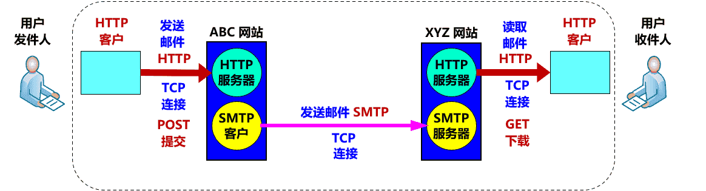

‍

‍

## 应用层协议

(补充)

|协议|名称|默认端口|底层协议|
| --------| ----------------------------| ----------------| ------------------------------------------------------------|
|HTTP|超文本传输协议|80|TCP|
|HTTPS|超文本传输安全协议|443|TCP|
|Telnet|远程登录服务的标准协议|23|TCP|
|FTP|文件传输协议|20传输和21连接|TCP|
|TFTP|简单文件传输协议|21|UDP|
|SMTP|简单邮件传输协议（发送用）|25|TCP|
|POP|邮局协议（接收用）|110|TCP|
|DNS|域名解析服务|53|服务器间进行域传输的时候用TCP 客户端查询DNS服务器时用 UDP|

‍

- 精确定义不同主机中的多个**应用进程之间**的通信规则。
- 包括：

  - 应用进程交换的报文类型，如请求报文和响应报文。
  - 各种报文类型的语法，如报文中的各个字段及其详细描述。
  - 字段的语义，即包含在字段中的信息的含义。
  - 进程何时、如何发送报文，以及对报文进行响应的规则。
- 不同于网络应用

  - 万维网
    - 电子邮件
      - 文件传输
  - HTTP
    - SMTP，POP3
      - FTP
- 许多都基于客户服务器方式

  - 客户 (client)
    - 服务请求方
      - 应用进程
  - 服务器 (server)
    - 服务提供方
      - 应用进程

‍

‍

‍

应用层协议定义了运行在不同端系统上应用程序进程如何相互传递报文：

* 交换的报文类型，例如请求报文和响应报文
* 各种报文类型的语法，如报文中的各个字段及这些字段是如何描述的
* 字段的语义，即这些字段中包含的信息的含义
* 一个进程何时以及如何发送报文，对报文进行响应的规则

‍

### 常见应用层协议

* DNS域名服务。用于将名称解析为IP地址，反之亦然DNS是一个倒置的树形结构。最顶部是根域，用英文句点（.）表示。全球有13个根域服务器，一台主服务器在美国，9台辅助服务器在美国，2台在欧州，一台在日本。根域服务器以下是一级域（顶级域）、二级域、三级域……最多127级
* FTP（File Translation Protocol）文件传输协议。FTP默认有两个端口21和20。21用于控制连接，20用于数据传输。
* DHCP(Dynamic Host Configuration Protocol)动态主机分配协议，使用 UDP 协议工作，给主机自动分配IP地址，作为网络管理员的主要管理手段。实现即插即用即联网功能。
* HTTP（HyperText Transfer Protocol）超文本传输协议，它是Web的核心。
* SMTP（Simple Mail Transfer Protocol ）简单邮件传输协议 <端口号25> 用于发送邮件。
* POP3（Post Office Protocol-Version 3）第三版的邮局协议: 接收方的用户代理不能使用SMTP取回邮件，因为取邮件是一个拉操作，而SMTP协议是一个推协议。通过引入一个特殊的邮件访问协议来解决这个难题，该协议将接收方邮件服务器上的邮件传送给他的本地PC。目前有多个流行的邮件访问协议，
* TELNET 远程登录协议 <端口号23>

‍

‍

## DNS域名系统

‍

‍

域名系统 DNS (Domain Name System) ：

* 互联网使用的命名系统。
* 用来把人们使用的机器**名字（域名）转换为 IP 地址**。
* 为互联网的各种网络应用提供了核心服务。

‍

‍

### 概述

​​

- 域名采用层次**树状结构**的命名方法：www.myschool.edu。
- DNS 是一个联机**分布式数据库系统**，采用**客户服务器**方式。
- 域名到 IP 地址的解析是由若干个**域名服务器程序**共同完成。
- 域名服务器程序在专设的结点上运行，运行该程序的机器称为**域名服务器**。

‍

‍

‍

‍

### 域名结构

* 命名方法：层次**树状**结构方法。
* 任何一个连接在互联网上的主机或路由器，都有一个**唯一**的层次结构的名字，即**域名** (domain name)。
* 域 (domain)：

  * 名字空间中一个**可被管理**的划分。
  * 可以划分为**子域**，而子域还可继续划分为子域的子域，这样就形成了顶级域、二级域、三级域，等等。
* 域名结构：**层次结构**。由标号 (label) 序列组成，各标号之间用点（.）隔开，各标号分别代表不同级别的域名。

  三级, 二级, 顶级域名

‍

‍

‍

### 域名服务器

- 实现域名系统使用分布在各地的**域名服务器**（DNS 服务器）
- 一个服务器所负责管辖的（或有权限的）范围叫做**区** (zone)
- 各单位根据具体情况来划分自己管辖范围的区。但在一个区中的所有节点必须是能够**连通**的。
- 每一个区设置相应的**权限域名服务器**，用来**保存**该区中的所有主机的域名到 IP 地址的映射。

> DNS 服务器的管辖范围不是以“域”为单位，而是以“**区**”为单位。

‍

‍

#### 区的不同划分方法

> 在一个根下面可能有许多不同域, 一个域可以被划分为一个或多个区
>
> * 域 abc.com
>
>   * 区abc.com
> * 域 xyz.com
>
>   * 区y.xyz.com
>   * 区xyz.com

​​

‍

#### 树状结构

‍

* 根域名服务器
* 顶级域名服务器    org. com....
* 权限域名服务器    abc.com...

​​

> 每个域名服务器都只对域名体系中的**一部分**进行管辖。

‍

‍

#### 类型

- 根据所起的作用，分为四种类型：
  - 根域名服务器
  - 顶级域名服务器
  - 权限域名服务器
  - 本地域名服务器

‍

‍

##### **根域名服务器**

- **最高层次，最为重要**。
- 所有根域名服务器都**知道**所有的**顶级域名服务器**的域名和 IP 地址。
- 不管是哪一个本地域名服务器，若要对互联网上任何一个域名进行解析，只要自己无法解析，就**首先**求助于根域名服务器。
- 若所有的根域名服务器都瘫痪了，整个互联网中的 DNS 系统就无法工作了。

‍

‍

##### **顶级域名服务器**

- 顶级域名服务器（即 **TLD 服务器**）负责管理在该顶级域名服务器注册的**所有二级域名**。
- 当收到 DNS 查询请求时，就给出相应的回答（可能是最后的结果，也可能是下一步应当找的域名服务器的 IP 地址）。

‍

‍

##### **权限域名服务器**

- 负责一个区（zone）的域名服务器。
- 当一个权限域名服务器还不能给出最后的查询回答时，就会告诉发出查询请求的 DNS 客户，下一步应当找哪一个权限域名服务器。

‍

‍

##### **本地域名服务器**

- 非常重要。
- 当一个主机发出 DNS 查询请求时，该查询请求报文就**发送**给本地域名服务器。
- 每一个互联网服务提供者 ISP 或一个大学，都可以拥有一个本地域名服务器。
- 当所要查询的主机也属于同一个本地 ISP 时，该本地域名服务器立即就能将所查询的主机名转换为它的 IP 地址，而**不需要**再去询问其他的域名服务器。
- 本地域名服务器有时也称为**默认域名服务器**。

‍

‍

#### 域名解析过程

‍

- 递归查询
  * 一条通道底, DFS搜索
  * 通常，主机向本地域名服务器查询时使用。(少见)
  * 查一个服务器, 若他不知道，就以 DNS 客户的身份，向其他根域名服务器继续发出查询请求报文。
- 迭代查询
  * 扩散式查询, BFS搜索
  * 本地域名服务器向根域名服务器查询时使用。
  * 要么给出所要查询的 IP 地址，要么告诉下一个要查询的域名服务器的 IP 地址。
  * 本地域名服务器继续后续查询。

‍

由于递归查询对于被查询的域名服务器负担太大，通常采用以下模式:

> 从请求主机到本地域名服务器的查询是递归查询，而其余的查询是迭代查询。(第一次请求是递归, 后续是迭代)

‍

‍

#### 高速缓存

- 也称为**高速缓存域名服务器**。
- 存放**最近用过的名字**以及从何处获得名字映射信息的记录。
- 作用：大大减轻根域名服务器的负荷，使 DNS 查询请求和回答报文的数量大为减少。
- 域名服务器应为每项内容设置**计时器**，并处理超过合理时间的项。
- 当权限域名服务器回答一个查询请求时，在响应中指明绑定**有效存在的时间值**。增加此时间值可减少网络开销，而减少此时间值可提高域名转换的准确性。

‍

‍

‍

## FTP文件传送协议

‍

- **文件传送协议 FTP** (File Transfer Protocol) 是互联网上使用得最广泛的文件传送协议。
- 提供**交互式**的访问，允许客户指明文件的类型与格式，并允许文件具有存取**权限**。
- **屏蔽**了各计算机系统的细节，因而适合于在**异构**网络中**任意**计算机之间传送文件。
- 是**文件共享协议**的一个大类。

‍

​​

‍

‍

### 概念

‍

#### 文件共享协议

- 文件传送协议：FTP， TFTP 等。
  - 复制整个文件。对文件副本进行访问。
    - 若要存取一个文件，就必须先获得一个本地文件副本。
    - 若要修改文件，只能对文件副本进行修改，然后再将修改后的文件副本传回到原节点。
- 联机访问 (on-line access) 协议：NFS 等。
  - 允许同时对一个文件进行存取。
  - 远地共享文件访问，如同对本地文件的访问一样。
  - 透明存取，不需要对该应用程序作明显的改动。
  - 由**操作系统**负责。

‍

‍

‍

### 特点

* 只提供文件传送的一些**基本服务**，它使用 **TCP** 可靠的运输服务。
* 主要功能：减少或消除在不同操作系统下处理文件的不兼容性。
* 使用**客户服务器**方式。

  * 一个 FTP 服务器进程可**同时**为多个客户进程提供服务。
  * FTP 的**服务器进程**由两大部分组成：

    * 一个**主进程**，负责接受新的请求；
    * 若干个**从属进程**，负责处理单个请求。

‍

‍

‍

### TFTP简单文件传送协议

- TFTP (Trivial File Transfer Protocol) 是一个很小且易于实现的文件传送协议。
- 使用**客户服务器**方式和使用 UDP 数据报，因此 TFTP 需要有自己的差错改正措施。
- 只支持文件传输，**不支持交互**。
- 没有庞大的命令集，没有列目录的功能，也不能对用户进行身份鉴别。
- 优点：（1）可用于 UDP 环境；（2）代码所占的内存较小。

‍

‍

## WWW万维网

‍

‍

### 概念

​​

- 万维网 WWW (World Wide Web) 并非某种特殊的计算机网络。
- 万维网是一个大规模的、联机式的**信息储藏所**。
- 万维网用链接的方法能非常方便地从互联网上的一个站点访问另一个站点，从而主动地按需获取丰富的信息。
- 这种访问方式称为“**链接**”。（提供分布式服务。）

‍

‍

#### 超媒体

万维网是分布式超媒体 (hypermedia) 系统

- 是**超文本** (hypertext) 系统的**扩充**。
- 超文本：由多个信息源**链接**成。是**万维网的基础**。
- 超媒体与超文本的**区别**：**文档内容不同**。
  - 超文本文档仅包含文本信息。
  - 超媒体文档还包含其他信息，如图形、图像、声音、动画，甚至活动视频图像等。
- 分布式系统
  - 信息分布在整个互联网上。每台主机上的文档都独立进行管理。

‍

‍

#### 必须解决的问题

1. 怎样**标志**分布在整个互联网上的万维网文档？

    * 使用**统一资源定位符 URL** (Uniform Resource Locator) 。
    * 使每一个文档在整个互联网的范围内具有**唯一**的标识符 URL。
2. 用什么**协议**来实现万维网上的各种链接？

    * 使用**超文本传送协议 HTTP** (HyperText Transfer Protocol)。
    * HTTP 是一个应用层协议，使用 **TCP** 连接进行可靠的传送。
3. 怎样使不同作者**创作**的不同风格的万维网文档都能在互联网上的各种主机上**显示**出来，同时使用户清楚地知道在什么地方存在着**链接**？

    * 使用**超文本标记语言 HTML** (HyperText Markup Language) 。
4. 怎样使用户能够很方便地**找到**所需的信息？

    * 使用各种的**搜索工具**（即搜索引擎）。

‍

‍

### 工作方式

- 以**客户服务器**方式工作。
- 客户程序：**浏览器**。
- 服务器程序：在万维网文档所驻留的主机上运行。这个计算机也称为**万维网服务器**。
- 客户程序向服务器程序发出请求，服务器程序向客户程序送回客户所要的**万维网文档**。
- 在一个客户程序主窗口上显示出的万维网文档称为**页面** (page)。

‍

‍

### URL统一资源定位符

‍

- 是对互联网上资源的位置和访问方法的一种**简洁表示**。
- 给资源的位置提供一种**抽象**的识别方法，并用这种方法给**资源定位**。
- 实际上就是在互联网上的**资源的地址**。
- 显然，互联网上的所有资源，都有一个**唯一**确定的URL。
- **资源**：指在互联网上可以被访问的任何对象，包括文件目录、文件、文档、图像、声音等，以及与互联网相连的**任何形式**的数据。

> URL 相当于一个文件名在网络范围的扩展。因此，URL 是与互联网相连的机器上的任何可访问对象的一个指针。

‍

‍

#### **格式**

由以冒号（:）隔开的两大部分组成，对字符大写或小写没有要求。

‍

一般形式：`<协议>://<主机>:<端口>/<路径>`​​​

* 协议：{ftp:文件传送协议 FTP, http:超文本传送协议 HTTP, News:USENET 新闻}
* 主机：存放资源的主机在互联网中的域名，也可以是用点分十进制的 IP 地址。
* 端口：端口号。省略时使用默认端口号。
* 路径：资源所在目录位置。区分大小写。省略时使用所定义的默认路径。后面可能还有一些选项。

‍

‍

### HTTP超文本传送协议

(这段会在面经和其他javaWeb开发文档中出现, 于是不做太多记录)

- HTTP 是**面向事务**的 (transaction-oriented) 应用层协议。
- 使用 **TCP** 连接进行可靠的传送。
- 定义了浏览器与万维网服务器通信的格式和规则。
- 是万维网上能够**可靠地交换文件**（包括文本、声音、图像等各种多媒体文件）的重要基础。

> HTTP 不仅传送完成超文本跳转所必需的信息，而且也传送任何可从互联网上得到的信息，如文本、超文本、声音和图像等。

‍

‍

‍

‍

#### 用户浏览页面

‍

##### 两种方法

- 在浏览器的地址窗口中**键入**所要找的页面的 URL。
- 在某一个页面中用鼠标**点击**一个可选部分，这时浏览器会自动在互联网上找到所要链接的页面。

‍

##### 请求文档耗时

$请求一个万维网文档所需的时间 \ge RTT（三报文握手建立 TCP 连接） + RTT（请求和接收文档） + 文档的传输时间 = 2 RTT + 文档的传输时间$

‍

‍

#### 特点

* HTTP 使用了面向连接的 **TCP** 作为运输层协议，保证了数据的可靠传输。
* HTTP 协议本身也是**无连接**的。
* HTTP 是**无状态**的 (stateless)，简化了服务器的设计，使服务器更容易支持大量并发的 HTTP 请求。

‍

​​

#### **代理服务器/缓存**

- 代理服务器 (proxy server) 又称为**万维网高速缓存** (Web cache)，它代表浏览器发出 HTTP 请求。
- 使用高速缓存可**减少**访问互联网服务器的**时延**。

‍

**不使用高速缓存的情况**

部分路由器需要持续处理请求, 转发外部响应, 工作量太大

‍

**使用高速缓存的情况**

示例

1. 浏览器访问互联网的服务器时，先与校园网的高速缓存建立 TCP 连接，并向高速缓存发出 HTTP 请求报文。
2. 若高速缓存已经存放了所请求的对象，则将此对象放入 HTTP 响应报文中返回给浏览器。
3. 若未存放，高速缓存就**代表浏览器与互联网上的源点服务器建立 TCP 连接**，并发送 HTTP 请求报文。
4. 源点服务器将所请求的对象放在 HTTP 响应报文中返回给校园网的高速缓存。
5. 高速缓存收到对象后，先复制到本地存储器中（留待以后用），然后将该对象放在 HTTP 响应报文中，通过已建立的 TCP 连接，返回给请求该对象的浏览器。

‍

‍

‍

‍

‍

## 电子邮件

‍

- 电子邮件 (e-mail)：指使用电子设备交换的邮件及其方法。
- 优点：使用方便，传递迅速，费用低廉，可以传送多种类型的信息（包括：文字信息，声音和图像等）。
- 重要标准：
  - 简单邮件发送协议：SMTP
  - 互联网文本报文格式
  - 通用互联网邮件扩充 MIME
  - 邮件读取协议：POP3 和 IMAP

​​

‍

### 概念

‍

#### 电邮系统组成

‍

- **用户代理** UA (User Agent)
  - 用户与电子邮件系统的接口。又被称为**电子邮件客户端软件**。
  - 基本功能：撰写、显示、处理、通信。
- **邮件服务器** (Mail Server)
  - 又被称为**邮件传输代理**。
  - 功能：发送和接收邮件，同时还要向发信人报告邮件传送的情况。
  - 按照**客户服务器**方式工作。
- **邮件发送 和 读取协议**
  - 邮件发送和读取使用不同的协议。
  - **简单邮件发送协议 SMTP**：用于在用户代理向邮件服务器 或 邮件服务器之间**发送**邮件。
  - **邮局协议 POP3**：用于用户代理从邮件服务器**读取**邮件。

‍

‍

**注意**

* 邮件服务器必须能够**同时充当**客户和服务器。
* SMTP 和 POP3（或 IMAP）都使用 **TCP 连接**可靠地传送邮件。

‍

---

发送和接收电子邮件的重要步骤

- 注意：邮件不会在互联网中的某个中间邮件服务器落地。
- 两种不同的通信方式
  - “推”(push)
  - “拉”(pull)

‍

‍

#### 邮件组成

* 电子邮件由**信封** (envelope) 和**内容** (content) 两部分组成。
* 电子邮件的传输程序根据邮件信封上的信息来传送邮件。
* 用户在从自己的邮箱中读取邮件时才能见到邮件的内容。

‍

‍

#### 地址格式

‍

* TCP/IP 体系的电子邮件系统规定电子邮件地址的格式如下：

  * 收件人邮箱名@邮箱所在主机的域名
* 例如：xiexiren@tsinghua.org.cn

  * 这个用户名在该域名的范围内是唯一的。
  * 邮箱所在的主机的域名，在全世界必须是唯一的

‍

#### 信息格式

‍

* 一个电子邮件分为**信封**和**内容**两大部分。RFC 5322 只规定了邮件**内容**中的**首部** (header) 格式。
* 邮件的**主体** (body) 部分则让用户自由撰写。

‍

‍

### SMTP简单邮件传送协议

​​

‍

* SMTP 规定了在两个相互通信的 SMTP 进程之间交换信息的方法。
* SMTP 使用**客户服务器**方式。客户与服务器之间采用**命令-响应**方式进行交互.
* SMTP **基于 TCP** 实现客户与服务器的通信。

SMTP 只能发送 ASCII 码，而互联网邮件扩充 MIME 可以发送二进制文件。MIME 并没有改动或者取代 SMTP，而是增加邮件主体的结构，定义了非 ASCII 码的编码规则。

‍

#### 通信的三个阶段

‍

##### **连接建立**

连接是在发送主机的 SMTP 客户和接收主机的 SMTP 服务器之间建立的

‍

* SMTP 客户首先使用熟知端口 25 与接收方的 SMTP 服务器建立 TCP 连接。

  > 注意：SMTP 不使用中间的邮件服务器。
  >
* SMTP 服务器发出服务就绪。
* SMTP 客户向服务器发送问候 (HELO命令），附上发送方的主机名。
* SMTP 服务器若有能力接收邮件，则回答：“250 OK”，表示已准备好接收。

‍

##### **邮件传送**

‍

‍

##### **连接释放**

邮件发送完毕后，SMTP 应释放 TCP 连接。  
​​

‍

‍

​​

‍

‍

**万维网电子邮件**  
​​

- 发送、接收电子邮件时使用 HTTP 协议。
- 两个邮件服务器之间传送邮件时使用 SMTP。
- 使用 HTTP POST 方法提交要发送的邮件。
- 使用 HTTP GET 方法读取邮件。

‍

‍

‍

‍

## DHCP动态主机配置协议

* 动态主机配置协议 **DHCP** (Dynamic Host Configuration Protocol) 提供了**即插即用连网** (plug-and-play networking) 的机制，允许一台计算机加入网络和获取 IP 地址，而不用手工配置。
* DHCP 给运行**服务器**软件、且位置固定的计算机指派一个**永久**地址，给运行**客户端**软件的计算机分配一个**临时**地址。

‍

‍

### 概念

* 在协议软件中，给协议参数赋值的动作叫做**协议配置**。
* 一个协议软件在使用之前必须是已正确配置的。
* 具体的配置信息取决于协议栈。
* 连接到互联网的计算机的协议软件需要正确配置的参数包括：

  * IP 地址
  * 子网掩码
  * 默认路由器的 IP 地址
  * 域名服务器的 IP 地址

‍

‍

### 工作方式

‍

使用客户服务器方式，采用**请求/应答**方式工作

- 需要 IP 地址的主机在启动时就向 DHCP 服务器**广播发送**发现报文（DHCPDISCOVER），这时该主机就成为 DHCP 客户。
- 本地网络上所有主机都能收到此广播报文，但只有 DHCP 服务器才回答此广播报文。
- DHCP 服务器先在其数据库中查找该计算机的配置信息。若找到，则返回找到的信息。若找不到，则从服务器的 IP 地址池 (address pool) 中取一个地址分配给该计算机。DHCP服务器的回答报文叫做提供报文（DHCPOFFER）。

‍

* DHCP 基于 UDP 工作，DHCP 服务器运行在 67 号端口， DHCP客户运行在 68 号端口。
* 需要 IP 地址的主机向 DHCP 服务器**广播**发送发现报文 (DHCPDISCOVER) 。
* DHCP 服务器回答提供报文 (DHCPOFFER) （**单播**），提供 IP 地址等配置信息。

‍

‍

#### DHCP 中继代理

(relay agent)

‍

> * 问题：每个网络上都需要有 DHCP 服务器吗？
> * 答案：不需要，因为会使 DHCP 服务器的数量太多。
> * 问题：若没有 DHCP 服务器，如何自动获得地址？
> * 解决：每一个网络**至少**有一个 DHCP **中继代理**，它配置了 DHCP 服务器的 IP 地址信息。

‍

DHCP 中继代理以单播方式转发发现报文

- DHCP 中继代理收到主机广播发送的发现报文后，就以**单播**方式向 DHCP 服务器转发此报文，并等待其回答。
- 收到 DHCP 服务器回答的提供报文后，DHCP 中继代理再将其发回给主机。

‍

‍

#### 租用期

(lease period)

- DHCP 服务器分配给 DHCP 客户的 IP 地址的**临时的**，因此 DHCP 客户只能在一段有限的时间内使用这个分配到的 IP 地址。DHCP 协议称这段时间为**租用期**。
- 租用期的数值应由 DHCP 服务器自己决定。
- DHCP 客户也可在自己发送的报文中（例如，发现报文）提出对租用期的要求。

‍

‍

#### 过程

1. DHCP 服务器**被动**打开 UDP 端口 67，等待客户端发来的报文。
2. DHCP 客户从 UDP 端口 68 发送 DHCP 发现报文 DHCPDISCOVER。
3. 凡收到 DHCP 发现报文的 DHCP 服务器**都发出** DHCP 提供报文 DHCPOFFER，因此 DHCP 客户可能收到多个 DHCP 提供报文 。
4. DHCP 客户从几个 DHCP 服务器中**选择其中的一个**，并向所选择的 DHCP 服务器发送 DHCP 请求报文 DHCPREQUEST。
5. 被选择的 DHCP 服务器发送确认报文 DHCPACK，DHCP 客户可开始使用得到的**临时** IP 地址了，进入已绑定状态。DHCP 客户现在要根据服务器提供的**租用期 T** 设置**两个**计时器 T1 和 T2，它们的超时时间分别是 0.5T 和 0.875T。当超时时间到时，就要请求更新租用期。
6. 租用期过了**一半**（T1 时间到），DHCP 发送请求报文 DHCPREQUEST，要求**更新**租用期。
7. DHCP 服务器若**同意**，则发回确认报文 DHCPACK。DHCP 客户得到了新的租用期，重新设置计时器。
8. DHCP 服务器若**不同意**，则发回否认报 DHCPNACK。这时 DHCP 客户必须立即停止使用原来的 IP 地址，而必须重新申请 IP 地址（回到步骤 2）。DHCP 服务器不响应步骤 6 的请求报文 DHCPREQUEST，则在租用期过了 **87.5%**  时 (T2 时间到)，DHCP 客户必须重新发送请求报文 DHCPREQUEST（重复步骤 6），然后又继续后面的步骤。
9. DHCP 客户**可随时提前终止**服务器所提供的租用期，这时只需向 DHCP 服务器发送释放报文 DHCPRELEASE 即可。

‍

‍

简略

1. 客户端发送 Discover 报文，该报文的目的地址为 255.255.255.255:67，源地址为 0.0.0.0:68，被放入 UDP 中，该报文被广播到同一个子网的所有主机上。如果客户端和 DHCP 服务器不在同一个子网，就需要使用中继代理。
2. DHCP 服务器收到 Discover 报文之后，发送 Offer 报文给客户端，该报文包含了客户端所需要的信息。因为客户端可能收到多个 DHCP 服务器提供的信息，因此客户端需要进行选择。
3. 如果客户端选择了某个 DHCP 服务器提供的信息，那么就发送 Request 报文给该 DHCP 服务器。
4. DHCP 服务器发送 Ack 报文，表示客户端此时可以使用提供给它的信息。

‍

‍

‍

## 应用进程跨越网络的通信

‍

‍

### 系统调用和应用编程接口

- 大多数操作系统使用**系统调用** (system call) 的机制在应用程序和操作系统之间传递控制权。
- 对程序员来说，每一个系统调用和一般程序设计中的函数调用非常相似，只是系统调用是将控制权传递给了操作系统。

‍

#### 应用编程接口 API

- **系统调用接口**实际上就是应用进程的控制权和操作系统的控制权进行转换的一个接口。
- 使用系统调用之前要编写一些程序，特别是需要设置系统调用中的许多参数，因此这种系统调用接口又称为**应用编程接口 API** (Application Programming Interface) 。

‍

‍

#### 应用进程通过套接字接入到网络​​

套接字的作用

- 当应用进程需要使用网络进行通信时就发出系统调用，请求操作系统为其**创建套接字**，以便把网络通信所需要的系统资源分配给该应用进程。
- 操作系统为这些资源的总和用一个**套接字描述符**的号码来表示。
- 应用进程所进行的网络操作都必须使用这个套接字描述符。
- 通信完毕后，应用进程通过一个**关闭**套接字的系统调用通知操作系统回收与该套接字描述符相关的所有资源。

‍

调用 socket 创建套接字  

‍

‍

‍
