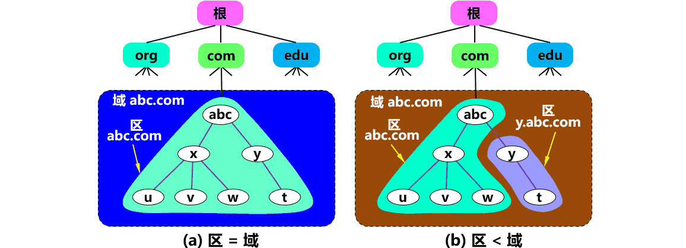
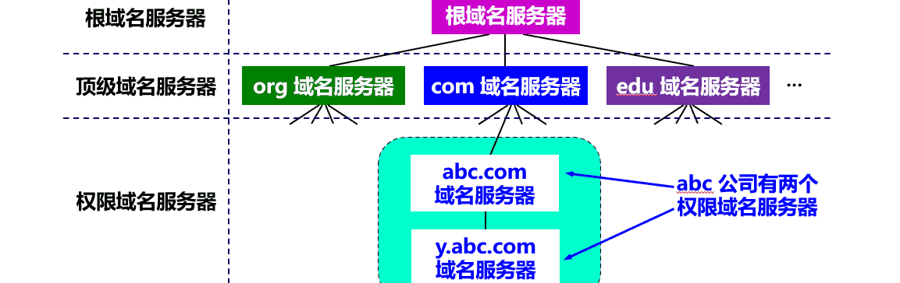
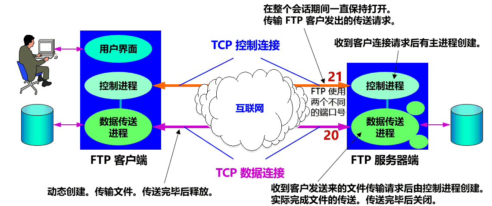
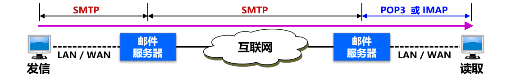
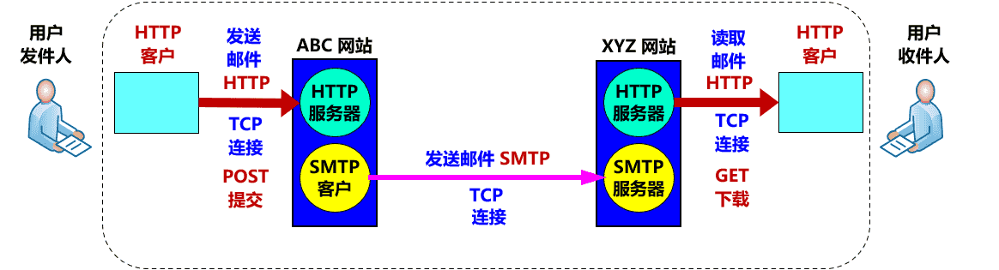

‍

‍

## 应用层协议

(补充)

‍

- 精确定义不同主机中的多个**应用进程之间**的通信规则。
- 包括：

  - 应用进程交换的报文类型，如请求报文和响应报文。
  - 各种报文类型的语法，如报文中的各个字段及其详细描述。
  - 字段的语义，即包含在字段中的信息的含义。
  - 进程何时、如何发送报文，以及对报文进行响应的规则。
- 不同于网络应用

  - 万维网
    - 电子邮件
      - 文件传输
  - HTTP
    - SMTP，POP3
      - FTP
- 许多都基于客户服务器方式

  - 客户 (client)
    - 服务请求方
      - 应用进程
  - 服务器 (server)
    - 服务提供方
      - 应用进程

‍

‍

‍

应用层协议定义了运行在不同端系统上应用程序进程如何相互传递报文：

* 交换的报文类型，例如请求报文和响应报文
* 各种报文类型的语法，如报文中的各个字段及这些字段是如何描述的
* 字段的语义，即这些字段中包含的信息的含义
* 一个进程何时以及如何发送报文，对报文进行响应的规则

‍

### 常见应用层协议

* DNS域名服务。用于将名称解析为IP地址，反之亦然DNS是一个倒置的树形结构。最顶部是根域，用英文句点（.）表示。全球有13个根域服务器，一台主服务器在美国，9台辅助服务器在美国，2台在欧州，一台在日本。根域服务器以下是一级域（顶级域）、二级域、三级域……最多127级
* FTP（File Translation Protocol）文件传输协议。FTP默认有两个端口21和20。21用于控制连接，20用于数据传输。
* DHCP(Dynamic Host Configuration Protocol)动态主机分配协议，使用 UDP 协议工作，给主机自动分配IP地址，作为网络管理员的主要管理手段。实现即插即用即联网功能。
* HTTP（HyperText Transfer Protocol）超文本传输协议，它是Web的核心。
* SMTP（Simple Mail Transfer Protocol ）简单邮件传输协议 <端口号25> 用于发送邮件。
* POP3（Post Office Protocol-Version 3）第三版的邮局协议: 接收方的用户代理不能使用SMTP取回邮件，因为取邮件是一个拉操作，而SMTP协议是一个推协议。通过引入一个特殊的邮件访问协议来解决这个难题，该协议将接收方邮件服务器上的邮件传送给他的本地PC。目前有多个流行的邮件访问协议，
* TELNET 远程登录协议 <端口号23>

‍

### 不常用应用层协议

* RPC （Remote Procedure Call Protocol ）（RFC- 1831）远程过程调用协 议
* RTCP （RTP Control Protocol ）RTP 控制协议
* RTSP （Real Time Streaming Protocol ）实时流传输协议
* TLS （Transport Layer Security Protocol ）安全传输层协议
* SDP( Session Description Protocol ）会话描述协议
* SOAP （Simple Object Access Protocol ）简单对象访问协议
* GTP 通用数据传输平台
* STUN （Simple Traversal of UDP over NATs ，NAT 的UDP 简单穿越） 是一种网络协议
* NTP （Network Time Protocol ）网络校时协议。

‍

‍

## DNS域名系统

‍

‍

域名系统 DNS (Domain Name System) ：

* 互联网使用的命名系统。
* 用来把人们使用的机器**名字（域名）转换为 IP 地址**。
* 为互联网的各种网络应用提供了核心服务。

‍

‍

### 概述

​​

- 域名采用层次**树状结构**的命名方法：www.myschool.edu。
- DNS 是一个联机**分布式数据库系统**，采用**客户服务器**方式。
- 域名到 IP 地址的解析是由若干个**域名服务器程序**共同完成。
- 域名服务器程序在专设的结点上运行，运行该程序的机器称为**域名服务器**。

‍

‍

### DNS记录

DNS常用的资源记录类型

* A：地址 此记录列出特定主机名的 IP 地址。这是名称解析的重要记录。
* CNAME：标准名称 此记录指定标准主机名的别名。
* MX：邮件交换器此记录列出了负责接收发到域中的电子邮件的主机。
* NS：名称服务器此记录指定负责给定区域的名称服务器。
* SOA record:Stores admin information about a domain. Learn more about the SOA record.
* SRV record:Specifies a port for specific services. Learn more about the SRV record.
* PTR record:Provides a domain name in reverse-lookups. Learn more about the PTR record.

‍

‍

### 域名结构

* 命名方法：层次**树状**结构方法。
* 任何一个连接在互联网上的主机或路由器，都有一个**唯一**的层次结构的名字，即**域名** (domain name)。
* 域 (domain)：

  * 名字空间中一个**可被管理**的划分。
  * 可以划分为**子域**，而子域还可继续划分为子域的子域，这样就形成了顶级域、二级域、三级域，等等。
* 域名结构：**层次结构**。由标号 (label) 序列组成，各标号之间用点（.）隔开，各标号分别代表不同级别的域名。

  三级, 二级, 顶级域名

‍

‍

‍

### 域名服务器

- 实现域名系统使用分布在各地的**域名服务器**（DNS 服务器）
- 一个服务器所负责管辖的（或有权限的）范围叫做**区** (zone)
- 各单位根据具体情况来划分自己管辖范围的区。但在一个区中的所有节点必须是能够**连通**的。
- 每一个区设置相应的**权限域名服务器**，用来**保存**该区中的所有主机的域名到 IP 地址的映射。

> DNS 服务器的管辖范围不是以“域”为单位，而是以“**区**”为单位。

‍

‍

#### 区的不同划分方法

‍

​​

‍

#### 树状结构

‍

​​

> 每个域名服务器都只对域名体系中的**一部分**进行管辖。

‍

#### 类型

- 根据所起的作用，分为四种类型：
  - 根域名服务器
  - 顶级域名服务器
  - 权限域名服务器
  - 本地域名服务器

‍

‍

##### **根域名服务器**

- **最高层次，最为重要**。
- 所有根域名服务器都**知道**所有的**顶级域名服务器**的域名和 IP 地址。
- 不管是哪一个本地域名服务器，若要对互联网上任何一个域名进行解析，只要自己无法解析，就**首先**求助于根域名服务器。
- 若所有的根域名服务器都瘫痪了，整个互联网中的 DNS 系统就无法工作了。

‍

根域名服务器共有 13 套装置

* 根域名服务器共有 13 套装置，构成 13 组根域名服务器。
* 根域名服务器总共只有 13 个不同 IP 地址的域名，但**并非**仅由13台机器所组成。(略)

‍

‍

- 根域名服务器**分布**在全世界。
- 为了提供更可靠的服务，在每一个地点的根域名服务器往往由**多台**机器组成。
- 根域名服务器采用**任播** (anycast) 技术，当DNS 客户向某个根域名服务器发出查询报文时，路由器能找到离这个 DNS 客户**最近**的一个根域名服务器。
- 截至 2020年9月3日，全球共有 1098 个根域名服务器在运行，其中在我国的共有28个。

> 注意：
> 根域名服务器并**不直接**把域名转换成 IP 地址（根域名服务器也没有存放这种信息），而是告诉本地域名服务器下一步应当找哪一个顶级域名服务器进行查询。

‍

‍

##### **顶级域名服务器**

- 顶级域名服务器（即 **TLD 服务器**）负责管理在该顶级域名服务器注册的**所有二级域名**。
- 当收到 DNS 查询请求时，就给出相应的回答（可能是最后的结果，也可能是下一步应当找的域名服务器的 IP 地址）。

‍

##### **权限域名服务器**

- 负责一个区（zone）的域名服务器。
- 当一个权限域名服务器还不能给出最后的查询回答时，就会告诉发出查询请求的 DNS 客户，下一步应当找哪一个权限域名服务器。

‍

‍

##### **本地域名服务器**

- 非常重要。
- 当一个主机发出 DNS 查询请求时，该查询请求报文就**发送**给本地域名服务器。
- 每一个互联网服务提供者 ISP 或一个大学，都可以拥有一个本地域名服务器。
- 当所要查询的主机也属于同一个本地 ISP 时，该本地域名服务器立即就能将所查询的主机名转换为它的 IP 地址，而**不需要**再去询问其他的域名服务器。
- 本地域名服务器有时也称为**默认域名服务器**。

‍

#### 提高可靠性

- DNS 域名服务器都把数据复制到几个域名服务器来保存，其中的一个是**主域名服务器**，其他的是**辅助域名服务器**。
- 当主域名服务器出故障时，辅助域名服务器可以保证 DNS 的查询工作不会中断。
- 主域名服务器**定期**把数据复制到辅助域名服务器中，而**更改**数据**只能**在主域名服务器中进行，保证了数据的一致性。

‍

#### 域名解析过程

‍

- 递归查询
  * 一条通道底, DFS搜索
  * 通常，主机向本地域名服务器查询时使用。(少见)
  * 查一个服务器, 若他不知道，就以 DNS 客户的身份，向其他根域名服务器继续发出查询请求报文。
- 迭代查询
  * 扩散式查询, BFS搜索
  * 本地域名服务器向根域名服务器查询时使用。
  * 要么给出所要查询的 IP 地址，要么告诉下一个要查询的域名服务器的 IP 地址。
  * 本地域名服务器继续后续查询。

‍

由于递归查询对于被查询的域名服务器负担太大，通常采用以下模式:

> 从请求主机到本地域名服务器的查询是递归查询，而其余的查询是迭代查询。(第一次请求是递归, 后续是迭代)

‍

#### 高速缓存

- 也称为**高速缓存域名服务器**。
- 存放**最近用过的名字**以及从何处获得名字映射信息的记录。
- 作用：大大减轻根域名服务器的负荷，使 DNS 查询请求和回答报文的数量大为减少。
- 域名服务器应为每项内容设置**计时器**，并处理超过合理时间的项。
- 当权限域名服务器回答一个查询请求时，在响应中指明绑定**有效存在的时间值**。增加此时间值可减少网络开销，而减少此时间值可提高域名转换的准确性。

‍

### DNS安全性

(补充)

* **DDoS（分布式拒绝服务）带宽泛洪攻击**    向处理如.com域的域名服务器发送大量DNS请求，使得大部分合法请求无法获得响应
* **DNS毒害（污染）**     给你返回假的或不能用的IP地址。比如中国的『墙』。所以如果你能拿到google的当前IP地址（百度搜的到），手动在hosts里配置，是可以做到直接访问谷歌服务器的。说到翻墙，一般大家都是用某种方法配置一台海外服务器当做中转（国家一般不墙这种个人服务器），来访问墙外服务器的，比如shadowsocks，shadowrocket之类的软件可以用来配置中转服务器。
* **DNS反射攻击**    请求中冒充目标主机源地址，大量请求DNS服务器，DNS就大量向源地址主机发送回答，淹没目标主机。

‍

‍

## FTP文件传送协议

‍

- **文件传送协议 FTP** (File Transfer Protocol) 是互联网上使用得最广泛的文件传送协议。
- 提供**交互式**的访问，允许客户指明文件的类型与格式，并允许文件具有存取**权限**。
- **屏蔽**了各计算机系统的细节，因而适合于在**异构**网络中**任意**计算机之间传送文件。
- 是**文件共享协议**的一个大类。

‍

### 概念

‍

#### 文件共享协议

- 文件传送协议：FTP， TFTP 等。
  - 复制整个文件。对文件副本进行访问。
    - 若要存取一个文件，就必须先获得一个本地文件副本。
    - 若要修改文件，只能对文件副本进行修改，然后再将修改后的文件副本传回到原节点。
- 联机访问 (on-line access) 协议：NFS 等。
  - 允许同时对一个文件进行存取。
  - 远地共享文件访问，如同对本地文件的访问一样。
  - 透明存取，不需要对该应用程序作明显的改动。
  - 由**操作系统**负责。

‍

#### 困难

网络环境下复制文件的**复杂性**：

* 计算机存储数据的格式不同。
* 文件的目录结构和文件命名的规定不同。
* 对于相同的文件存取功能，操作系统使用的命令不同。
* 访问控制方法不同。

‍

### 特点

* 只提供文件传送的一些**基本服务**，它使用 **TCP** 可靠的运输服务。
* 主要功能：减少或消除在不同操作系统下处理文件的不兼容性。
* 使用**客户服务器**方式。

  * 一个 FTP 服务器进程可**同时**为多个客户进程提供服务。
  * FTP 的**服务器进程**由两大部分组成：

    * 一个**主进程**，负责接受新的请求；
    * 若干个**从属进程**，负责处理单个请求。

‍

‍

### 工作过程

‍

* FTP 使用 TCP 进行连接，它需要两个连接来传送一个文件：

  * 控制连接：服务器打开端口号 21 等待客户端的连接，客户端主动建立连接后，使用这个连接将客户端的命令传送给服务器，并传回服务器的应答。
  * 数据连接：用来传送一个文件数据。
* 根据数据连接是否是服务器端主动建立，FTP 有主动和被动两种模式：

  * 主动模式：服务器端主动建立数据连接，其中服务器端的端口号为 20，客户端的端口号随机，但是必须大于 1024，因为 0~1023 是熟知端口号。
  * 被动模式：客户端主动建立数据连接，其中客户端的端口号由客户端自己指定，服务器端的端口号随机。
  * 主动模式要求客户端开放端口号给服务器端，需要去配置客户端的防火墙。被动模式只需要服务器端开放端口号即可，无需客户端配置防火墙。但是被动模式会导致服务器端的安全性减弱，因为开放了过多的端口号。

‍

**被动模式示例**

1. 服务端打开熟知端口（端口号为 21），使客户进程能够连接上。
2. 等待客户进程发出连接请求。
3. 启动从属进程来处理客户进程发来的请求。从属进程对客户进程的请求处理完毕后即终止，但从属进程在运行期间根据需要还可能创建其他一些子进程。
4. 回到等待状态，继续接受其他客户进程发来的请求。主进程与从属进程的处理是并发地进行。

‍

‍

FTP 客户和服务器之间的两个从属进程和两个 TCP 连接

​​

‍

#### NFS 采用的思路

- FTP 并非对所有的数据传输都是最佳的：**仅能访问副本**。
- NFS 允许应用进程打开一个远地文件，并能在该文件的某一个特定的位置上开始读写数据。
- NFS 可使用户只复制一个大文件中的一个很小的片段，而不需要复制整个大文件。
- NFS 在网络上传送的只是少量的修改数据。

‍

‍

### TFTP简单文件传送协议

- TFTP (Trivial File Transfer Protocol) 是一个很小且易于实现的文件传送协议。
- 使用**客户服务器**方式和使用 UDP 数据报，因此 TFTP 需要有自己的差错改正措施。
- 只支持文件传输，**不支持交互**。
- 没有庞大的命令集，没有列目录的功能，也不能对用户进行身份鉴别。
- 优点：（1）可用于 UDP 环境；（2）代码所占的内存较小。

‍

#### 特点

- 每次传送的数据报文中有 512 字节的数据，但最后一次可不足 512 字节。
- 数据报文按序编号，从 1 开始。
- 支持 ASCII 码或二进制传送。
- 可对文件进行读或写。
- 使用很简单的首部。

‍

#### 工作过程

- 开始工作时，TFTP 客户进程发送一个读请求或写请求报文给 TFTP 服务器进程，其 UDP 熟知端口号码为 **69**。
- TFTP 服务器进程选择一个新的端口和 TFTP 客户进程进行通信。
- 若文件长度恰好为 512 字节的整数倍，则在文件传送完毕后，还必须在**最后**发送一个只含首部而无数据的数据报文。
- 若文件长度不是 512 字节的整数倍，则最后传送数据报文的数据字段一定不满 512 字节，作为文件结束的标志。

‍

TFTP 的工作很像停止等待协议

* 发送完一个文件块后就等待对方的确认，确认时应指明所确认的块编号。
* 发完数据后在规定时间内收不到确认就要重发数据 PDU。
* 发送确认 PDU 的一方若在规定时间内未收到下一个文件块，需重发确认 PDU，保证文件的传送不致因某一个数据报的丢失而告失败。

‍

‍

## TELNET远程终端协议

- 是一个简单的远程终端协议，是互联网的正式标准。
- 允许用户在其所在地通过 **TCP** 连接注册（即登录）到**远地**的另一个主机上（使用主机名或 IP 地址）。
- 能将用户的击键传到远地主机，同时也能将远地主机的输出通过 TCP 连接返回到用户屏幕。
- 服务是**透明**的。
- 又称为**终端仿真协议**。

‍

### 特点

‍

使用客户 - 服务器方式

- 在本地系统运行 TELNET **客户进程**，而在远地主机则运行 TELNET **服务器进程**。
- 服务器中的**主进程**等待新的请求，产生**从属进程**来处理每一个连接。

‍

**选项协商**

 (Option Negotiation) 使客户和服务器可商定使用更多的终端功能，协商的双方是平等的。

‍

‍

### NVT

NVT （Network Virtual Terminal ）格式

‍

使用网络虚拟终端 NVT 格式

‍

**流程**

- 客户端把用户的击键和命令转换成 NVT 格式，并送交服务器。
- 服务器端把收到的数据和命令，从 NVT 格式转换成远地系统所需的格式。
- 向客户返回数据时，服务器把远地系统的格式转换为 NVT 格式，本地客户再从 NVT 格式转换到本地系统所需的格式。

‍

## WWW万维网

‍

‍

### 概念

​​

- 万维网 WWW (World Wide Web) 并非某种特殊的计算机网络。
- 万维网是一个大规模的、联机式的**信息储藏所**。
- 万维网用链接的方法能非常方便地从互联网上的一个站点访问另一个站点，从而主动地按需获取丰富的信息。
- 这种访问方式称为“**链接**”。（提供分布式服务。）

‍

#### 超媒体

万维网是分布式超媒体 (hypermedia) 系统

- 是**超文本** (hypertext) 系统的**扩充**。
- 超文本：由多个信息源**链接**成。是**万维网的基础**。
- 超媒体与超文本的**区别**：**文档内容不同**。
  - 超文本文档仅包含文本信息。
  - 超媒体文档还包含其他信息，如图形、图像、声音、动画，甚至活动视频图像等。
- 分布式系统
  - 信息分布在整个互联网上。每台主机上的文档都独立进行管理。

‍

#### 必须解决的问题

1. 怎样**标志**分布在整个互联网上的万维网文档？

    * 使用**统一资源定位符 URL** (Uniform Resource Locator) 。
    * 使每一个文档在整个互联网的范围内具有**唯一**的标识符 URL。
2. 用什么**协议**来实现万维网上的各种链接？

    * 使用**超文本传送协议 HTTP** (HyperText Transfer Protocol)。
    * HTTP 是一个应用层协议，使用 **TCP** 连接进行可靠的传送。
3. 怎样使不同作者**创作**的不同风格的万维网文档都能在互联网上的各种主机上**显示**出来，同时使用户清楚地知道在什么地方存在着**链接**？

    * 使用**超文本标记语言 HTML** (HyperText Markup Language) 。
4. 怎样使用户能够很方便地**找到**所需的信息？

    * 使用各种的**搜索工具**（即搜索引擎）。

‍

‍

### 工作方式

- 以**客户服务器**方式工作。
- 客户程序：**浏览器**。
- 服务器程序：在万维网文档所驻留的主机上运行。这个计算机也称为**万维网服务器**。
- 客户程序向服务器程序发出请求，服务器程序向客户程序送回客户所要的**万维网文档**。
- 在一个客户程序主窗口上显示出的万维网文档称为**页面** (page)。

‍

‍

### URL统一资源定位符

‍

- 是对互联网上资源的位置和访问方法的一种**简洁表示**。
- 给资源的位置提供一种**抽象**的识别方法，并用这种方法给**资源定位**。
- 实际上就是在互联网上的**资源的地址**。
- 显然，互联网上的所有资源，都有一个**唯一**确定的URL。
- **资源**：指在互联网上可以被访问的任何对象，包括文件目录、文件、文档、图像、声音等，以及与互联网相连的**任何形式**的数据。

> URL 相当于一个文件名在网络范围的扩展。因此，URL 是与互联网相连的机器上的任何可访问对象的一个指针。

‍

#### **格式**

由以冒号（:）隔开的两大部分组成，对字符大写或小写没有要求。

‍

一般形式：`<协议>://<主机>:<端口>/<路径>`​​​

* 协议：{ftp:文件传送协议 FTP, http:超文本传送协议 HTTP, News:USENET 新闻}
* 主机：存放资源的主机在互联网中的域名，也可以是用点分十进制的 IP 地址。
* 端口：端口号。省略时使用默认端口号。
* 路径：资源所在目录位置。区分大小写。省略时使用所定义的默认路径。后面可能还有一些选项。

‍

‍

### HTTP超文本传送协议

(这段会在面经和其他javaWeb开发文档中出现, 于是不做太多记录)

- HTTP 是**面向事务**的 (transaction-oriented) 应用层协议。
- 使用 **TCP** 连接进行可靠的传送。
- 定义了浏览器与万维网服务器通信的格式和规则。
- 是万维网上能够**可靠地交换文件**（包括文本、声音、图像等各种多媒体文件）的重要基础。

> HTTP 不仅传送完成超文本跳转所必需的信息，而且也传送任何可从互联网上得到的信息，如文本、超文本、声音和图像等。

‍

‍

‍

‍

#### 用户浏览页面

‍

##### 两种方法

- 在浏览器的地址窗口中**键入**所要找的页面的 URL。
- 在某一个页面中用鼠标**点击**一个可选部分，这时浏览器会自动在互联网上找到所要链接的页面。

‍

##### 请求文档耗时

$请求一个万维网文档所需的时间 \ge RTT（三报文握手建立 TCP 连接） + RTT（请求和接收文档） + 文档的传输时间 = 2 RTT + 文档的传输时间$

‍

‍

#### 特点

* HTTP 使用了面向连接的 **TCP** 作为运输层协议，保证了数据的可靠传输。
* HTTP 协议本身也是**无连接**的。
* HTTP 是**无状态**的 (stateless)，简化了服务器的设计，使服务器更容易支持大量并发的 HTTP 请求。

‍

​​

#### **代理服务器/缓存**

- 代理服务器 (proxy server) 又称为**万维网高速缓存** (Web cache)，它代表浏览器发出 HTTP 请求。
- 使用高速缓存可**减少**访问互联网服务器的**时延**。

‍

**不使用高速缓存的情况**

部分路由器需要持续处理请求, 转发外部响应, 工作量太大

‍

**使用高速缓存的情况**

示例

1. 浏览器访问互联网的服务器时，先与校园网的高速缓存建立 TCP 连接，并向高速缓存发出 HTTP 请求报文。
2. 若高速缓存已经存放了所请求的对象，则将此对象放入 HTTP 响应报文中返回给浏览器。
3. 若未存放，高速缓存就**代表浏览器与互联网上的源点服务器建立 TCP 连接**，并发送 HTTP 请求报文。
4. 源点服务器将所请求的对象放在 HTTP 响应报文中返回给校园网的高速缓存。
5. 高速缓存收到对象后，先复制到本地存储器中（留待以后用），然后将该对象放在 HTTP 响应报文中，通过已建立的 TCP 连接，返回给请求该对象的浏览器。

‍

‍

#### **报文结构**

(略)

- 两类报文：
  - **请求报文**：从客户向服务器的请求。
  - **响应报文**：从服务器到客户的回答。
  - 由于 HTTP 是面向正文的 (text-oriented)，因此报文中每一个字段的值都是一些 **ASCII 码**串，每个字段的**长度都是不确定的**。
- 三个组成部分：
  - **开始行**：用于区分是请求报文还是响应报文。
  - **首部行**：说明浏览器、服务器或报文主体的一些信息。可以有多行，也可以不使用。
  - **实体主体**：请求报文中一般不用，响应报文中也可能没有该字段。

‍

‍

‍

### 文档/页面

* 在一个客户程序主窗口上显示出的万维网文档称为**页面** (page)。
* 页面制作的标准语言：**HTML**。

‍

**分类**

* 静态文档：该文档创作完毕后就存放在万维网服务器中，在被用户浏览的过程中，内容不会改变。
* 动态文档：文档的内容是在浏览器访问万维网服务器时才由应用程序动态创建。
* 动态文档和静态文档之间的主要差别体现在**服务器端**：文档内容的生成方法不同。从浏览器的角度看，这两种文档并没有区别。

‍

#### 静态万维网文档

‍

##### **HTML**

- 超文本标记语言 HTML (HyperText Markup Language) 是一种制作万维网页面的**标准语言**，它消除了不同计算机之间信息交流的障碍，是万维网的重要基础 [RFC 2854]。
- 最新 HTML 5.0 增加了`<audio>`和`<video>`两个标签，实现对多媒体中的音频、视频使用的支持，增加了能够在移动设备上支持多媒体功能。

> 注意：HTML **不是**应用层的协议，它只是万维网浏览器使用的一种语言。

- HTML 定义了许多用于**排版的命令**（即**标签**）。
- HTML 把各种标签嵌入到万维网的页面中，构成了所谓的 HTML 文档。
- HTML 文档是一种可以用任何文本编辑器创建的 **ASCII 码文件**。
- HTML 文档的**后缀**：.html 或 .htm。

‍

##### XML

* **可扩展标记语言 XML** (Extensible Markup Language) 和 HTML 很相似。
* 设计宗旨是：**传输数据**，而不是显示数据。
* 特点和优点：

  * 可用来**标记**数据、定义数据类型；
  * 允许用户对自己的标记语言进行**自定义**，并且是**无限制**的；
  * 简单，与平台**无关**；
  * 将用户界面与结构化数据**分隔**开来；

‍

##### XHTML

- **可扩展超文本标记语言 XHTML** (Extensible HTML) 与 HTML 4.01 几乎相同，是更严格的 HTML 版本。
- 作为一种 XML 应用被重新定义的 HTML，将逐渐取代 HTML。

‍

##### CSS

- **层叠样式表 CSS** (Cascading Style Sheets) 是一种样式表语言，用于为 HTML 文档**定义布局**。
- CSS 与 HTML 的区别：HTML 用于结构化内容，而 CSS 则用于格式化结构化的内容。
- 例如：精确规定在浏览器上显示的字体、颜色、边距、高度、宽度、背景图像等。

‍

‍

#### **动态万维网文档**

‍

万维网服务器功能的扩充

- 增加一个**应用程序**：处理浏览器发来的数据，并创建动态文档。
- 增加一个**机制**：使万维网服务器把浏览器发来的数据**传送**给这个应用程序，然后万维网服务器能够**解释**这个应用程序的输出，并向浏览器**返回** HTML 文档。

‍

##### CGI

- **通用网关接口 CGI** (Common Gateway Interface) ：定义动态文档应如何创建，输入数据应如何提供给应用程序，以及输出结果应如何使用的一种标准。
- 通用：CGI 标准所定义的规则对其他任何语言都是通用的。
- 网关：CGI 程序的作用像网关。
- 接口：有一些已定义好的变量和调用等可供其他 CGI 程序使用。

‍

CGI 网关程序

- 正式名字：**CGI 脚本** (script)。
- 脚本：指的是一个程序，它被另一个程序（解释程序）而不是计算机的处理机来解释或执行。
- **脚本语言** (script language)：如 Perl, JavaScript，Tcl/Tk 等。也可用一些常用的编程语言写出，如 C，C++等。
- 脚本运行起来要比一般的编译程序要慢。
- 脚本不一定是一个独立的程序，可以是一个动态装入的库，甚至是服务器的一个子程序。

> CGI 程序又称为 cgi-bin 脚本，因为在许多万维网服务器上，将 CGI 程序放在 /cgi-bin 的目录下。

‍

‍

‍

#### **活动万维网文档**

- **活动文档 (active document)**  技术：把屏幕连续更新的工作转移给**浏览器端**。
- 每当浏览器请求一个活动文档时，服务器就返回一段**程序副本**在浏览器端运行。
- 活动文档程序可与用户**直接交互**，并可连续地改变屏幕的显示。
- 由于活动文档技术**不需要**服务器的连续更新传送，对网络带宽的要求也不会太高。

‍

‍

### 信息检索系统

用来进行搜索的程序叫做**搜索引擎** (search engine)

‍

一些著名的搜索引擎

* 全文检索搜索引擎：

  * Google (www.google.com)
  * 必应 (bing.com)
  * 百度 (www.baidu.com)
* 分类目录搜索引擎：

  * 雅虎 (www.yahoo.com)
  * 雅虎中国 (cn.yahoo.com)
  * 新浪 (www.sina.com)
  * 搜狐 (www.sohu.com)
  * 网易 (www.163.com)

‍

#### 分类

‍

‍

##### 全文检索搜索引擎

* 一种纯技术型的检索工具。
* 通过搜索软件（例如一种叫做“蜘蛛”或“网络机器人”的 Spider 程序）到互联网上的各网站收集信息。
* 按照一定的规则建立一个很大的在线索引数据库。
* 用户在查询时只要输入关键词，从已经建立的索引数据库里查询（非实时）。
* 需要定期更新维护数据库。

‍

##### 分类目录搜索引擎

* 不采集网站的任何信息，而是利用各网站向搜索引擎提交的网站信息时填写的关键词和网站描述等信息，经过人工审核编辑后，输入到分类目录的数据库中，供网上用户查询。
* 分类目录搜索也叫做分类网站搜索。
* 查询时只需要按照分类，不需要使用关键词，查询的准确性较好。
* 查询的结果不是具体的页面，而是被收录网站主页的 URL 地址。

‍

---

##### 垂直搜索引擎

 (Vertical Search Engine) 

- 针对某一特定领域、特定人群或某一特定需求提供搜索服务。
- 也是提供关键字来进行搜索，但被放到一个行业知识的上下文中，返回的结果更倾向于信息、消息、条目等。
- 目前热门的垂直搜索行业有：购物、旅游、汽车、求职、房产、交友等。

‍

##### 元搜索引擎

(Meta Search Engine) 

- 把用户提交的检索请求发送到多个独立的搜索引擎上去搜索，并把检索结果集中统一处理，以统一的格式提供给用户，因此是**搜索引擎之上的搜索引擎**。
- 主要精力放在提高搜索速度、智能化处理搜索结果、个性化搜索功能的设置和用户检索界面的友好性上。
- 其查全率和查准率都比较高。

‍

## 电子邮件

‍

- 电子邮件 (e-mail)：指使用电子设备交换的邮件及其方法。
- 优点：使用方便，传递迅速，费用低廉，可以传送多种类型的信息（包括：文字信息，声音和图像等）。
- 重要标准：
  - 简单邮件发送协议：SMTP
  - 互联网文本报文格式
  - 通用互联网邮件扩充 MIME
  - 邮件读取协议：POP3 和 IMAP

​​

‍

### 概念

‍

#### 电邮系统组成

‍

- **用户代理** UA (User Agent)，
  - 用户与电子邮件系统的接口。又被称为**电子邮件客户端软件**。
  - 基本功能：撰写、显示、处理、通信。
- **邮件服务器** (Mail Server)，
  - 又被称为**邮件传输代理**。
  - 功能：发送和接收邮件，同时还要向发信人报告邮件传送的情况。
  - 按照**客户服务器**方式工作。
- **邮件发送和读取协议**。
  - 邮件发送和读取使用不同的协议。
  - **简单邮件发送协议 SMTP**：用于在用户代理向邮件服务器 或 邮件服务器之间**发送**邮件。
  - **邮局协议 POP3**：用于用户代理从邮件服务器**读取**邮件。

‍

**注意**

* 邮件服务器必须能够**同时充当**客户和服务器。
* SMTP 和 POP3（或 IMAP）都使用 **TCP 连接**可靠地传送邮件。

‍

发送和接收电子邮件的重要步骤

​​

- 注意：邮件不会在互联网中的某个中间邮件服务器落地。
- 两种不同的通信方式
  - “推”(push)
  - “拉”(pull)

‍

#### 邮件组成

* 电子邮件由**信封** (envelope) 和**内容** (content) 两部分组成。
* 电子邮件的传输程序根据邮件信封上的信息来传送邮件。
* 用户在从自己的邮箱中读取邮件时才能见到邮件的内容。

‍

‍

#### 地址格式

‍

* TCP/IP 体系的电子邮件系统规定电子邮件地址的格式如下：

  * 收件人邮箱名@邮箱所在主机的域名
* 例如：xiexiren@tsinghua.org.cn

  * 这个用户名在该域名的范围内是唯一的。
  * 邮箱所在的主机的域名，在全世界必须是唯一的

‍

#### 信息格式

‍

* 一个电子邮件分为**信封**和**内容**两大部分。RFC 5322 只规定了邮件**内容**中的**首部** (header) 格式。
* 邮件的**主体** (body) 部分则让用户自由撰写。

‍

‍

### SMTP简单邮件传送协议

​​

‍

* SMTP 规定了在两个相互通信的 SMTP 进程之间交换信息的方法。
* SMTP 使用**客户服务器**方式。客户与服务器之间采用**命令-响应**方式进行交互.
* SMTP **基于 TCP** 实现客户与服务器的通信。

SMTP 只能发送 ASCII 码，而互联网邮件扩充 MIME 可以发送二进制文件。MIME 并没有改动或者取代 SMTP，而是增加邮件主体的结构，定义了非 ASCII 码的编码规则。

‍

#### 通信的三个阶段

‍

##### **连接建立**

连接是在发送主机的 SMTP 客户和接收主机的 SMTP 服务器之间建立的

‍

* SMTP 客户首先使用熟知端口 25 与接收方的 SMTP 服务器建立 TCP 连接。

  > 注意：SMTP 不使用中间的邮件服务器。
  >
* SMTP 服务器发出服务就绪。
* SMTP 客户向服务器发送问候 (HELO命令），附上发送方的主机名。
* SMTP 服务器若有能力接收邮件，则回答：“250 OK”，表示已准备好接收。

‍

##### **邮件传送**

‍

‍

##### **连接释放**

邮件发送完毕后，SMTP 应释放 TCP 连接。  
​​

‍

‍

​​

‍

### POP3邮件读取协议

邮局协议 (Post Office Protocol) 第3个版本

POP3 的特点是只要用户从服务器上读取了邮件，就把该邮件删除。但最新版本的 POP3 可以不删除邮件

‍

* POP3 使用**客户服务器**方式。
* POP3 **基于 TCP** 实现客户与服务器的通信。

‍

特点

* POP3 支持用户**鉴别**。
* POP3 服务器**删除**被用户读取了的邮件。

‍

‍

### IMAP邮件读取协议

网际报文存取协议 (Internet Message Access Protocol)

‍

- IMAP 使用**客户服务器**方式。
- IMAP **基于 TCP** 实现客户与服务器的通信。
- IMAP 是一个**联机**协议。

MAP 协议中客户端和服务器上的邮件保持同步，如果不手动删除邮件，那么服务器上的邮件也不会被删除。IMAP 这种做法可以让用户随时随地去访问服务器上的邮件。

‍

‍

#### 特点

- 连接后只下载**邮件首部**（部分下载）。
- 用户直接在 IMAP 服务器上**创建和管理**文件夹。
- 用户可以**搜索**邮件内容。
- 用户可以在不同的地方使用不同的计算机随时上网阅读和处理自己的邮件。
- 允许收信人**只读取**邮件中的某一个部分。
- 缺点：要想查阅邮件，必须先联网。

‍

‍

#### 比较

|操作位置|操作内容|IMAP|POP3|
| :-----------| :-----------------------------| :---------------------| :-------------|
|收件箱|阅读、标记、移动、删除邮件等|客户端与邮箱更新同步|仅在客户端内|
|发件箱|保存到已发送|客户端与邮箱更新同步|仅在客户端内|
|创建文件夹|新建自定义的文件夹|客户端与邮箱更新同步|仅在客户端内|
|草稿|保存草稿|客户端与邮箱更新同步|仅在客户端内|
|垃圾文件夹|接收并移入垃圾文件夹的邮件|支持|不支持|
|广告邮件|接收并移入广告邮件夹的邮|支持|不支持|

‍

​​

**必须注意**

- 邮件读取协议 POP 或 IMAP 与邮件传送协议 SMTP 完全不同。
- 发信人的用户代理向源邮件服务器发送邮件，以及源邮件服务器向目的邮件服务器发送邮件，都是使用 SMTP 协议。
- 而 POP 协议或 IMAP 协议则是用户从目的邮件服务器上读取邮件所使用的协议。

​​

‍

‍

### 基于万维网电子邮件

‍

‍

‍

用户代理 (UA) 的缺点

- 必须在计算机中安装用户代理软件。
- 收发邮件不方便。

‍

万维网电子邮件优点

- 不需要在计算机中再安装用户代理软件。
- 计算机能联网，就能非常方便地收发电子邮件。
- 界面非常友好。

‍

**万维网电子邮件**  
​​

- 发送、接收电子邮件时使用 HTTP 协议。
- 两个邮件服务器之间传送邮件时使用 SMTP。
- 使用 HTTP POST 方法提交要发送的邮件。
- 使用 HTTP GET 方法读取邮件。

‍

‍

### MIME通用互联网邮件扩充

‍

SMTP 缺点

- 不能传送可执行文件或其他的二进制对象。
- 限于传送 7 位的 ASCII 码，无法传送非 ASCII 编码的信息。
- 服务器会拒绝超过一定长度的邮件。
- 某些 SMTP 的实现并没有完全按照 `[RFC 821]` 的 SMTP 标准。

‍

‍

**概述**

- **通用互联网邮件扩充 MIME** 并没有改动 SMTP 或取代它。
- 意图：继续使用目前的 `[RFC 822]` 格式，但**增加**了邮件主体的结构，并定义了传送非 ASCII 码的**编码规则**。

‍

MIME 主要包括三个部分

- 5 个新的邮件**首部字段**。
- 定义了许多邮件内容的**格式**，对多媒体电子邮件的表示方法进行了标准化。
- 定义了**传送编码**，可对任何内容格式进行转换，而不会被邮件系统改变。

‍

‍

‍

## DHCP动态主机配置协议

* 动态主机配置协议 **DHCP** (Dynamic Host Configuration Protocol) 提供了**即插即用连网** (plug-and-play networking) 的机制，允许一台计算机加入网络和获取 IP 地址，而不用手工配置。
* DHCP 给运行**服务器**软件、且位置固定的计算机指派一个**永久**地址，给运行**客户端**软件的计算机分配一个**临时**地址。

‍

### 概念

* 在协议软件中，给协议参数赋值的动作叫做**协议配置**。
* 一个协议软件在使用之前必须是已正确配置的。
* 具体的配置信息取决于协议栈。
* 连接到互联网的计算机的协议软件需要正确配置的参数包括：

  * IP 地址
  * 子网掩码
  * 默认路由器的 IP 地址
  * 域名服务器的 IP 地址

‍

‍

### 工作方式

‍

使用客户服务器方式，采用**请求/应答**方式工作

- 需要 IP 地址的主机在启动时就向 DHCP 服务器**广播发送**发现报文（DHCPDISCOVER），这时该主机就成为 DHCP 客户。
- 本地网络上所有主机都能收到此广播报文，但只有 DHCP 服务器才回答此广播报文。
- DHCP 服务器先在其数据库中查找该计算机的配置信息。若找到，则返回找到的信息。若找不到，则从服务器的 IP 地址池 (address pool) 中取一个地址分配给该计算机。DHCP服务器的回答报文叫做提供报文（DHCPOFFER）。

‍

* DHCP 基于 UDP 工作，DHCP 服务器运行在 67 号端口， DHCP客户运行在 68 号端口。
* 需要 IP 地址的主机向 DHCP 服务器**广播**发送发现报文 (DHCPDISCOVER) 。
* DHCP 服务器回答提供报文 (DHCPOFFER) （**单播**），提供 IP 地址等配置信息。

‍

‍

#### DHCP 中继代理

(relay agent)

‍

> * 问题：每个网络上都需要有 DHCP 服务器吗？
> * 答案：不需要，因为会使 DHCP 服务器的数量太多。
> * 问题：若没有 DHCP 服务器，如何自动获得地址？
> * 解决：每一个网络**至少**有一个 DHCP **中继代理**，它配置了 DHCP 服务器的 IP 地址信息。

‍

DHCP 中继代理以单播方式转发发现报文

- DHCP 中继代理收到主机广播发送的发现报文后，就以**单播**方式向 DHCP 服务器转发此报文，并等待其回答。
- 收到 DHCP 服务器回答的提供报文后，DHCP 中继代理再将其发回给主机。

‍

#### 租用期

(lease period)

- DHCP 服务器分配给 DHCP 客户的 IP 地址的**临时的**，因此 DHCP 客户只能在一段有限的时间内使用这个分配到的 IP 地址。DHCP 协议称这段时间为**租用期**。
- 租用期的数值应由 DHCP 服务器自己决定。
- DHCP 客户也可在自己发送的报文中（例如，发现报文）提出对租用期的要求。

‍

#### 过程

1. DHCP 服务器**被动**打开 UDP 端口 67，等待客户端发来的报文。
2. DHCP 客户从 UDP 端口 68 发送 DHCP 发现报文 DHCPDISCOVER。
3. 凡收到 DHCP 发现报文的 DHCP 服务器**都发出** DHCP 提供报文 DHCPOFFER，因此 DHCP 客户可能收到多个 DHCP 提供报文 。
4. DHCP 客户从几个 DHCP 服务器中**选择其中的一个**，并向所选择的 DHCP 服务器发送 DHCP 请求报文 DHCPREQUEST。
5. 被选择的 DHCP 服务器发送确认报文 DHCPACK，DHCP 客户可开始使用得到的**临时** IP 地址了，进入已绑定状态。DHCP 客户现在要根据服务器提供的**租用期 T** 设置**两个**计时器 T1 和 T2，它们的超时时间分别是 0.5T 和 0.875T。当超时时间到时，就要请求更新租用期。
6. 租用期过了**一半**（T1 时间到），DHCP 发送请求报文 DHCPREQUEST，要求**更新**租用期。
7. DHCP 服务器若**同意**，则发回确认报文 DHCPACK。DHCP 客户得到了新的租用期，重新设置计时器。
8. DHCP 服务器若**不同意**，则发回否认报 DHCPNACK。这时 DHCP 客户必须立即停止使用原来的 IP 地址，而必须重新申请 IP 地址（回到步骤 2）。DHCP 服务器不响应步骤 6 的请求报文 DHCPREQUEST，则在租用期过了 **87.5%**  时 (T2 时间到)，DHCP 客户必须重新发送请求报文 DHCPREQUEST（重复步骤 6），然后又继续后面的步骤。
9. DHCP 客户**可随时提前终止**服务器所提供的租用期，这时只需向 DHCP 服务器发送释放报文 DHCPRELEASE 即可。

‍

简略

1. 客户端发送 Discover 报文，该报文的目的地址为 255.255.255.255:67，源地址为 0.0.0.0:68，被放入 UDP 中，该报文被广播到同一个子网的所有主机上。如果客户端和 DHCP 服务器不在同一个子网，就需要使用中继代理。
2. DHCP 服务器收到 Discover 报文之后，发送 Offer 报文给客户端，该报文包含了客户端所需要的信息。因为客户端可能收到多个 DHCP 服务器提供的信息，因此客户端需要进行选择。
3. 如果客户端选择了某个 DHCP 服务器提供的信息，那么就发送 Request 报文给该 DHCP 服务器。
4. DHCP 服务器发送 Ack 报文，表示客户端此时可以使用提供给它的信息。

‍

## SNMP简单网络管理协议

‍

‍

‍

### 网络管理

- **网络管理**包括对硬件、软件和人力的使用、综合与协调，以便对网络资源进行监视、测试、配置、分析、评价和控制，这样就能以合理的价格满足网络的一些需求，如实时运行性能，服务质量等。
- 网络管理常简称为**网管**。

‍

**网络管理的基本原理**

> 若要管理某个对象，就必然会给该对象添加一些软件或硬件，但这种“添加”必须对原有对象的影响尽量小些。

‍

#### **五大功能**

- 故障管理：故障检测、隔离和纠正。
- 配置管理：初始化网络、并配置网络。
- 计费管理：记录网络资源的使用。
- 性能管理：估价系统资源的运行状况及通信效率等。
- 网络安全管理：对授权机制、访问控制、加密和加密关键字的管理。

‍

#### **一般模型**

​​

网络管理模型中的主要构件

- **管理站**也常称为**网络运行中心** NOC (Network Operations Center)，是网络管理系统的核心。
- **管理程序**是管理站中的关键构件，在运行时就成为**管理进程**。
- 管理站（硬件）或管理程序（软件）都可称为**管理者**(manager)。Manager 不是指人，而是指机器或软件。
- **网络管理员** (administrator) 指的是负责网络管理的人员。
- 大型网络往往实行**多级管理**，因而有多个管理者，而一个管理者一般只管理本地网络的设备。

‍

##### 被管对象

(Managed Object)

- 网络的每一个被管设备（包括设备中的软件）中可能有多个**被管对象**。
- 被管设备有时可称为**网络元素**或**网元**。
- 在被管设备中也会有一些不能被管的对象。

‍

##### 代理

(agent)

- 在每一个被管设备中都要运行一个程序，以便和管理站中的管理程序进行通信。
- 这些运行着的程序叫做**网络管理代理程序**，或简称为**代理**。
- 代理程序在管理程序的命令和控制下在被管设备上采取本地的行动。

‍

##### 网络管理协议

- **网络管理协议**简称为**网管协议**。
- 网络管理协议是管理程序和代理程序之间进行通信的规则。
- 网络管理员利用网络管理协议，通过管理站对网络中的被管设备进行管理。
- 注意：网管协议本身不管理网络。

‍

‍

### 定义

- **简单网络管理协议 SNMP** (Simple Network Management Protocol) 中的管理程序和代理程序按**客户服务器**方式工作。
- 管理程序运行 **SNMP 客户程序**，向某个代理程序发出请求 (或命令)。
- 代理程序运行 **SNMP 服务器程序**，返回响应 (或执行某个动作)。
- 在网管系统中，往往是一个（或少数几个）客户程序与很多的服务器程序进行交互。

‍

‍

### 基本功能

- 最重要的指导思想：**尽可能简单**。
- 基本功能：
  - 监视网络性能
  - 检测分析网络差错
  - 配置网络设备等。

* SNMP 定义了管理站和代理之间所交换的**分组格式**。
* 所交换的分组包含各代理中的对象（**变量**）名及其状态（**值**）。
* SNMP 负责读取和改变这些数值。

‍

SNMP 使用无连接的 UDP

* 运行**代理程序**的**服务器**端用 UDP **熟知端口** 161 接收 get 或 set 报文，发送响应报文。与熟知端口通信的客户端使用**临时端口**。
* 运行**管理程序**的**客户端**则使用 UDP **熟知端口** 162 来接收来自各代理的 trap 报文。

‍

‍

#### SNMP 的管理站和委托代理

- 整个系统必须有一个**管理站**。
- 若网络元素使用的不是 SNMP 而是另一种网络管理协议，SNMP 协议就无法控制该网络元素。这时可使用**委托代理** (proxy agent)。
- 委托代理能提供协议转换和过滤操作等功能，对被管对象进行管理。  
  ​​

‍

‍

#### SNMP 网络管理组成

- SNMP 的网络管理由三个部分组成：
  1. SNMP 本身
  2. 管理信息结构 SMI (Structure of Management Information)
  3. 管理信息库 MIB (Management Information Base)。

‍

‍

#### SNMP 的探询操作 陷阱

* SNMP 的操作只有**两种**基本的管理功能：

  * “读”操作，用 get 报文来检测各被管对象的状况；
  * “写”操作，用 set 报文来改变各被管对象的状况。
* SNMP 的这些功能通过**探询**操作来实现。

‍

* SNMP 管理进程**定时**向被管理设备**周期性**地发送探询信息。
* 好处：

  * 可使系统相对简单。
  * 能限制通过网络所产生的管理信息的通信量。
* 缺点：

  * 不够灵活，而且所能管理的设备数目不能太多。
  * 开销也较大。

‍

##### 陷阱

(trap)

* SNMP 允许**不经过询问**就能发送某些信息。这种信息称为**陷阱**，表示它能够捕捉“事件”。
* 当被管对象的代理检测到有事件发生时，就检查其门限值。代理只向管理进程报告达到某些门限值的事件（即**过滤**）。
* 过滤的好处：

  * 仅在严重事件发生时才发送陷阱；
  * 陷阱信息很简单且所需字节数很少。

‍

SNMP 是有效的网络管理协议

* 使用**探询**（至少是周期性地）以维持对网络资源的实时监视。
* 同时也采用**陷阱**机制报告特殊事件，使得 SNMP 成为一种有效的网络管理协议。

‍

‍

#### SNMP的协议数据单元

‍

SNMPv1 定义的协议数据单元 (PDU) 类型

(略)

‍

‍

### SMI 管理信息结构

‍

管理信息结构 SMI

* SMI 定义了命名对象和定义对象类型（包括范围和长度）的**通用规则**，以及把对象和对象的值进行**编码的规则**，以确保网络管理数据的语法和语义的**无二义性**。
* 但从 SMI 的名称并不能看出它的功能。
* SMI 并不定义一个实体应管理的对象数目，也不定义被管对象名以及对象名及其值之间的关联。

‍

SMI 的功能

- 被管对象应怎样命名；
- 用来存储被管对象的数据类型有哪些种；
- 在网络上传送的管理数据应如何编码。

‍

SMI 规定：所有被管对象必须在命名树上  
​​  
​​

‍

### MIB 管理信息库

‍

管理信息库 MIB

* MIB 在被管理的实体中创建了命名对象，并规定了其类型。
* 管理程序使用 MIB 中的信息，对网络进行管理。

‍

* 被管对象必须维持可供管理程序读写的若干控制和状态信息。这些信息总称为**管理信息库** MIB (Management Information Base) 。
* 管理程序使用 MIB 中这些信息的**值**对网络进行管理（如读取或重新设置这些值）。
* 只有在 MIB 中的对象才是 SNMP 所能够管理的。

‍

‍

‍

## 应用进程跨越网络的通信

‍

‍

### 系统调用和应用编程接口

- 大多数操作系统使用**系统调用** (system call) 的机制在应用程序和操作系统之间传递控制权。
- 对程序员来说，每一个系统调用和一般程序设计中的函数调用非常相似，只是系统调用是将控制权传递给了操作系统。

‍

#### 应用编程接口 API

- **系统调用接口**实际上就是应用进程的控制权和操作系统的控制权进行转换的一个接口。
- 使用系统调用之前要编写一些程序，特别是需要设置系统调用中的许多参数，因此这种系统调用接口又称为**应用编程接口 API** (Application Programming Interface) 。

‍

‍

#### 应用进程通过套接字接入到网络​​

套接字的作用

- 当应用进程需要使用网络进行通信时就发出系统调用，请求操作系统为其**创建套接字**，以便把网络通信所需要的系统资源分配给该应用进程。
- 操作系统为这些资源的总和用一个**套接字描述符**的号码来表示。
- 应用进程所进行的网络操作都必须使用这个套接字描述符。
- 通信完毕后，应用进程通过一个**关闭**套接字的系统调用通知操作系统回收与该套接字描述符相关的所有资源。

‍

调用 socket 创建套接字  
​​

‍

‍

## P2P

‍

在 P2P 工作方式下，所有的音频/视频文件都是在普通的互联网**用户之间传输**。  
​​

‍

### 集中目录服务器的P2P工作方式

- Napster **最早**使用 P2P 技术，提供免费下载 MP3 音乐。
- Napster 将所有音乐文件的索引信息都集中存放在 Napster 目录服务器中。
- 使用者只要查找目录服务器，就可知道应从何处下载所要的 MP3 文件。
- 用户要及时向 Napster 的目录服务器报告自己存有的音乐文件。
- Napster 的文件传输是**分散**的，文件的定位则是**集中**的。

‍

#### 工作过程

1. 用户 X 向 Napster 目录服务器查询（采用客户服务器方式）谁有音乐文件 MP3#。
2. Napster 目录服务器回答 X：有三个地点有文件 MP3​，即 A, B 和 C（给出了这三个地点的 IP 地址）。于是用户 X 得知所需的文件 MP3​ 的三个下载地点。
3. 用户 X 可以随机地选择三个地点中的任一个。假定 X 向 A 发送下载文件 MP3# 的请求报文。双方都使用 P2P 方式通信。
4. 对等方 A（现在作为服务器）把文件 MP3# 发送给 X。

‍

集中式目录服务器的缺点

- 可靠性差。
- 会成为性能的瓶颈。

‍

‍

### 全分布式结构的P2P文件共享程序

- Gnutella 是**第二代** P2P 文件共享程序，采用**全分布**方法定位内容的 P2P 文件共享应用程序。
- Gnutella 与 Napster 最大的**区别**：**不使用**集中式的目录服务器，而是使用**洪泛法**在大量 Gnutella 用户之间进行查询。
- 为了不使查询的通信量过大，Gnutella 设计了一种**有限范围**的洪泛查询，减少了倾注到互联网的查询流量，但也影响到查询定位的准确性。
- **第三代** P2P 文件共享程序采用分散定位和分散传输技术。例如 KaZaA，电骡 eMule，比特洪流 BT (Bit Torrent) 等。

‍

**使用 P2P 的比特洪流 BT 主要特点**

- BitTorrent 所有对等方集合称为一个**洪流** (torrent)。
- 下载文件的数据单元为长度固定的**文件块** (chunk)。
- 基础设施结点，叫做**追踪器** (tracker)。
- A 和对等方建立了 **TCP 连接**。所有与 A 建立了 TCP 连接的对等方为**相邻对等方**(neighboring peers)。

‍

(下略)

‍

## CDN

(补充)

> Content Distribution Networks  
> 通过CDN，全网部署缓存节点，存储服务内容，就近为用户提供服务，

* CDN：在CDN节点中存储内容的多个拷贝，例如Netfflix stores copies of MadMen
* 用户从CDN中请求内容

  * 重定向到最近的拷贝，请求内容
  * 如果网络路径拥塞，可能选择不同的拷贝
